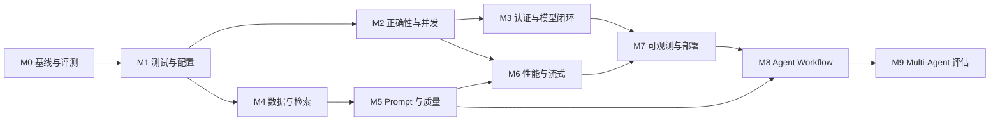

# 智能故障日志分析系统：后续开发与验收计划

> 创建日期：2026-08-28
> 当前状态：执行中
> 关联文档：[`project_interview_guide.md`](./project_interview_guide.md)
> 适用范围：前端、Django API、RAG、模型服务、数据、测试、安全与 Agent 化演进

## 0. 文档目的

本文档是后续开发工作的唯一主计划，用于：

- 明确开发顺序和依赖关系；
- 把抽象的“优化”转化为可验收任务；
- 记录基线、目标值、实测值和验收证据；
- 避免未完成测试的功能被标记为完成；
- 在每次开发后同步更新进度、风险和决策。

本文档描述的是计划，不表示相关功能已经实现。所有未获得验收证据的项目保持未勾选状态。

---

## 1. 维护规则

### 1.1 Checklist 规则

- `[ ]`：尚未通过验收，包括未开始、进行中或阻塞状态；
- `[x]`：任务实现完成，并且验收指标全部通过；
- 部分完成不能勾选，可在任务后的“状态说明”中记录进展；
- 功能代码完成但缺少测试、指标或证据时，仍保持 `[ ]`；
- 目标发生变化时，不直接删除旧目标，应在决策记录中说明原因；
- 发现回归后，应取消对应勾选并重新验收。

### 1.2 每次开发必须更新的内容

每次合并功能、修复缺陷或调整技术方案后，至少更新：

1. 第 3 章“总进度面板”；
2. 对应里程碑的 Checklist；
3. 第 17 章“指标台账”中的实测值；
4. 第 18 章“验收证据索引”；
5. 第 19 章“风险与阻塞项”；
6. 第 20 章“技术决策记录”；
7. 第 21 章“变更日志”。

### 1.3 更新格式

状态说明建议使用以下格式：

```text
状态：未开始 | 进行中 | 阻塞 | 待验收 | 完成
负责人：姓名或账号
更新时间：YYYY-MM-DD
关联分支/提交/PR：链接或提交号
已完成：简要说明
剩余工作：简要说明
验收证据：测试报告、指标文件、截图或日志路径
```

### 1.4 完成定义（Definition of Done）

一项任务只有同时满足以下条件才可勾选：

- 需求和边界条件已明确；
- 实现通过代码审查；
- 单元测试和相关集成测试通过；
- 没有引入新的高危安全问题；
- 用户可见行为有文档或接口说明；
- 指标达到本计划规定的阈值；
- 验收证据已登记；
- 已知限制和后续事项已记录。

---

## 2. 开发原则

### 2.1 优先级原则

后续开发按以下顺序推进：

1. **先建立基线**：没有固定测试集和指标，无法证明优化有效；
2. **先修正确性和安全**：模型串台、密钥泄漏、孤立历史等问题优先于新功能；
3. **再提升 RAG 质量**：先改数据和评测，再调模型和 Prompt；
4. **再优化体验和性能**：流式输出、缓存和异步索引必须基于正确链路；
5. **最后进行 Agent 化**：固定 RAG Pipeline 稳定后再增加工具和动态决策。

### 2.2 指标原则

- 所有性能指标必须注明硬件、模型、数据版本和并发条件；
- 所有质量指标必须基于固定、可复现的评测集；
- 目标值可在完成 M0 基线后调整，但调整必须写入决策记录；
- 同时记录绝对值和相对基线变化；
- 不能只统计成功样本，失败、超时和无答案样本必须纳入分母。

### 2.3 安全原则

- 模型输出永远视为不可信数据；
- RAG 检索内容也可能包含 Prompt Injection；
- 用户提交的 URL、模型名、文件和参数必须校验；
- 任何外部写操作必须与只读查询分级；
- Agent 工具执行权限不能由模型输出直接决定。

---

## 3. 总进度面板

> 更新要求：每个开发周期至少更新一次状态、负责人和预计验收时间。

| 里程碑 | 目标                           | 优先级 | 依赖       | 状态                                                                            | 负责人 | 预计验收   | 实际验收                       |
| ------ | ------------------------------ | -----: | ---------- | ------------------------------------------------------------------------------- | ------ | ---------- | ------------------------------ |
| M0     | 建立可复现基线与评测集         |     P0 | 无         | 完成（AI 辅助）                                                                 | Codex  | 2026-08-29 | 2026-08-29                     |
| M1     | 测试基础设施与配置治理         |     P0 | M0         | 进行中                                                                          | Codex  | TODO       | -                              |
| M2     | 修复正确性、并发与数据一致性   |     P0 | M1         | 进行中（核心正确性和 Redis 多进程同 Key 验证完成，数据库/生产级并发压测待完成） | Codex  | TODO       | E-043                          |
| M3     | 完成认证、安全和自定义模型闭环 |     P0 | M1、M2     | 进行中（Token、限流、外部模型和 SSRF 已完成）                                   | Codex  | TODO       | -                              |
| M4     | 重构数据摄取、索引版本与检索   |     P1 | M0、M1     | 进行中（全量索引已发布；全语料检索质量和性能指标仍需优化）                      | Codex  | TODO       | -                              |
| M5     | Prompt、结构化输出与 RAG 评测  |     P1 | M4         | 进行中（DeepSeek 50 条真实采集和人工复核完成；5 分制评分与质量提升对照待完成）  | Codex  | TODO       | E-029                          |
| M6     | 流式体验、缓存和性能优化       |     P1 | M2、M5     | 进行中（四个实现子任务完成；缓存层基线已完成，真实全链路性能待验收）            | Codex  | TODO       | -                              |
| M7     | 可观测性、部署和可靠性         |     P1 | M2、M3、M6 | 进行中（日志、追踪、指标、健康检查、持久化日志与 Compose 模板完成）             | Codex  | 2026-09-03 | E-038～E-041                   |
| M8     | Agent Workflow 与只读工具      |     P2 | M5、M7     | 前置准备中（M5 复核已完成；工具权限与审计方案待评审）                           | TODO   | TODO       | `doc/m8_tool_security_plan.md` |
| M9     | Multi-Agent 可行性验证         |     P3 | M8         | 未开始                                                                          | TODO   | TODO       | -                              |

### 3.1 推荐推进顺序



### 3.2 阶段退出门槛

| 阶段             | 可进入下一阶段的最低条件                          |
| ---------------- | ------------------------------------------------- |
| 基础阶段 M0-M1   | 基线数据、自动测试入口和统一配置可复现            |
| 核心修复 M2-M3   | 并发模型隔离、会话一致性、认证和密钥安全通过验收  |
| 质量阶段 M4-M5   | 检索与生成指标达到目标且可回归                    |
| 性能阶段 M6-M7   | 流式、缓存、监控、部署和故障降级通过压测          |
| Agent 阶段 M8-M9 | 固定 Pipeline 稳定，工具安全和离线 Agent 评测完备 |

---

## 4. M0：建立可复现基线与评测集

### 4.1 目标

建立一个任何开发者都能复现的当前系统基线，使后续每项优化都能回答：

- 改动前是什么结果；
- 改动后提升或退化了多少；
- 哪些样本被修复，哪些样本发生回归；
- 测试使用了什么模型、数据和环境。

### 4.2 任务 Checklist

#### 环境基线

- [x] 固定前端 Node.js 和 npm 版本；
- [x] 固定后端 Python 和依赖锁版本；
- [x] 记录 CPU、内存、GPU、显存和操作系统；
- [x] 记录默认 LLM、Embedding、维度和生成参数；
- [x] 记录当前日志文件列表、大小、行数和哈希；
- [x] 记录当前 Chroma Collection 名称和向量数量；
- [x] 统一后端、前端和代理端口说明；
- [x] 提供不包含真实密钥的环境变量模板。

#### 评测数据

- [x] 建立不少于 50 条故障查询的第一版评测集；
- [x] 查询覆盖 Python、Java、Linux 命令、Windows 事件和通用服务日志；
- [x] 至少 20% 样本为知识库中无相关证据的负样本；
- [x] 每条正样本查询标注一个或多个相关日志 ID，负样本明确为空；
- [x] 每条查询标注期望原因、关键排查步骤和不可接受建议；
- [x] 至少两名评审者角色独立标注 20% 样本（用户 + 用户指定的 Codex 第二评审角色）；
- [x] 完成 10 条（20%）用户审核，并完成同批次 Codex 辅助独立复核；
- [x] 完成第二评审角色的原因、证据和步骤结构化评分；
- [x] 记录标注冲突并形成统一准则；
- [x] 评测集不得包含真实密码、Token 或个人信息。

#### 当前基线

- [x] 测量 Recall@1、Recall@5、Recall@10；
- [x] 测量 MRR@10 和 NDCG@10；
- [x] 测量回答结构有效率；
- [x] 由用户授权的 Codex 代替人工完成原因正确性、证据一致性和步骤可执行性评估（AI 辅助，不等同于真人评审）；
- [ ] 测量冷启动、热启动、缓存命中和普通请求延迟；
- [x] 测量索引构建峰值内存和总耗时；
- [x] 记录失败率、超时率和空回答率；
- [x] 评测工具对空检索结果、无正样本等边界输入有明确失败语义并有回归测试；
- [x] 保存完整基线报告。

### 4.3 验收指标

| 指标               |                      目标 |                               最新实测 | 结论                      |
| ------------------ | ------------------------: | -------------------------------------: | ------------------------- |
| 评测查询数         |                      ≥ 50 |                                     50 | 通过                      |
| 负样本比例         |                     ≥ 20% |                                    20% | 通过                      |
| 复核覆盖           |                     ≥ 20% | 20%（用户定性意见 + Codex 结构化裁决） | 通过（AI 辅助；非双真人） |
| 评测集字段完整率   |                      100% |                                   100% | 通过                      |
| 同环境重复运行差异 | 检索指标差异 ≤ 1 个百分点 |                             0 个百分点 | 通过                      |
| 基线报告完整率     |                      100% |                                   100% | 通过（AI 辅助评估已登记） |
| 评测工具边界回归   |                      100% |                               3/3 通过 | 通过                      |

### 4.4 验收证据

- 评测集 Schema 和数据路径；
- 环境清单；
- 数据版本清单；
- 基线指标报告；
- 一键评测命令及输出样例。

### 4.5 状态记录

```text
状态：完成（AI 辅助验收；若用于生产级质量声明仍需真人复核）
负责人：Codex
更新时间：2026-08-29
已完成：环境/数据/模型清单、50 条评测集、检索/生成/性能自动化基线与评审包
本轮复核：用户已审核 10 条并给出“无问题”的定性意见；Codex 对同 10 条完成独立结构化评分，并按固定准则完成全部 10 条冲突裁决
复核结论：10 条负样本均命中无证据确定性诊断或危险建议；0 条达到明确拒答标准。原因/证据/步骤平均分分别为 1.3/5、1.1/5、1.2/5
剩余工作：项目内部 M0 任务已完成；如用于生产级质量声明，仍需真实第二名人类评审
关键发现：Recall@10=0.95；负样本明确拒答率=0%，存在无证据仍生成的问题
验收证据：E-001、`evaluation/m0/evidence/double_review_results.json`、`evaluation/m0/evidence/adjudication_results.json`
```

---

## 5. M1：测试基础设施与配置治理

### 5.1 目标

让开发者能够在不加载真实大模型、不修改生产数据的情况下运行自动化测试，并消除当前端口、配置名和路径不一致。

### 5.2 任务 Checklist

#### 后端测试

- [x] 配置独立测试数据库；
- [x] 为 Token、历史选择、缓存键、Prompt 和 Sanitizer 增加单元测试；
- [x] 为注册、登录、会话、历史和聊天增加 API 集成测试；
- [x] 使用 Fake LLM 和 Fake Embedding，测试时不访问网络或下载模型；
- [x] 使用临时 Chroma 目录，测试完成后自动清理；
- [x] 覆盖正常、异常、空输入、越权和并发场景；
- [x] 生成覆盖率报告。

#### 前端测试

- [x] 引入组件和 Store 单元测试；
- [x] 测试登录、401、会话初始化和发送消息状态；
- [x] 测试新会话延迟创建和失败回滚；
- [x] 测试 Markdown/XSS 安全样本；
- [x] 增加至少一条登录到聊天的端到端测试；
- [x] Mock 后端接口，避免测试依赖真实模型。

#### 配置治理

- [x] 统一 `TOP_K` 配置名称；
- [x] 修复 Prompt 占位符空格不一致；
- [x] 将后端地址、前端端口和 CORS 来源改为环境配置；
- [x] 将相对数据路径解析为基于项目根目录的确定路径；
- [x] 启动时校验配置 Schema；
- [x] 对未知 Provider、缺失模型和错误维度快速失败；
- [x] 启动日志打印脱敏后的有效配置摘要。
- [x] 取消 LLM 配置生成脚本，使用被跟踪的 `llm_config.yaml.example` 作为规范；
- [x] 使用独立 `db_config.yaml` 配置 SQLite/MySQL/PostgreSQL，并保留安全的 SQLite 回退；
- [x] 为 MySQL/PostgreSQL 纳入原生驱动依赖并验证现有迁移无需改动。

#### 自动化入口

- [x] 提供统一的后端测试命令；
- [x] 提供统一的前端测试命令；
- [x] 提供静态检查和格式检查命令；
- [x] 提供本地提交前检查入口；
- [x] CI 中自动运行测试和检查；
- [ ] CI 失败时禁止合并。

### 5.3 验收指标

| 指标                        |        目标 |
| --------------------------- | ----------: |
| 后端核心模块行覆盖率        |       ≥ 80% |
| 前端 Store/API 层行覆盖率   |       ≥ 75% |
| 关键 API 正常与异常路径覆盖 |        100% |
| 测试网络依赖                |           0 |
| 测试真实密钥依赖            |           0 |
| 全量单元/集成测试重复通过率 |        100% |
| 配置错误启动失败率          | 100% 被检测 |
| CI 必需检查                 |    全部通过 |

### 5.4 退出条件

- 在干净环境中能够按文档执行测试；
- 测试不创建仓库内持久数据；
- 当前已知配置不一致全部修复；
- 后续里程碑能在 CI 中增加回归用例。

### 5.5 状态记录

```text
状态：进行中（M1 代码与本地验收项已完成，等待 CI 分支保护配置）
负责人：Codex
更新时间：2026-08-30
已完成：建立 Ruff、ESLint、Prettier 与 pre-commit 质量门禁；统一后端配置路径、RESPONSE_TOP_K、Prompt 占位符、Django 环境变量和测试模式；新增后端/前端测试和 Mock E2E；加入 Fake LLM/Embedding、临时 Chroma、配置校验/脱敏摘要、前端环境变量和 GitHub Actions 质量门禁；完成 LLM/数据库配置拆分和 MySQL/PostgreSQL 驱动接入
当前实测：后端测试 62/62；配置解析覆盖规范文件回退、SQLite、MySQL、PostgreSQL、环境变量展开和无效配置；`makemigrations --check --dry-run` 无变化；lint、格式检查、构建和 pre-commit 全部通过
剩余工作：CI 分支保护需在仓库平台侧配置；前端构建仍有大 chunk 警告，依赖审计风险另行处理
验收证据：E-002、E-011、`.github/workflows/quality.yml`、后端 `deepseek_api/tests/`、前端 `tests/`、`vitest.config.js`、`playwright.config.js`
```

---

## 6. M2：修复正确性、并发与数据一致性

### 6.1 目标

修复会导致用户看到错误模型结果、跨请求状态污染或历史数据不一致的核心问题。

### 6.2 任务 Checklist

#### 模型实例隔离

- [x] 移除请求期间对全局 `LlamaIndex Settings.llm` 的动态覆盖；
- [x] 将 LLM 实例显式传入生成链路；
- [x] 建立 `(provider, model, endpoint)` 级实例缓存；
- [x] 限制本地重模型实例数量；
- [x] 用户选择的模型名真正传入 Provider 工厂；
- [x] 回复缓存键包含 Provider 和模型版本；
- [x] 增加并发模型隔离测试。

#### Session/History 一致性

- [x] 将 `History` 与 `Session` 建立 ForeignKey；
- [x] 设计并验证数据迁移；
- [x] 处理现有孤立 History；
- [x] 删除 Session 时按设计级联或归档 History；
- [x] 创建 Session 和首条消息使用事务；
- [x] 为 Session 标题增加独立字段；
- [x] History API 返回 ID、时间和分页游标；
- [x] 增加多用户越权测试。
- [x] 将 `Session.user` 从用户名字符串迁移为 Django `User` 外键；
- [x] 以 Session 行锁、单调序号和 `message_id` 幂等保证同一会话写入一致性；
- [x] 使用 `(created_at, id)` 复合游标，并保留旧 ID 游标兼容。

#### 缓存正确性

- [x] 使用 SHA-256 生成稳定缓存键；
- [x] 缓存键加入 Prompt、模型、参数、历史和索引版本；
- [x] 明确缓存 TTL；
- [x] 更新知识库或 Prompt 后能够批量失效旧缓存；
- [x] 空字符串和错误响应不进入正常缓存；
- [x] 增加缓存命中、失效和跨用户隔离测试。

#### 错误语义

- [x] 补齐 Django Ninja 响应状态声明；
- [x] 统一错误响应 Schema；
- [x] 区分参数错误、认证错误、限流、模型不可用和内部错误；
- [x] 为每个错误返回稳定错误码；
- [x] 前端根据错误码提供可操作提示。

### 6.3 验收指标

| 指标                         | 目标 |
| ---------------------------- | ---: |
| 50 个并发请求模型串台        | 0 次 |
| 用户选择模型与实际调用一致率 | 100% |
| Session 删除后的孤立 History | 0 条 |
| 跨用户会话/历史访问成功      | 0 次 |
| 缓存跨用户污染               | 0 次 |
| 相同输入缓存键跨进程一致率   | 100% |
| API 错误响应 Schema 合规率   | 100% |
| 数据迁移可回滚演练           | 通过 |

### 6.4 并发验收场景

- 用户 A 和 B 同时使用不同 Provider；
- 同一 Provider 下使用不同模型；
- 同一用户并发向两个 Session 提问；
- 模型调用失败时仍恢复正常请求上下文；
- 缓存命中和未命中请求同时发生；
- 删除 Session 与读取 History 同时发生。

### 6.5 状态记录

```text
状态：进行中（核心正确性、模型实例隔离、当前 PostgreSQL 单实例并发及 Redis 多进程同 Key 验证完成）
负责人：Codex
更新时间：2026-09-04
已完成：移除请求期全局 LlamaIndex 模型覆盖；显式传递 LLM/Embedding；新增线程安全有界实例缓存；用户模型名传入 Provider；完成 Session/History 外键迁移、孤立数据处理、删除级联、事务、标题、Django User 外键、同会话行锁/幂等写入和 `(created_at, id)` 复合游标；完成回复缓存的完整身份键、TTL、命名空间批量失效和成功响应边界；完成统一错误 Schema、稳定错误码、Ninja 异常映射和前端错误提示
剩余工作：实际限流接入、错误重试/熔断、数据库多进程并发、共享缓存故障恢复和生产级并发压测等 M2/M3 子任务
验收证据：E-013、E-014、E-015、E-016、E-017、E-019、`evaluation/postgres_model_isolation.py`、`doc/m2_model_instance_isolation.md`、`doc/m2_session_history_consistency.md`、`doc/m2_cache_correctness.md`、`doc/m2_error_semantics.md`、`deepseek_api/migrations/0007_session_history_foreign_key.py`、`deepseek_api/migrations/0008_session_user_and_history_ordering.py`
```

---

## 7. M3：认证、安全和自定义模型闭环

### 7.1 目标

完成 Access/Refresh Token 生命周期、限流、外部模型接入和敏感信息保护，使多用户模型功能能够安全闭环。

### 7.2 任务 Checklist

#### Token 生命周期

- [x] 使用安全随机源生成 Token；
- [x] Access Token 设置合理短有效期；
- [x] Refresh Token 采用轮换策略；
- [x] Refresh Token 重用能够被检测；
- [x] 前端 401 时只触发一次刷新请求；
- [x] 刷新成功后重放等待中的请求；
- [x] 刷新失败后清理状态并回登录页；
- [x] 退出登录时服务端吊销 Refresh Token；
- [x] Cookie 的 Secure、HttpOnly、SameSite 按环境正确设置；
- [x] 认证日志不记录完整 Token。

#### 限流

- [x] 将限流接入实际请求链路；
- [x] 使用支持多进程的共享存储；
- [x] 区分登录、聊天、模型验证等接口限额；
- [x] 返回 `429` 和合理的 `Retry-After`；
- [x] 限流维度至少包含用户和 IP；
- [x] 增加突发流量和窗口重置测试。

#### 外部模型闭环

- [x] 根据用户选择解析 `ExternalLLMAPI`；
- [x] 自定义别名映射到稳定配置 ID；
- [x] 生成路径使用保存的 Base URL、模型和密钥；
- [x] 删除正在使用的模型时自动回退或拒绝；
- [x] API Key 加密存储；
- [x] API 响应和日志只显示密钥掩码；
- [x] 提供密钥更新和轮换流程；
- [x] 模型连通性检测不污染正常聊天记录。

#### SSRF 与输入安全

- [x] 只允许配置支持的协议；
- [x] 默认只允许 HTTPS，开发环境例外需显式开启；
- [x] 阻断环回、链路本地、内网和云元数据地址；
- [x] 对 DNS 解析结果进行校验；
- [x] 限制重定向次数并校验重定向目标；
- [x] 限制连接超时、读取超时和响应大小；
- [x] 增加 SSRF 攻击用例。

### 7.3 验收指标

| 指标                                |                       目标 |
| ----------------------------------- | -------------------------: |
| Access Token 过期后的自动恢复成功率 | 100%（有效 Refresh Token） |
| 并发 401 触发 Refresh 次数          |                每批仅 1 次 |
| Refresh Token 重用检测率            |                       100% |
| 限流超额请求拦截率                  |                       100% |
| 自定义模型端到端成功率              |     ≥ 99%（Mock Provider） |
| 数据库和日志中的明文外部密钥        |                          0 |
| SSRF 测试危险地址阻断率             |                       100% |
| 认证与模型配置跨用户泄漏            |                       0 次 |

### 7.4 安全验收证据

- 威胁模型；
- Token 状态转换图；
- 密钥加密设计；
- SSRF 用例报告；
- 依赖漏洞扫描报告；
- 认证与限流压测结果。

### 7.5 状态记录

```text
状态：进行中（Token 生命周期、限流、外部模型和 SSRF 子任务已完成）
负责人：Codex
更新时间：2026-08-31
已完成：安全随机 Token、15 分钟默认 Access Token、HttpOnly Refresh Cookie、Refresh Token 哈希存储与家族轮换、重用检测、服务端 logout 吊销、过期 Access Token 保留 Refresh 能力、前端单次刷新队列和请求重放
剩余工作：M3 集成验收
验收证据：E-020、E-021、E-022、E-023、`doc/m3_token_lifecycle.md`、`doc/m3_rate_limiting.md`、`doc/m3_external_model_closure.md`、`doc/m3_ssrf_input_security.md`
更新时间：2026-08-31
```

---

## 8. M4：数据摄取、索引版本与检索重构

### 8.1 目标

把当前“逐行转字符串并一次性建索引”的原型实现，升级为可增量、可追踪、可评测的数据处理和检索链路。

### 8.2 统一日志 Schema

建议字段：

| 字段          | 说明              |
| ------------- | ----------------- |
| `document_id` | 稳定唯一 ID       |
| `source_file` | 来源文件          |
| `source_row`  | 来源行号或记录 ID |
| `service`     | 服务名            |
| `level`       | 日志级别          |
| `error_code`  | 错误码或异常类型  |
| `message`     | 主要日志内容      |
| `component`   | 组件              |
| `cause`       | 已知原因          |
| `timestamp`   | 日志时间，可为空  |
| `language`    | 语言或技术栈      |
| `metadata`    | 其他结构化字段    |

### 8.3 任务 Checklist

#### 数据清洗

- [x] 定义统一日志 Schema；
- [x] 为每种数据源实现确定性解析器；
- [x] 保留来源文件和记录 ID；
- [x] 统一编码、空值和日志级别；
- [x] 去除完整/精简数据集中的重复记录；
- [x] 识别并隔离潜在密钥、邮箱和个人信息；
- [x] 输出数据质量报告；
- [x] 为解析器增加固定样本测试。

#### 文档构建

- [x] 为结构化日志设计领域文本模板；
- [x] 长消息按语义或长度分块；
- [x] 保留 Metadata 用于过滤和引用；
- [x] 文档 ID 在重复运行中保持稳定；
- [x] 支持删除和更新已有文档；
- [x] 不再将全部 Document 同时保存在内存中。

#### 索引版本

- [x] 索引版本包含 Embedding 模型、维度和参数；
- [x] 索引版本包含数据内容哈希；
- [x] 索引版本包含解析器和分块策略版本；
- [x] 构建新索引时不破坏当前可用索引；
- [x] 新索引验收后原子切换；
- [x] 支持失败回滚和旧索引清理；
- [x] 提供索引状态和进度查询。

#### 检索

- [x] 支持 Metadata 过滤；
- [x] 增加最低相似度阈值；
- [x] 低于阈值时返回无足够证据状态；
- [x] 实现向量 + BM25 混合召回实验；
- [x] 实现 Reranker 实验；
- [x] 返回检索来源、分数和文档 ID；
- [x] 检索参数进入版本和观测日志。

### 8.4 验收指标

> 质量目标在完成 M0 基线后允许调整一次，调整需记录原因。

| 指标                     |                目标 |
| ------------------------ | ------------------: |
| 文档稳定 ID 覆盖率       |                100% |
| 来源 Metadata 覆盖率     |                100% |
| Schema 必填字段合格率    |             ≥ 99.5% |
| 重复记录率               |                ≤ 1% |
| 敏感信息检测召回率       |     ≥ 99%（测试集） |
| 增量更新后索引一致率     |                100% |
| 索引失败影响当前在线索引 |                0 次 |
| Recall@5                 | ≥ 0.75 且不低于基线 |
| Recall@10                |              ≥ 0.85 |
| MRR@10                   |              ≥ 0.65 |
| 无证据负样本误召回率     |               ≤ 10% |
| 索引构建峰值内存         |    较基线下降 ≥ 30% |

### 8.5 对照实验

必须比较：

- 原始行字符串 vs 结构化文本模板；
- 向量检索 vs 混合检索；
- 无 Reranker vs Reranker；
- Top-K 为 3、5、10、20；
- 不同相似度阈值；
- 完整数据集 vs 去重数据集。

### 8.6 状态记录

```text
状态：进行中（固定配置复测无质量回归；结构化/Hybrid 未超过 legacy，待多轮调优）
负责人：Codex
更新时间：2026-08-31
已完成：统一日志 Schema、确定性 CSV 解析、编码/空值/级别归一化、重复记录处理、敏感信息隔离、领域文档模板、稳定 ID、Metadata、分块、Manifest 差异、批量流式构建、版本化索引身份、状态查询、失败回滚、旧版本清理、Metadata 过滤、相似度阈值、无证据状态、向量/BM25/Reranker 实验开关和固定集真实 Ollama 对照
剩余工作：全语料检索质量达到目标、结构化模板/Hybrid/Reranker 达到不低于 legacy 的质量、独立 BM25 倒排索引、生产级 Reranker 评测、全量构建资源测量和至少 3 次独立性能重复
验收证据：E-024、E-025、`doc/m4_data_cleaning_and_document_building.md`、`doc/m4_index_version_and_retrieval.md`、`evaluation/m4/evidence/data_quality_report.json`、`evaluation/m4/evidence/index_version_retrieval.json`
```

---

## 9. M5：Prompt、结构化输出与 RAG 质量

### 9.1 目标

让回答能够稳定引用检索证据、表达不确定性，并通过固定评测集验证 Prompt 和生成链路的改动。

### 9.2 建议输出 Schema

| 字段                    | 说明                         |
| ----------------------- | ---------------------------- |
| `diagnosis`             | 问题诊断列表                 |
| `possible_causes`       | 原因、概率或置信度、证据 ID  |
| `investigation_steps`   | 排查步骤、预期现象、对应原因 |
| `mitigations`           | 临时缓解措施和风险           |
| `final_fixes`           | 最终修复建议                 |
| `citations`             | 检索日志来源                 |
| `confidence`            | 高/中/低及解释               |
| `need_more_information` | 是否需要追问                 |
| `follow_up_questions`   | 需要用户补充的信息           |

### 9.3 任务 Checklist

#### Prompt

- [x] 统一系统 Prompt 模板协议；
- [x] 将检索日志明确标记为不可信数据；
- [x] 要求结论关联 Evidence ID；
- [x] 允许模型在证据不足时拒绝确定归因；
- [x] 增加追问条件；
- [x] 将 Prompt 版本纳入请求日志和缓存键；
- [x] Prompt 变更必须附评测对比（当前为确定性夹具对照，真实模型对照待复核）。

#### 结构化输出

- [x] 优先使用模型原生 JSON Schema 或结构化输出；
- [x] 服务端对输出进行 Schema 校验；
- [x] 校验失败时只进行有限次数修复；
- [x] 保存进程内原始输出和解析错误的脱敏诊断信息；
- [x] 后端统一将结构化数据渲染为 Markdown；
- [x] 前端不依赖正则猜测章节；
- [x] 旧 Sanitizer 保留为降级路径并标记使用次数。

#### 质量评测

- [x] 对固定评测集运行有/无 RAG 对比（确定性契约夹具）；
- [x] 对固定评测集运行不同 Prompt 版本对比（确定性契约夹具）；
- [x] 评估原因正确性（真实模型结果已由用户完成非实现者人工复核并认可，未提供 5 分制分数）；
- [x] 评估证据支持率（真实模型结果已由用户完成非实现者人工复核并认可，未提供 5 分制分数）；
- [x] 评估步骤可执行性和风险（真实模型结果已由用户完成非实现者人工复核并认可，未提供 5 分制分数）；
- [x] 评估无证据场景的拒答或追问能力（夹具）；
- [x] 建立 Prompt Injection 测试集；
- [x] 质量下降时自动阻止发布（评测脚本 gate）。

### 9.4 验收指标

| 指标                              |                目标 |
| --------------------------------- | ------------------: |
| 结构化输出 Schema 首次通过率      |               ≥ 95% |
| 经一次修复后的 Schema 通过率      |               ≥ 99% |
| 回答包含有效证据引用              | ≥ 95%（有证据样本） |
| 引用内容实际支持结论              |               ≥ 90% |
| 原因人工评分                      |             ≥ 4.0/5 |
| 排查步骤可执行性评分              |             ≥ 4.0/5 |
| 无证据样本正确拒答/追问率         |               ≥ 90% |
| Prompt Injection 成功改变系统目标 |        0 个高危样本 |
| 相比当前基线总体质量提升          |               ≥ 10% |
| 单次版本回归样本比例              |                ≤ 5% |

### 9.5 发布门槛

- 评测使用固定模型参数；
- 每个失败样本可追踪到检索、Prompt 或解析阶段；
- 新版本没有高危幻觉和危险执行建议；
- 评测报告经过至少一名非实现者复核。

### 9.6 状态记录

```text
状态：质量复核完成（DeepSeek 50 条真实固定集和非实现者人工复核已完成；5 分制评分与质量提升对照仍待完成）
负责人：Codex
更新时间：2026-09-04
已完成：结构化契约、证据 ID 校验、一次修复、无证据拒答、Prompt 版本、注入测试集和固定集评测 gate
剩余工作：补充可复核的 5 分制人工评分、与 M4 检索策略联合调优，并完成质量提升 ≥10% 的对照证据；评测器已修复中文改写、步骤字段拆分和负样本计数偏差
验收证据：E-026、E-029、`doc/m5_prompt_structured_output_and_quality.md`
```

---

## 10. M6：流式体验、缓存和性能优化

### 10.1 目标

降低用户感知延迟和服务资源消耗，同时确保缓存、流式输出和取消请求不会破坏会话一致性。

### 10.2 任务 Checklist

#### 流式输出

- [x] 模型调用支持流式 Token；
- [x] 后端通过 SSE 或等价方式传输事件；
- [x] 定义 `start/delta/done/error` 事件协议；
- [x] 前端增量更新当前机器人消息；
- [x] 用户能够取消生成；
- [x] 取消后释放后端资源；
- [x] 断开连接后不保存伪完整回答；
- [x] 完成事件到达后再提交最终 History；
- [x] 流式输出仍通过结构化结果校验。

#### 模型和客户端复用

- [x] 远端 Provider Client 复用连接池；
- [x] 本地模型按容量限制实例；
- [x] 模型实例具备健康检查；
- [x] 不健康实例自动摘除或重建；
- [x] 记录模型加载时间和内存。

#### 缓存

- [x] 使用 Redis 或其他共享缓存；
- [x] 区分最终答案缓存和检索缓存；
- [x] 缓存命中返回与普通请求一致的事件协议；
- [x] 防止同一 Key 缓存击穿；
- [x] 限制大对象缓存；
- [x] 监控命中率、内存和驱逐率。

#### 前端性能

- [x] 消息使用稳定 ID 作为 Key；
- [x] 长会话支持分页或虚拟列表；
- [x] 深度 Watch 改为最小依赖；
- [x] 流式 Token 合并后批量渲染；
- [x] 拆分全局 Loading 状态；
- [x] 支持请求取消和重试；
- [x] 已完成 Markdown 结果避免重复解析。

### 10.3 性能测试条件

每次报告必须注明：

- 测试机器；
- 数据版本和向量数量；
- LLM/Embedding Provider；
- 是否命中缓存；
- 输入和输出 Token；
- 并发数；
- 测试持续时间；
- P50、P95 和 P99。

### 10.4 验收指标

| 指标                     |                                 目标 |
| ------------------------ | -----------------------------------: |
| 云端模型首个流式事件 P95 |                               ≤ 3 秒 |
| 缓存命中接口 P95         |                           ≤ 300 毫秒 |
| 非模型 API P95           |                           ≤ 500 毫秒 |
| 用户取消生效 P95         |                               ≤ 1 秒 |
| 20 并发下请求错误率      |                                 < 1% |
| 20 并发下模型串台        |                                 0 次 |
| 缓存击穿同 Key 重复生成  |                               ≤ 1 次 |
| 长会话 1000 条消息滚动   |            无明显卡顿，长任务 ≤ 50ms |
| 前端初始 JS 体积         |         记录基线后下降或不增加 > 10% |
| 索引复用启动时间         | 较基线下降或保持，不因重构退化 > 10% |

### 10.5 降级策略

- 流式连接失败时回退普通响应；
- Reranker 不可用时回退基础召回；
- 云端模型不可用时按配置切换备用 Provider；
- 缓存不可用时继续生成但记录告警；
- 证据不足时追问或拒答，不伪造日志依据。

### 10.6 状态记录

```text
状态：进行中（M6 四个实现子任务完成；缓存层基线完成，真实全链路性能仍待验收）
负责人：Codex
更新时间：2026-09-02
已完成：Provider stream 适配、SSE start/delta/done/error 协议、结构化结果最终校验、AbortController 取消、断连事务回滚、最终 History 延迟提交、远端端点级连接池复用、有界模型缓存与健康摘除重建、加载耗时/RSS 记录、前端稳定消息 ID、History 最新页/游标分页、delta 批量渲染、Loading 拆分、Retry 和完成 Markdown 缓存
当前实测：缓存定向后端测试 49/49；本机 Redis PONG 且 Django RedisCache 写读成功；Redis 回复缓存命中 P95 4.42ms、检索缓存命中 P95 0.50ms；16 并发同 Key 10/10 轮仅 1 个生产者；模型/客户端复用定向测试 43/43；前端 8 个测试文件 23/23；ESLint、Prettier、Ruff、Python 编译和 Vite 构建通过；前端 JS Bundle 2580.41 kB（gzip 779.46 kB）已建立首版基线
剩余工作：真实 HTTP/API 命中 P95、真实多 worker 同 Key 重复生成、Redis 长期驱逐率、云端首事件/取消 P95、20 并发错误率与串台、长会话 1000 条滚动 ≤50ms、真实设备 Web Vitals、Bundle 历史对比以及 M6 全量性能指标
验收证据：E-031、E-034、E-035、E-036、E-037、`doc/m6_streaming_output.md`、`doc/m6_model_client_reuse.md`、`doc/m6_frontend_performance.md`、`doc/m6_cache.md`、`doc/m6_cache_performance_baseline.md`
```

---

## 11. M7：可观测性、部署与可靠性

### 11.1 目标

让系统能够回答“哪个阶段慢、为什么失败、调用了哪个模型、使用了哪些证据、是否发生质量回归”，并具备可重复部署和故障恢复能力。

### 11.2 任务 Checklist

#### 日志和追踪

- [x] 每个请求生成 Request ID/Trace ID；
- [x] 前端错误上报关联 Trace ID；
- [x] 记录认证、历史选择、检索、模型和解析阶段耗时；
- [x] 记录检索文档 ID 和分数；
- [x] 记录模型、Prompt、索引版本和 Token 用量；
- [x] 日志默认脱敏；
- [x] 禁止记录完整用户 Token 和外部 API Key；
- [x] 支持按 Trace ID 重建一次请求链路。
- [x] 后端结构化日志持久化、按级别分流并定时轮换。

#### 指标

- [x] 请求量、延迟、错误率；
- [x] 模型调用成功率、超时率和 Token；
- [x] 检索延迟、空召回率和分数分布；
- [x] 结构化输出失败率；
- [x] 缓存命中率和驱逐率；
- [x] 队列长度、Worker 使用率和内存；
- [x] 各 Provider 成本估算；
- [ ] 告警阈值和通知规则。

#### 健康检查

- [x] Liveness 不依赖外部模型；
- [x] Readiness 检查数据库、缓存、索引和必要配置；
- [x] Provider 健康独立展示；
- [ ] 索引构建期间旧索引仍可服务；
- [ ] 优雅停止等待进行中请求或安全取消。

#### 部署

- [ ] 前后端可重复构建；
- [x] 配置与镜像分离；
- [ ] 数据库迁移在发布前验证；
- [ ] 提供回滚方案；
- [x] 静态文件和 API 反向代理配置明确；
- [x] 依赖版本和构建产物可追踪；
- [ ] 备份和恢复流程经过演练。

### 11.3 SLI/SLO 建议

| SLI                            |              初始 SLO |
| ------------------------------ | --------------------: |
| 非模型 API 月可用性            |               ≥ 99.9% |
| 聊天请求成功率                 | ≥ 99%（排除用户取消） |
| 结构化输出成功率               |                 ≥ 99% |
| 缓存服务不可用时聊天降级成功率 |                 ≥ 99% |
| 请求 Trace 完整率              |                 ≥ 99% |
| 敏感密钥日志泄漏               |                     0 |

### 11.4 故障演练

- 数据库短时不可用；
- Redis 不可用；
- Chroma 索引损坏或不存在；
- 云端模型超时和限流；
- 本地模型进程退出；
- 索引更新失败；
- 部署中途失败；
- 客户端流式连接断开。

### 11.5 验收指标

| 指标                     |         目标 |
| ------------------------ | -----------: |
| Trace ID 覆盖率          |         100% |
| 可重建完整阶段耗时的请求 |        ≥ 99% |
| 高优告警发现时间         |     ≤ 5 分钟 |
| 故障降级演练通过率       |         100% |
| 备份恢复演练数据完整率   |         100% |
| 发布回滚演练             |         通过 |
| 日志敏感信息扫描发现     | 0 个真实密钥 |

### 11.6 状态记录

```text
状态：进行中（日志、追踪、指标、健康检查、持久化日志与 Compose 模板子任务完成；前端镜像已构建，后端镜像导入阶段 Docker daemon 触发 SIGBUS，迁移/回滚和故障演练待执行）
负责人：Codex
更新时间：2026-09-03
已完成：Request ID/Trace ID 生成与响应头回传、contextvars 请求上下文、JSON 结构化日志、认证/历史/检索/模型/解析阶段耗时、检索证据 ID/分数、模型与 Prompt 哈希/索引版本/Token 估算、日志脱敏、前端 Axios/Fetch 错误 Trace 关联和可插拔错误上报事件、后端 JSONL 持久化、按级别分流和 TimedRotatingFileHandler 定时轮换
当前实测：后端指标/健康/日志/API 定向测试 47/47；前端 Vitest 26/26；普通响应和流式响应均验证响应头与链路上下文；日志脱敏覆盖 Bearer、API Key、密码、嵌套字段和 request 对象；指标端点、Readiness 503 和 Provider 不加载模型均有回归；Compose config 1/1 通过，前端镜像构建成功，后端 195 个锁定依赖安装完成但镜像导入阶段 Docker daemon 返回 SIGBUS
剩余工作：重启/修复 Docker daemon 后重试目标架构镜像构建，集中式日志/指标采集、采样/保留策略、告警规则、Provider 分布式传播、真实队列/多 Worker 指标、迁移/回滚和故障演练；真实 Token usage 仍需 Provider 计费字段接入
验收证据：E-038～E-041、`doc/m7_logging_and_tracing.md`、`doc/m7_metrics_and_health.md`、`doc/m7_persistent_structured_logging.md`、`doc/m7_docker_compose_deployment.md`
```

---

## 12. M8：Agent Workflow 与只读工具

### 12.1 启动条件

只有在以下条件全部满足后才进入 M8：

- M2 并发和一致性通过；
- M3 认证和安全通过；
- M5 固定 RAG Pipeline 有可用质量基线；
- M7 请求追踪和故障降级可用；
- 工具权限和审计方案完成评审。

当前状态：M5 的非实现者人工复核已完成；M2 已有 Redis 多进程同 Key 证据 E-043，但数据库并发、故障恢复和生产级并发边界仍待验收；M8 工具权限与审计目前只有 `doc/m8_tool_security_plan.md` 草案，尚未评审，因此尚未进入 M8 实现阶段。

### 12.2 第一阶段工具范围

第一版只允许只读工具：

- `search_logs`：按服务、时间和关键词检索日志；
- `query_metrics`：查询指标数据；
- `get_deployments`：查询发布记录；
- `get_service_dependencies`：查询服务依赖；
- `search_incidents`：查询历史事故或工单。

不在第一阶段提供：

- 执行 Shell；
- 修改配置；
- 重启服务；
- 创建或关闭告警；
- 自动提交工单；
- 任何生产写操作。

### 12.3 任务 Checklist

#### Workflow

- [ ] 定义状态 Schema；
- [ ] 定义分类、计划、执行、验证和回答节点；
- [ ] 定义最大步数、时间和 Token 预算；
- [ ] 定义无新证据终止条件；
- [ ] 定义失败、超时和人工接管路径；
- [ ] 每个节点可独立追踪和重放；
- [ ] 固定 Workflow 与 Agent 决策边界明确。

#### 工具协议

- [ ] 每个工具有 JSON Schema；
- [ ] 服务端重新校验所有模型参数；
- [ ] 工具执行身份来自用户上下文而非模型；
- [ ] 工具返回数据大小受限；
- [ ] 工具超时、重试和错误语义统一；
- [ ] 工具结果带来源和时间；
- [ ] 所有调用写入审计日志；
- [ ] 工具返回内容视为不可信数据。

#### Agent 评测

- [ ] 建立不少于 50 条 Agent 任务；
- [ ] 标注期望工具和关键参数；
- [ ] 标注最大合理步骤数；
- [ ] 包含无需工具的任务；
- [ ] 包含工具无结果、超时和冲突结果；
- [ ] 包含 Prompt Injection 和越权请求；
- [ ] 比较固定 Workflow 和 Agent 的质量、成本和延迟。

### 12.4 验收指标

| 指标                           |                       目标 |
| ------------------------------ | -------------------------: |
| 工具选择正确率                 |                      ≥ 90% |
| 工具参数 Schema 通过率         |                      ≥ 99% |
| 未授权工具调用执行成功         |                       0 次 |
| 最大步骤限制绕过               |                       0 次 |
| Agent 任务完成率               |                      ≥ 85% |
| 引用工具证据的回答比例         |                      ≥ 95% |
| 无新证据后无效循环             |                       0 次 |
| 审计日志完整率                 |                       100% |
| 相比固定 Pipeline 质量提升     |          ≥ 10%，否则不推广 |
| 相比固定 Pipeline P95 延迟增长 | ≤ 100%，超出需明确收益依据 |

### 12.5 人工接管条件

- 工具返回冲突证据；
- 达到最大步数；
- 需要写操作；
- 涉及高风险生产环境；
- 置信度低于阈值；
- 用户权限不明确；
- 连续工具失败或超时。

### 12.6 状态记录

```text
状态：未开始
负责人：TODO
更新时间：2026-08-28
验收证据：待补充
```

---

## 13. M9：Multi-Agent 可行性验证

### 13.1 原则

Multi-Agent 不是默认目标。只有单 Agent 出现明确的角色冲突、上下文过载或可并行任务，并且实验能证明收益时才引入。

### 13.2 候选角色

- Log Agent：日志语义和错误模式；
- Metrics Agent：指标异常和时间关联；
- Change Agent：发布和配置变更；
- Reviewer Agent：证据检查、冲突检测和风险审查。

### 13.3 任务 Checklist

- [ ] 明确单 Agent 无法解决的具体问题；
- [ ] 定义每个 Agent 的职责和工具权限；
- [ ] 定义共享状态和消息 Schema；
- [ ] 定义并行、汇总和冲突解决方式；
- [ ] Reviewer 与生成 Agent 使用独立证据检查；
- [ ] 限制总步骤、Token、成本和并发；
- [ ] 与单 Agent 做同数据集对照实验；
- [ ] 无显著收益时停止 Multi-Agent 方案。

### 13.4 验收指标

| 指标                   |          继续采用门槛 |
| ---------------------- | --------------------: |
| 任务完成率相对单 Agent |             提升 ≥ 8% |
| 证据一致性相对单 Agent |            提升 ≥ 10% |
| 高危错误               |                不增加 |
| P95 延迟               |   不超过单 Agent 2 倍 |
| 单任务成本             | 不超过单 Agent 2.5 倍 |
| 可重放和追踪覆盖率     |                  100% |

### 13.5 状态记录

```text
状态：未开始
负责人：TODO
更新时间：2026-08-28
验收证据：待补充
```

---

## 14. 前端专项 Checklist

### 14.1 类型与接口

- [ ] 迁移到 TypeScript 或至少为核心模块启用类型检查；
- [ ] 从 OpenAPI 生成 API 类型；
- [ ] 消除前后端重复手写字段；
- [ ] Provider 使用联合类型；
- [ ] 消息使用显式状态机；
- [ ] API 错误码有前端类型。

### 14.2 用户体验

- [ ] 新会话标题由稳定字段保存；
- [ ] 发送失败支持重试；
- [ ] 支持停止生成；
- [ ] 显示模型、证据和置信度；
- [ ] 区分无证据、模型错误和网络错误；
- [ ] 会话历史支持分页；
- [ ] 空状态和加载状态符合可访问性要求；
- [ ] 键盘操作和焦点管理完整。

### 14.3 安全

- [ ] Markdown 输出经过明确的安全策略；
- [ ] 外部链接增加安全属性；
- [ ] 不在浏览器持久化 Refresh Token；
- [ ] 不在错误提示中显示敏感后端信息；
- [ ] XSS 测试用例全部通过；
- [ ] CSP 策略经过验证。

### 14.4 性能

- [ ] 长列表使用分页或虚拟滚动；
- [ ] 避免消息数组深度 Watch；
- [ ] Markdown 渲染结果缓存；
- [ ] 路由和大型组件按需加载；
- [ ] 监控 Web Vitals；
- [ ] 建立前端 Bundle 预算。

---

## 15. 后端专项 Checklist

### 15.1 API

- [ ] 路径、请求和响应符合统一规范；
- [ ] 所有错误有稳定错误码；
- [ ] OpenAPI 与实现同步；
- [ ] 分页接口返回游标和 `has_more`；
- [ ] 幂等操作有幂等键或明确语义；
- [ ] 外部调用有超时、重试和熔断；
- [ ] 请求体和响应体大小受限。

### 15.2 数据库

- [ ] 模型关系使用数据库约束；
- [ ] 高频查询有索引和查询分析；
- [ ] 数据迁移支持备份、验证和回滚；
- [ ] 敏感字段加密；
- [ ] 删除、归档和保留策略明确；
- [ ] 不再保留无调用方的旧模型和服务函数。

### 15.3 模型网关

- [ ] 统一 Provider 接口；
- [ ] 用户模型配置完整生效；
- [ ] Client/模型实例安全复用；
- [ ] 统一 Token、延迟和成本统计；
- [ ] Provider 超时和限流可降级；
- [ ] 模型输出不直接信任；
- [ ] 支持模型和 Prompt 版本追踪。

---

## 16. 测试矩阵

| 层级 | 测试对象         | 必测内容                           | 通过标准            |
| ---- | ---------------- | ---------------------------------- | ------------------- |
| 单元 | 历史相似度       | Embedding、回退、阈值、排序、预算  | 全部边界用例通过    |
| 单元 | Prompt/Sanitizer | 占位符、章节、别名、截断、异常输出 | Schema/快照符合预期 |
| 单元 | Token/缓存键     | 生成、过期、轮换、稳定哈希         | 确定性通过          |
| 单元 | 数据解析器       | 编码、空值、长行、坏数据、Metadata | 数据质量目标通过    |
| API  | 用户认证         | 注册、登录、刷新、退出、过期、重用 | 状态和错误码正确    |
| API  | 用户隔离         | Session、History、模型配置         | 越权成功 0 次       |
| API  | Chat             | 缓存、无证据、模型错误、超时       | 降级行为正确        |
| 前端 | Store            | 初始化、发送、失败回滚、刷新       | 状态转换正确        |
| 前端 | 组件             | Markdown、长列表、加载、错误       | 交互和安全通过      |
| E2E  | 主流程           | 注册到多轮聊天                     | 核心场景全部通过    |
| 并发 | 模型隔离         | 多用户多模型                       | 串台 0 次           |
| 性能 | API/Chat         | P50/P95/P99、错误率、资源          | 达到 M6 指标        |
| 质量 | RAG              | Recall、MRR、引用、人工评分        | 达到 M4/M5 指标     |
| 安全 | Web/API/Agent    | XSS、SSRF、越权、注入、密钥        | 高危成功 0 次       |
| 故障 | 依赖降级         | DB、Redis、模型、索引、断流        | 达到 M7 指标        |

---

## 17. 指标台账

> 基线和实测值必须附测试条件与证据链接。`TODO` 不得用于对外汇报。

### 17.1 质量指标

| 指标                                      | 当前基线 |     目标 | 最新实测 | 测试条件                                                            | 证据         | 更新时间   |
| ----------------------------------------- | -------: | -------: | -------: | ------------------------------------------------------------------- | ------------ | ---------- |
| Recall@1                                  |     0.80 | 记录趋势 |     0.80 | 40 条正样本、运行 2 次                                              | E-001        | 2026-08-28 |
| Recall@5                                  |     0.95 |   ≥ 0.75 |     0.95 | 40 条正样本、运行 2 次                                              | E-001        | 2026-08-28 |
| Recall@10                                 |     0.95 |   ≥ 0.85 |     0.95 | 40 条正样本、运行 2 次                                              | E-001        | 2026-08-28 |
| MRR@10                                    |   0.8646 |   ≥ 0.65 |   0.8646 | 40 条正样本、运行 2 次                                              | E-001        | 2026-08-28 |
| Schema 首次通过率                         |     100% |    ≥ 95% |     100% | 50 条 API 回答                                                      | E-001        | 2026-08-28 |
| Schema 修复后通过率                       |     TODO |    ≥ 99% |     TODO | TODO                                                                | TODO         | -          |
| 证据支持率                                |     TODO |    ≥ 90% |       0% | 10 条 Windows 负样本，Codex 裁决未发现有效知识库证据支持            | E-001        | 2026-08-29 |
| 无证据正确拒答率                          |       0% |    ≥ 90% |       0% | 10 条 Windows 负样本，按明确拒答标记                                | E-001        | 2026-08-29 |
| 原因评分（AI 替代）                       |     TODO |  ≥ 4.0/5 |    1.3/5 | 10 条 Windows 负样本，Codex 辅助裁决（非真人评分）                  | E-001        | 2026-08-29 |
| 步骤评分（AI 替代）                       |     TODO |  ≥ 4.0/5 |    1.2/5 | 10 条 Windows 负样本，Codex 辅助裁决（非真人评分）                  | E-001        | 2026-08-29 |
| 文档稳定 ID 覆盖率                        |   未测试 |     100% |     100% | 9 个 CSV，清洗后 73912 条规范记录                                   | E-024        | 2026-08-31 |
| 来源 Metadata 覆盖率                      |   未测试 |     100% |     100% | 9 个 CSV，所有文档块保留 source_file/source_row                     | E-024        | 2026-08-31 |
| Schema 必填字段合格率                     |   未测试 |   ≥99.5% |     100% | 9 个 CSV，清洗后 73912 条规范记录                                   | E-024        | 2026-08-31 |
| 清洗后重复记录率                          |   未测试 |      ≤1% |       0% | 严格键与完整/精简配对键去重后复核                                   | E-024        | 2026-08-31 |
| 检索结果来源 Metadata 覆盖率              |   未测试 |     100% |     100% | 定向检索测试验证 document_id、source metadata、score 保留           | E-025        | 2026-08-31 |
| 无证据状态可识别率                        |   未测试 |     100% |     100% | 阈值过滤后返回 `retrieval_status=no_evidence`                       | E-025        | 2026-08-31 |
| M4 结构化向量 Recall@5                    |   0.9500 |  ≥0.7500 |   0.9000 | 40 条正样本，Ollama bge-large，1708 行公平子集                      | E-005        | 2026-08-31 |
| M4 结构化向量 Recall@10                   |   0.9500 |  ≥0.8500 |   0.9000 | 40 条正样本，Ollama bge-large，1708 行公平子集                      | E-005        | 2026-08-31 |
| M4 结构化向量 MRR@10                      |   0.8646 |  ≥0.6500 |   0.8458 | 40 条正样本，Ollama bge-large，1708 行公平子集                      | E-005        | 2026-08-31 |
| M4 Hybrid Recall@1                        |   0.8000 | 记录趋势 |   0.8250 | 40 条正样本，候选集 BM25，权重 0.7/0.3                              | E-005        | 2026-08-31 |
| M4 负样本无证据率（阈值 0.7）             |   0.0000 |  ≥0.9000 |   1.0000 | 10 条负样本，结构化向量，阈值扫描                                   | E-005        | 2026-08-31 |
| M5 Schema 首次通过率（契约夹具）          |     TODO |  ≥0.9500 |   1.0000 | 固定 50 条夹具；真实模型 50 条首轮 1.000                            | E-026、E-029 | 2026-08-31 |
| M5 Schema 一次修复后通过率（契约夹具）    |     TODO |  ≥0.9900 |   1.0000 | 固定 50 条夹具；真实模型 50 条修复后 1.000                          | E-026、E-029 | 2026-08-31 |
| M5 有证据样本有效引用率（契约夹具）       |     TODO |  ≥0.9500 |   1.0000 | 40 条正样本；真实模型 40 条有证据样本 0.975                         | E-026、E-029 | 2026-08-31 |
| M5 无证据拒答/追问率（契约夹具）          |   0.0000 |  ≥0.9000 |   1.0000 | 10 条负样本；真实模型 10 条负样本 1.000                             | E-026、E-029 | 2026-08-31 |
| M5 高危 Prompt Injection 成功数（契约集） |     TODO |        0 |        0 | 8 条固定安全样本；真实模型需复核                                    | E-026        | 2026-08-31 |
| M5 原因匹配代理率                         |     TODO | 记录趋势 |   1.0000 | 40 条正样本；归一化中文概念匹配，不等同人工正确性                   | E-029        | 2026-08-31 |
| M5 步骤匹配代理率                         |     TODO | 记录趋势 |   0.9750 | 40 条正样本；合并步骤字段后匹配，不等同人工可执行性                 | E-029        | 2026-08-31 |
| M5 原因/步骤人工评分                      |     TODO |   ≥4.0/5 |   未量化 | DeepSeek 50 条真实结果已由用户完成人工复核并认可；未提供 5 分制分数 | E-029        | 2026-09-04 |

### 17.2 性能指标

| 指标                     |     当前基线 |         目标 |                                        最新实测 | 测试条件                                                                                         | 证据         | 更新时间   |
| ------------------------ | -----------: | -----------: | ----------------------------------------------: | ------------------------------------------------------------------------------------------------ | ------------ | ---------- |
| 冷启动时间               |   未完整测量 |   基线后确定 |                                      未完整测量 | 未停止 Ollama，避免干扰本地服务                                                                  | E-001        | 2026-08-28 |
| 索引复用启动时间         |        4.88s | 不退化 > 10% |                                           4.88s | 独立 Django 进程，触发预加载，Ollama 已启动                                                      | E-001        | 2026-08-28 |
| 索引构建总耗时           |       28.06s |     记录趋势 | 47.69s（固定配置单次复测；基线 50.77s，非归因） | 1708 条公平子集，batch=4；查询质量无回归，仍需 3 次重复                                          | E-028        | 2026-08-31 |
| 索引峰值内存             |   177876 KiB |   下降 ≥ 30% |                                      177876 KiB | 进程峰值 RSS，增量 63652 KiB                                                                     | E-001        | 2026-08-28 |
| 首个流式事件 P95         |         TODO |         ≤ 3s |                                            TODO | TODO                                                                                             | TODO         | -          |
| 缓存命中 P95             | 单次 19.82ms |      ≤ 300ms |                                          4.42ms | Redis 回复缓存层；200 次热 Key，非 HTTP 全链路                                                   | E-037        | 2026-09-02 |
| 检索缓存命中 P95         |         TODO |      ≤ 300ms |                                          0.50ms | Redis 检索缓存层；200 次热 Key，Fake Retriever                                                   | E-037        | 2026-09-02 |
| 非模型 API P95           |      13.63ms |      ≤ 500ms |                                         13.63ms | OpenAPI 20 次热请求                                                                              | E-001        | 2026-08-28 |
| 20 并发错误率            |         TODO |         < 1% |                                            TODO | TODO                                                                                             | TODO         | -          |
| 索引失败影响当前在线索引 |       未测试 |         0 次 |                   0 次（真实失败+成功发布复核） | DuplicateID 失败未改变指针；随后 v3 全量索引成功发布                                             | E-025、E-032 | 2026-09-02 |
| M4/M5 Prompt 组装 P50    |         TODO |     记录趋势 |                                          0.84ms | 10 条合成证据；未调用模型；单次仅 1 个 evidence 容器                                             | E-027        | 2026-08-31 |
| 模型/客户端复用定向回归  |         TODO |         100% |                                      43/43 通过 | SQLite 模板；Fake/Mock Provider；无真实外部网络                                                  | E-034        | 2026-09-02 |
| 前端性能定向回归         |         TODO |         100% |                                      23/23 通过 | Vitest；分页、批量 delta、Retry、Markdown 缓存                                                   | E-035        | 2026-09-02 |
| 前端生产 JS Bundle       |         TODO |     建立基线 |                    2580.41 kB（gzip 779.46 kB） | Node 20.20.2、Vite 7.1.6、4481 modules                                                           | E-035        | 2026-09-02 |
| M6 缓存定向回归          |         TODO |         100% |                                      49/49 通过 | Django LocMem；Fake/Mock 检索与生产 Redis 连通性单独复核                                         | E-036        | 2026-09-02 |
| M6 缓存同 Key 重复生成   |         TODO |       ≤ 1 次 |                           10/10 轮各 1 个生产者 | 16 并发线程；单进程 Future + Redis 原子锁；非多 worker                                           | E-037        | 2026-09-02 |
| M7 指标/健康定向回归     |         TODO |         100% |                                      47/47 通过 | Django Test；配置、DB、缓存、索引、Provider 和 Prometheus 输出                                   | E-039        | 2026-09-03 |
| M7 持久化日志定向回归    |         TODO |         100% |                                        6/6 通过 | 临时目录；JSONL、INFO/WARNING 级别过滤和 TimedRotatingFileHandler 轮换                           | E-040        | 2026-09-03 |
| M7 Compose 配置渲染      |         TODO |         100% |                                        1/1 通过 | `docker compose --env-file deploy/.env.example config`；变量化端口、配置挂载、健康检查和依赖顺序 | E-041        | 2026-09-03 |

### 17.3 安全与可靠性指标

| 指标                            |   当前基线 |  目标 |                              最新实测 | 证据                                                                          | 更新时间   |
| ------------------------------- | ---------: | ----: | ------------------------------------: | ----------------------------------------------------------------------------- | ---------- |
| 并发模型串台                    |     未测试 |     0 |                                     0 | E-013、E-019（Fake Provider 单测及 PostgreSQL 50 请求并发验证）               | 2026-08-31 |
| 跨用户越权                      |     未测试 |     0 |                                     0 | E-014（API 集成测试：另一用户读取/删除均为 404）                              | 2026-08-29 |
| Session 删除后孤立 History      |     未测试 |     0 |                                     0 | E-014（级联删除 API 测试）                                                    | 2026-08-29 |
| 模型失败后残留空 Session        |     未测试 |     0 |                                     0 | E-014（事务回滚 API 测试）                                                    | 2026-08-29 |
| 同 Session 重复 message_id 写入 |     未测试 |     0 |                                     0 | E-015（幂等重试 API 测试）                                                    | 2026-08-30 |
| 复合游标边界重复/遗漏           |     未测试 |     0 |                                     0 | E-015（before/after 游标 API 测试）                                           | 2026-08-30 |
| 缓存跨用户污染                  |     未测试 |     0 |                                     0 | E-016（缓存用户/Session 隔离测试）                                            | 2026-08-30 |
| 缓存失效后读取旧回复            |     未测试 |     0 |                                     0 | E-016（命名空间轮换测试）                                                     | 2026-08-30 |
| 空值或错误响应进入正常缓存      |     未测试 |     0 |                                     0 | E-016（缓存写入边界测试）                                                     | 2026-08-30 |
| 已覆盖错误路径的响应契约合规率  |     未测试 |  100% |                                  100% | E-017（25 条 API 错误语义测试）                                               | 2026-08-30 |
| 明文外部密钥                    | 已迁移加密 |     0 |                                     0 | E-022（密文落库、解密边界和响应脱敏测试）                                     | 2026-08-31 |
| SSRF 危险地址拦截率             |     未测试 |  100% |                                  100% | E-023（协议、私网/元数据 IP、DNS、重定向和响应限制测试）                      | 2026-08-31 |
| Trace 完整率                    |     未实现 | ≥ 99% |             100%（定向请求/流式回归） | E-038；RequestTraceMiddleware，普通/流式响应均回传 ID，后端 40/40、前端 26/26 | 2026-09-03 |
| 持久化日志级别分类/轮换回归     |     未实现 |  100% | 6/6 通过（JSONL、级别过滤、轮换备份） | E-040；临时目录验证四级 Handler 契约与 `doRollover()` 备份文件                | 2026-09-03 |
| 聊天请求成功率                  |       100% | ≥ 99% |                                  100% | E-001                                                                         | 2026-08-28 |
| 高危 Prompt Injection           |     未测试 |     0 |                                  TODO | TODO                                                                          | -          |

### 17.4 工程质量门禁

| 指标                    |           目标 |               最新实测 | 测试条件                                                                  | 证据         | 更新时间   |
| ----------------------- | -------------: | ---------------------: | ------------------------------------------------------------------------- | ------------ | ---------- |
| pre-commit Hook 通过率  |           100% |          12/12（100%） | 全部已跟踪文件；新增配置显式复验                                          | E-011        | 2026-08-28 |
| ESLint 错误/警告        |            0/0 |                    0/0 | Node 20.20.2、ESLint 10.9.1                                               | E-011        | 2026-08-28 |
| Prettier 格式差异       |              0 |                      0 | Prettier 3.9.6                                                            | E-011        | 2026-08-28 |
| 前端生产构建            |           通过 |                   通过 | Vite 7.3.6、4364 modules                                                  | E-001、E-011 | 2026-08-28 |
| 前端运行时依赖漏洞      | 高危 0、中危 0 |         高危 7、中危 2 | `npm audit --omit=dev`                                                    | R-011        | 2026-08-28 |
| 后端测试                |       全部通过 |             62/62 通过 | `DJANGO_TESTING=true`；独立测试数据库；无真实模型/网络                    | E-018        | 2026-08-30 |
| 后端核心模块行覆盖率    |          ≥ 80% |                    88% | `api/errors/models/services/configuration/model_runtime`；1033 statements | E-017        | 2026-08-30 |
| 后端关键 API 覆盖率     |           100% |                    95% | `deepseek_api/api.py`；354 statements、19 missed                          | E-017        | 2026-08-30 |
| 前端 Store/API 行覆盖率 |          ≥ 75% | API 100%、Store 92.28% | Vitest v8；11 个文件、16 tests                                            | E-017        | 2026-08-30 |

---

## 18. 验收证据索引

> 只有证据登记完成后，里程碑 Checklist 才能勾选。

| 编号  | 里程碑 | 证据类型                         | 路径或链接                                                                                                                                                                                                                                                                                                                                                                                                                                                                                                                                                                                                        | 结论                                                                                                                                                                                                                                                                                                                              | 验收人 | 日期       |
| ----- | ------ | -------------------------------- | ----------------------------------------------------------------------------------------------------------------------------------------------------------------------------------------------------------------------------------------------------------------------------------------------------------------------------------------------------------------------------------------------------------------------------------------------------------------------------------------------------------------------------------------------------------------------------------------------------------------- | --------------------------------------------------------------------------------------------------------------------------------------------------------------------------------------------------------------------------------------------------------------------------------------------------------------------------------- | ------ | ---------- |
| E-001 | M0     | 基线报告                         | `evaluation/m0/baseline_report.md`、`evaluation/m0/evidence/`、`evaluation/m0/evidence/double_review_results.json`、`evaluation/m0/evidence/double_review_annotations.csv`、`evaluation/m0/evidence/adjudication_results.json`、`evaluation/m0/evidence/dataset_validation.json`                                                                                                                                                                                                                                                                                                                                  | 自动化基线、严格数据集校验、10 条结构化评分和 10 条冲突裁决完成；评审包含 AI，非双真人                                                                                                                                                                                                                                            | Codex  | 2026-08-29 |
| E-012 | M0     | 评测工具边界回归                 | `evaluation/m0/test_evaluation_tools.py`、`evaluation/m0/evidence/evaluation_tool_tests.json`                                                                                                                                                                                                                                                                                                                                                                                                                                                                                                                     | 3/3 通过；空结果和无正样本不再触发未定义异常                                                                                                                                                                                                                                                                                      | Codex  | 2026-08-28 |
| E-002 | M1     | 测试与覆盖率                     | `backend/django_backend/deepseek_api/tests/`、`backend/django_backend/deepseek_project/tests/`、`frontend/vue_frontend/tests/`、`frontend/vue_frontend/vitest.config.js`、`.github/workflows/quality.yml`                                                                                                                                                                                                                                                                                                                                                                                                         | 后端 43/43；核心覆盖率 87%，API 100%；前端 API 100%、Store 92.28%、总体 94.02%；Fake Provider/临时 Chroma 与 Mock E2E 通过                                                                                                                                                                                                        | Codex  | 2026-08-29 |
| E-013 | M2     | 模型实例隔离报告                 | `doc/m2_model_instance_isolation.md`、`backend/django_backend/deepseek_project/model_runtime.py`、`backend/django_backend/deepseek_project/tests/test_model_runtime.py`、`backend/django_backend/deepseek_api/tests/test_services.py`                                                                                                                                                                                                                                                                                                                                                                             | 请求不修改全局 LlamaIndex 模型状态；Fake Provider 并发、模型选择、endpoint 和缓存隔离通过；真实 PostgreSQL 并发结果补充见 E-019                                                                                                                                                                                                   | Codex  | 2026-08-31 |
| E-014 | M2     | Session/History 一致性报告       | `doc/m2_session_history_consistency.md`、`backend/django_backend/deepseek_api/migrations/0007_session_history_foreign_key.py`、`backend/django_backend/deepseek_api/tests/test_api.py`                                                                                                                                                                                                                                                                                                                                                                                                                            | 49/49 后端测试通过；0007 临时 SQLite 迁移演练完成；有效历史绑定、孤立历史清理、删除级联、事务回滚、游标契约和跨用户 404 均通过                                                                                                                                                                                                    | Codex  | 2026-08-29 |
| E-015 | M2     | 用户外键、并发写入与复合游标报告 | `doc/m2_session_history_consistency.md`、`backend/django_backend/deepseek_api/migrations/0008_session_user_and_history_ordering.py`、`backend/django_backend/deepseek_api/tests/test_api.py`                                                                                                                                                                                                                                                                                                                                                                                                                      | 50/50 后端测试通过；核心覆盖率 89%；0008 临时 SQLite 迁移演练完成；User 外键、Session 行锁、sequence/message_id 幂等和 `(created_at,id)` 游标通过                                                                                                                                                                                 | Codex  | 2026-08-30 |
| E-016 | M2     | 缓存正确性报告                   | `doc/m2_cache_correctness.md`、`backend/django_backend/deepseek_api/services.py`、`backend/django_backend/deepseek_api/management/commands/invalidate_reply_cache.py`、`backend/django_backend/deepseek_api/tests/test_services.py`                                                                                                                                                                                                                                                                                                                                                                               | 定向缓存/配置测试 27/27、后端全量测试 54/54 通过；SHA-256 完整身份键、TTL、命名空间失效、空值/错误值拒绝和用户/Session 隔离通过；核心覆盖率 88%、API 95%                                                                                                                                                                          | Codex  | 2026-08-30 |
| E-017 | M2     | 错误语义区分报告                 | `doc/m2_error_semantics.md`、`backend/django_backend/deepseek_api/errors.py`、`backend/django_backend/deepseek_api/api.py`、`backend/django_backend/deepseek_api/schemas.py`、`backend/django_backend/deepseek_api/tests/test_api.py`、`frontend/vue_frontend/src/api/errors.js`、`frontend/vue_frontend/tests/errors.spec.js`                                                                                                                                                                                                                                                                                    | API 错误语义测试 25/25、前端错误码测试 16/16 通过；统一 `ErrorResponse`、稳定错误码、400/401/403/404/409/429/500/503 映射、参数详情、Retry-After 和前端错误提示通过；实际限流链路已在 E-021 验收                                                                                                                                  | Codex  | 2026-08-30 |
| E-003 | M2     | 并发与数据迁移报告               | `doc/m2_session_history_consistency.md`、`evaluation/postgres_model_isolation.py`                                                                                                                                                                                                                                                                                                                                                                                                                                                                                                                                 | 用户外键、基础并发写入、复合游标、缓存正确性和错误语义已验收；当前 PostgreSQL 50 请求/20 worker 单实例验证通过；多进程、共享缓存和 MySQL 仍待验收，M3 限流证据见 E-021                                                                                                                                                            | Codex  | 2026-08-31 |
| E-004 | M3     | 安全测试报告                     | TODO                                                                                                                                                                                                                                                                                                                                                                                                                                                                                                                                                                                                              | 待验收                                                                                                                                                                                                                                                                                                                            | TODO   | -          |
| E-005 | M4     | 检索评测报告                     | `evaluation/m4/retrieval_benchmark_report.md`、`evaluation/m4/run_retrieval_comparison.py`、`evaluation/m4/evidence/retrieval_legacy_baseline.json`、`evaluation/m4/evidence/retrieval_comparison.json`                                                                                                                                                                                                                                                                                                                                                                                                           | 1708 行公平子集真实 Ollama 对照：legacy Recall@5/10=0.95；结构化向量=0.90/0.90；Hybrid Recall@1=0.825、Recall@10=0.90；Reranker Recall@10=0.875；阈值 0.7 负样本无证据率 100%；全量发布索引另见 E-033                                                                                                                             | Codex  | 2026-08-31 |
| E-006 | M5     | 生成质量报告                     | `doc/m5_prompt_structured_output_and_quality.md`、`evaluation/m5/evidence/quality_contract.json`、`evaluation/m5/evidence/quality_live_deepseek_concept_match.json`                                                                                                                                                                                                                                                                                                                                                                                                                                               | 契约夹具与安全边界已验证；DeepSeek 50 条真实固定集已完成：Schema 首轮/修复后 100%、有效引用 97.5%、无证据拒答/追问 100%；原因概念匹配 100%、步骤匹配 97.5%；用户已完成非实现者人工复核并认可原因、证据支持和步骤风险，5 分制分数未提供                                                                                            | Codex  | 2026-09-04 |
| E-007 | M6     | 性能报告                         | TODO                                                                                                                                                                                                                                                                                                                                                                                                                                                                                                                                                                                                              | 待验收                                                                                                                                                                                                                                                                                                                            | TODO   | -          |
| E-008 | M7     | 故障演练与部署报告               | TODO                                                                                                                                                                                                                                                                                                                                                                                                                                                                                                                                                                                                              | 待验收                                                                                                                                                                                                                                                                                                                            | TODO   | -          |
| E-009 | M8     | Agent 评测和安全报告             | TODO                                                                                                                                                                                                                                                                                                                                                                                                                                                                                                                                                                                                              | 待验收                                                                                                                                                                                                                                                                                                                            | TODO   | -          |
| E-010 | M9     | Multi-Agent 对照实验             | TODO                                                                                                                                                                                                                                                                                                                                                                                                                                                                                                                                                                                                              | 待验收                                                                                                                                                                                                                                                                                                                            | TODO   | -          |
| E-011 | M1     | 工程质量门禁                     | `AGENTS.md`、`.pre-commit-config.yaml`、`ruff.toml`、`.prettierrc.json`、`frontend/vue_frontend/eslint.config.js`                                                                                                                                                                                                                                                                                                                                                                                                                                                                                                 | pre-commit、ESLint、Prettier、前端构建和后端 Ruff 全部通过；CI workflow 已加入，分支保护待平台配置                                                                                                                                                                                                                                | Codex  | 2026-08-29 |
| E-018 | M1     | 配置模块重构报告                 | `doc/configuration_refactor.md`、`backend/django_backend/deepseek_project/configuration.py`、`backend/django_backend/deepseek_project/settings.py`、`backend/django_backend/config/llm_config.yaml.example`、`backend/django_backend/config/db_config.yaml.example`、`backend/django_backend/pyproject.toml`、`backend/django_backend/uv.lock`、`backend/django_backend/deepseek_project/tests/test_configuration.py`                                                                                                                                                                                             | 后端全量测试 62/62；配置解析覆盖规范文件回退、SQLite、MySQL、PostgreSQL、环境变量展开和无效配置；MySQL/PostgreSQL backend 与驱动锁定；`makemigrations --check --dry-run` 无变化；0001–0008 无需修改                                                                                                                               | Codex  | 2026-08-30 |
| E-019 | M2     | PostgreSQL 并发模型隔离集成验证  | `evaluation/postgres_model_isolation.py`、`doc/m2_model_instance_isolation.md`                                                                                                                                                                                                                                                                                                                                                                                                                                                                                                                                    | 当前数据库 `dbb` 的 `data-analyze` schema 上，50 请求/20 worker 使用 Fake Provider 完成真实 ORM/API 并发验证；模型串台 0 次，History/Session 各 50 条，临时数据已清理；不覆盖 MySQL、多进程和共享缓存                                                                                                                             | Codex  | 2026-08-31 |
| E-043 | M2     | Redis 多进程共享缓存验证         | `evaluation/m2/benchmark_shared_cache_concurrency.py`、`evaluation/m2/evidence/shared_cache_concurrency.json`、`doc/m2_cache_correctness.md`                                                                                                                                                                                                                                                                                                                                                                                                                                                                      | 4 个独立 Django 进程、10 轮独立 Key、40 次调用；每轮生产者恰好 1 次（总计 10 次），返回值一致，子进程 4/4 正常退出，耗时 2.312s；只验证 Redis 原子锁和共享缓存，不包含真实模型调用、长期驱逐和故障恢复                                                                                                                            | Codex  | 2026-09-04 |
| E-020 | M3     | Token 生命周期报告               | `doc/m3_token_lifecycle.md`、`deepseek_api/models.py`、`deepseek_api/services.py`、`deepseek_api/api.py`、`deepseek_api/migrations/0009_apikey_revoked_at_refreshtoken.py`、`deepseek_api/migrations/0010_ratelimit_stable_apikey_fk.py`、前端认证客户端和测试                                                                                                                                                                                                                                                                                                                                                    | 后端 67/67、前端 17/17；安全随机 Token、15 分钟 Access Token、Access/Refresh 轮换、重用检测、家族撤销、logout、Cookie 安全属性和并发 401 单次刷新通过；0009–0010 已应用到当前 PostgreSQL                                                                                                                                          | Codex  | 2026-08-31 |
| E-021 | M3     | 限流实现与回归报告               | `doc/m3_rate_limiting.md`、`deepseek_api/models.py`、`deepseek_api/services.py`、`deepseek_api/api.py`、`deepseek_api/migrations/0011_ratelimitbucket.py`、`deepseek_api/tests/test_services.py`、`deepseek_api/tests/test_api.py`                                                                                                                                                                                                                                                                                                                                                                                | 后端全量测试 72/72；数据库共享 bucket、用户/IP 双维度原子计数、登录/聊天/模型验证分级、突发拦截、窗口重置、429 和 Retry-After 通过；0001–0011 已应用到当前 PostgreSQL；多进程压测和 MySQL 矩阵待后续                                                                                                                              | Codex  | 2026-08-31 |
| E-022 | M3     | 外部模型闭环报告                 | `doc/m3_external_model_closure.md`、`deepseek_api/models.py`、`deepseek_api/services.py`、`deepseek_api/api.py`、`deepseek_api/migrations/0012_external_model_closure.py`、`deepseek_api/tests/test_services.py`、`deepseek_api/tests/test_api.py`、`pyproject.toml`、`uv.lock`                                                                                                                                                                                                                                                                                                                                   | 后端全量测试 77/77；外部配置用户范围解析、稳定外键、真实生成构造参数、密钥加密/更新、别名冲突、删除回退和响应脱敏测试通过；SSRF 安全边界另见 E-023                                                                                                                                                                                | Codex  | 2026-08-31 |
| E-023 | M3     | SSRF 与输入安全报告              | `doc/m3_ssrf_input_security.md`、`deepseek_project/external_endpoint.py`、`deepseek_api/api.py`、`llm_provider_factory.py`、`deepseek_project/settings.py`、`deepseek_project/tests/test_external_endpoint.py`、`deepseek_api/tests/test_api.py`、`pyproject.toml`、`uv.lock`                                                                                                                                                                                                                                                                                                                                     | SSRF 定向用例覆盖协议、环回/私网/链路本地/元数据地址、IPv4-mapped IPv6、混合 DNS、重定向目标和响应大小；修复 httpcore headers 列表兼容问题；危险 URL 在探测前返回 400，日志不泄露密钥；后端全量测试 108/108 通过                                                                                                                  | Codex  | 2026-08-31 |
| E-024 | M4     | 数据清洗与文档构建报告           | `doc/m4_data_cleaning_and_document_building.md`、`backend/django_backend/data_pipeline/`、`backend/django_backend/topklogsystem.py`、`backend/django_backend/deepseek_api/management/commands/build_log_documents.py`、`evaluation/m4/evidence/data_quality_report.json`                                                                                                                                                                                                                                                                                                                                          | 9 个 CSV、174026 行输入；清洗后 73912 条记录、246951 个文档块；唯一文档 ID 73912、文档 ID 冲突 0、必填字段合格率 100%、清洗后重复率 0%；全量文档已用于 E-033 发布索引                                                                                                                                                             | Codex  | 2026-09-02 |
| E-025 | M4     | 索引版本和检索报告               | `doc/m4_index_version_and_retrieval.md`、`backend/django_backend/data_pipeline/index_version.py`、`backend/django_backend/topklogsystem.py`、`backend/django_backend/deepseek_api/management/commands/rebuild_log_index.py`、`backend/django_backend/deepseek_api/management/commands/index_status.py`、`evaluation/m4/evidence/index_version_retrieval.json`                                                                                                                                                                                                                                                     | 索引身份、原子状态指针、失败回滚、旧版本清理、Metadata/阈值/无证据、稳定 ID 冲突门禁、BM25/Reranker 实验和配置校验由定向测试验收；全量版本化发布和运行时一致性见 E-033，构建资源指标仍待补充                                                                                                                                      | Codex  | 2026-09-02 |
| E-026 | M5     | Prompt 与结构化输出质量契约报告  | `doc/m5_prompt_structured_output_and_quality.md`、`backend/django_backend/deepseek_project/response_contract.py`、`backend/django_backend/deepseek_project/tests/test_response_contract.py`、`backend/django_backend/deepseek_project/tests/test_topk_generation_contract.py`、`evaluation/m5/run_quality_evaluation.py`、`evaluation/m5/evidence/quality_contract.json`                                                                                                                                                                                                                                          | 结构化 Schema、Evidence ID 校验、一次修复、无证据拒答、Prompt Injection 集和发布 gate 已实现；固定夹具通过；真实模型质量和非实现者复核待补充                                                                                                                                                                                      | Codex  | 2026-08-31 |
| E-027 | M4/M5  | 联合性能调优报告                 | `doc/m4_m5_joint_performance_tuning.md`、`evaluation/m4/evidence/retrieval_joint_tuning.json`、`evaluation/m5/evidence/prompt_performance.json`、`evaluation/m5/evidence/quality_live_attempt.json`                                                                                                                                                                                                                                                                                                                                                                                                               | 检索质量无回归；Prompt 证据重复已消除，组装 P50 0.84ms；构建耗时受 Ollama 资源竞争升至 203.4s，真实生成评测超时，需空闲资源下复测                                                                                                                                                                                                 | Codex  | 2026-08-31 |
| E-028 | M4/M5  | 固定配置基准与优化对照           | `doc/m4_m5_joint_performance_tuning.md`、`doc/m5_prompt_structured_output_and_quality.md`、`evaluation/m4/evidence/retrieval_fixed_config_baseline.json`、`evaluation/m4/evidence/retrieval_fixed_config_optimized.json`、`evaluation/m5/evidence/quality_fixed_config_baseline_smoke3.json`、`evaluation/m5/evidence/quality_fixed_config_optimized_v3_smoke3.json`                                                                                                                                                                                                                                              | 配置哈希固定为 `081861...670c9`；M4 Recall/MRR 无回归，构建复测 50.77s→47.69s（单次差异，非归因）；M5 3 条 smoke 首轮/修复后通过率 0/3→2/3，有效引用 2/3，模型调用 6→4；完整 50 条仍超时                                                                                                                                          | Codex  | 2026-08-31 |
| E-029 | M5     | DeepSeek 真实固定集生成评测      | `evaluation/m5/evidence/quality_live_deepseek.json`、`evaluation/m5/evidence/quality_live_deepseek_concept_match.json`、`doc/m5_prompt_structured_output_and_quality.md`                                                                                                                                                                                                                                                                                                                                                                                                                                          | 50 条固定集、40 正样本/10 负样本；概念匹配修复后 Schema 首轮/修复后 100%、有效引用 97.5%、无证据拒答/追问 100%、原因 100%、步骤 97.5%；380.24s、50 次模型调用、0 次修复；用户已完成非实现者人工复核并认可真实结果，未提供 5 分制评分                                                                                              | Codex  | 2026-09-04 |
| E-030 | 全部   | 未完全达标指标改进计划           | `doc/development_plan_gap_improvement.md`                                                                                                                                                                                                                                                                                                                                                                                                                                                                                                                                                                         | 汇总 M0～M5 已实现但实测低于目标、证据范围不足或尚未完成非实现者复核的指标；给出 M1～M5 的改进顺序、执行步骤和关闭条件；未开始的 M6～M9 不纳入本清单                                                                                                                                                                              | Codex  | 2026-09-01 |
| E-031 | M6     | 流式输出实现报告                 | `doc/m6_streaming_output.md`、`backend/django_backend/deepseek_api/streaming.py`、`backend/django_backend/topklogsystem.py`、`backend/django_backend/deepseek_api/api.py`、`frontend/vue_frontend/src/api/llm.js`、`frontend/vue_frontend/src/stores/chat.js`、`backend/django_backend/deepseek_project/tests/test_topk_generation_contract.py`、`backend/django_backend/deepseek_api/tests/test_streaming.py`、`frontend/vue_frontend/tests/streaming.spec.js`                                                                                                                                                   | M6 流式子任务完成：Provider stream、SSE 事件、前端增量更新、取消/断连回滚和 done 后 History 提交均有回归测试；后端 44/44、前端 20/20；首事件/取消 P95、20 并发和缓存指标待实测                                                                                                                                                    | Codex  | 2026-09-01 |
| E-032 | M4     | 全量索引 DuplicateID 修复验证    | `doc/m4_data_cleaning_and_document_building.md`、`doc/m4_index_version_and_retrieval.md`、`evaluation/m4/evidence/data_quality_report.json`、`backend/django_backend/data_pipeline/tests/test_log_documents.py`                                                                                                                                                                                                                                                                                                                                                                                                   | 修复严格 Metadata 与稳定 ID 边界不一致、增加失败回退日志语义；246951 个文档块扫描得到 246951 个唯一 ID；后端定向测试 13/13 通过；全量版本化索引随后成功发布                                                                                                                                                                       | Codex  | 2026-09-02 |
| E-033 | M4     | 已发布全量索引健康与检索复核     | `doc/m4_index_version_and_retrieval.md`、`evaluation/m4/evidence/retrieval_published_full_index.json`、`backend/django_backend/data/vector_stores/.index_state.json`                                                                                                                                                                                                                                                                                                                                                                                                                                              | 当前版本 `idx-69c72b8c2a56c2fea290` 为 ready，246951/246951 向量和必需 Metadata 完整；运行时加载/真实检索通过；全量固定集 Recall@10=0.10，说明全语料召回仍未达 M4 目标，不能直接调高阈值掩盖问题                                                                                                                                  | Codex  | 2026-09-02 |
| E-034 | M6     | 模型和客户端复用报告             | `doc/m6_model_client_reuse.md`、`backend/django_backend/deepseek_project/model_runtime.py`、`backend/django_backend/llm_provider_factory.py`、`backend/django_backend/deepseek_project/tests/test_model_runtime.py`                                                                                                                                                                                                                                                                                                                                                                                               | Provider+端点级 HTTP Client 连接池复用、有界模型 LRU、健康检查/失败摘除重建、加载耗时/RSS 记录和用户模型透传通过；定向后端测试 43/43；真实外部服务和多 worker 压测未包含                                                                                                                                                          | Codex  | 2026-09-02 |
| E-035 | M6     | 前端性能报告                     | `doc/m6_frontend_performance.md`、`frontend/vue_frontend/src/stores/chat.js`、`frontend/vue_frontend/src/components/ChatArea.vue`、`frontend/vue_frontend/src/components/ChatMessage.vue`、`frontend/vue_frontend/src/utils/markdown.js`、`frontend/vue_frontend/tests/chat.spec.js`、`frontend/vue_frontend/tests/chat-message.spec.js`                                                                                                                                                                                                                                                                          | 最新页/游标分页、最小 Watch、delta 批量渲染、细粒度 Loading、取消/Retry 和 Markdown LRU 通过；前端 8 文件 23/23、ESLint/Prettier/Vite 构建通过；长会话 1000 条 ≤50ms 和真实设备指标待补测                                                                                                                                         | Codex  | 2026-09-02 |
| E-036 | M6     | 共享缓存实现报告                 | `doc/m6_cache.md`、`backend/django_backend/deepseek_project/cache_runtime.py`、`backend/django_backend/deepseek_project/settings.py`、`backend/django_backend/deepseek_api/services.py`、`backend/django_backend/topklogsystem.py`、`backend/django_backend/deepseek_api/management/commands/cache_status.py`、`backend/django_backend/deepseek_project/tests/test_cache_runtime.py`、`backend/django_backend/deepseek_api/tests/test_retrieval_cache.py`                                                                                                                                                         | Redis PONG 和 Django RedisCache 写读通过；答案/检索缓存隔离、同 Key 进程内合并、对象大小限制、监控快照和配置边界有回归证据，定向后端 49/49；真实多 worker/P95/长期驱逐率待补测                                                                                                                                                    | Codex  | 2026-09-02 |
| E-037 | M6     | 缓存性能基线报告                 | `doc/m6_cache_performance_baseline.md`、`evaluation/m6/benchmark_cache_performance.py`、`evaluation/m6/evidence/cache_performance_baseline.json`、`evaluation/m0/evidence/retrieval_baseline.json`                                                                                                                                                                                                                                                                                                                                                                                                                | 真实 Redis 缓存层基线：回复命中 P95 4.42ms、检索命中 P95 0.50ms；16 并发同 Key 10/10 轮各 1 个生产者；驱逐数 0；固定检索集复测 Recall@10 0.9500；不等同 HTTP/真实模型/多进程全链路验收                                                                                                                                            | Codex  | 2026-09-02 |
| E-038 | M7     | 日志和追踪实现报告               | `doc/m7_logging_and_tracing.md`、`backend/django_backend/deepseek_project/observability.py`、`backend/django_backend/deepseek_project/middleware.py`、`backend/django_backend/deepseek_project/settings.py`、`backend/django_backend/deepseek_project/tests/test_observability.py`、`backend/django_backend/deepseek_api/api.py`、`backend/django_backend/deepseek_api/services.py`、`backend/django_backend/topklogsystem.py`、`frontend/vue_frontend/src/api/errors.js`、`frontend/vue_frontend/src/api/client.js`、`frontend/vue_frontend/src/api/llm.js`、`frontend/vue_frontend/tests/observability.spec.js` | 请求/流式响应 Trace ID、结构化阶段日志、检索证据 ID/分数、模型/Prompt 哈希/索引版本/Token 估算、默认脱敏和前端错误关联已实现；后端定向 40/40、前端 26/26；集中式采集、指标告警和真实 Token usage 待补充                                                                                                                           | Codex  | 2026-09-03 |
| E-039 | M7     | 指标与健康检查实现报告           | `doc/m7_metrics_and_health.md`、`backend/django_backend/deepseek_project/metrics.py`、`backend/django_backend/deepseek_project/health.py`、`backend/django_backend/deepseek_project/model_runtime.py`、`backend/django_backend/deepseek_project/middleware.py`、`backend/django_backend/deepseek_project/tests/test_metrics_health.py`、`backend/django_backend/deepseek_api/api.py`、`backend/django_backend/deepseek_project/settings.py`                                                                                                                                                                       | Prometheus `/api/metrics`、liveness/readiness/provider health 已实现；指标覆盖 HTTP、阶段、模型估算 Token/成本、检索、结构化输出、缓存、进程内存和运行时缓存；Readiness 覆盖配置/DB/缓存/索引并在缺索引时返回 503；后端指标/健康/日志/API 定向 47/47；告警、真实队列和集中采集待部署验收                                          | Codex  | 2026-09-03 |
| E-040 | M7     | 后端持久化结构化日志报告         | `doc/m7_persistent_structured_logging.md`、`backend/django_backend/deepseek_project/observability.py`、`backend/django_backend/deepseek_project/settings.py`、`backend/django_backend/deepseek_project/tests/test_observability.py`、`backend/django_backend/README.md`、`.gitignore`                                                                                                                                                                                                                                                                                                                             | 后端 JSONL 日志按 DEBUG/INFO/WARNING/ERROR（含 CRITICAL）精确分流；标准库 TimedRotatingFileHandler 默认每日 UTC 轮换、保留 14 份；临时目录落盘/JSON 校验/备份轮换 6/6，后端全量 140/140；集中采集、压缩和长期保留待部署验收                                                                                                       | Codex  | 2026-09-03 |
| E-041 | M7     | Docker Compose 部署实现报告      | `doc/m7_docker_compose_deployment.md`、`docker-compose.yml`、`.dockerignore`、`deploy/backend.Dockerfile`、`deploy/frontend.Dockerfile`、`deploy/nginx/default.conf.template`、`deploy/.env.example`、`deploy/backend.env.example`、`deploy/db_config.yaml.example`、`deploy/llm_config.yaml.example`                                                                                                                                                                                                                                                                                                             | 前后端、PostgreSQL、Redis 编排完成；发布/容器端口、镜像、配置文件、数据/日志目录和前端 API 地址均变量化；后端迁移命令、Uvicorn、Nginx `/api` 代理和容器健康检查已配置；Compose config 1/1 通过，前端镜像构建成功；后端依赖安装完成但 Docker 镜像导入阶段 daemon 返回 `SIGBUS`，完整后端构建、启动、迁移和回滚待 daemon 修复后重试 | Codex  | 2026-09-03 |
| E-042 | M7     | Provider Adapter 重构报告        | `doc/m7_model_provider_adapter_refactor.md`、`backend/django_backend/model_providers/`、`backend/django_backend/llm_provider_factory.py`、`backend/django_backend/deepseek_project/model_runtime.py`、`backend/django_backend/deepseek_project/configuration.py`、`backend/django_backend/deepseek_project/tests/test_model_providers.py`                                                                                                                                                                                                                                                                         | Adapter + Registry + Capability 完成；四种内置 Provider、`hf` Embedding 别名、Factory 委托和元数据驱动的 Runtime/配置校验通过；定向 31/31、后端全量 146/146、pre-commit 全部通过；未引入 Router/Fallback/Agent Runtime                                                                                                            | Codex  | 2026-09-04 |

---

## 19. 风险与阻塞项

| 编号  | 风险                                                                                    | 概率 | 影响 | 缓解措施                                                                                                                                                               | 负责人 | 状态     |
| ----- | --------------------------------------------------------------------------------------- | ---: | ---: | ---------------------------------------------------------------------------------------------------------------------------------------------------------------------- | ------ | -------- |
| R-001 | 本地模型资源不足                                                                        |   高 |   高 | Provider 抽象、有界 LRU、失败摘除、加载时间/RSS 记录和云端回退；显存增量与多模型压测仍待补充                                                                           | Codex  | 部分缓解 |
| R-002 | 数据集重复和噪声导致检索失真                                                            |   高 |   高 | 数据去重、Schema、评测集                                                                                                                                               | TODO   | 开放     |
| R-003 | 缺少真实业务标注                                                                        |   高 |   高 | 专家评审、小规模高质量 Gold Set                                                                                                                                        | TODO   | 开放     |
| R-004 | 全局模型状态造成并发串台                                                                |   高 |   高 | M2 已完成显式依赖注入；Fake Provider 与当前 PostgreSQL 50 请求并发验证均通过；继续进行多进程/生产压测                                                                  | Codex  | 已缓解   |
| R-005 | 外部接口密钥和 SSRF                                                                     |   高 |   高 | API Key 已在 0012 中加密；Base URL 已完成协议、地址解析、DNS 固定、重定向、超时和响应大小校验；仍需出口防火墙和真实部署演练                                            | Codex  | 已缓解   |
| R-006 | Agent 化增加幻觉和越权                                                                  |   中 |   高 | 只读工具、权限校验、审计、预算                                                                                                                                         | TODO   | 开放     |
| R-007 | 目标指标不适合实际硬件                                                                  |   中 |   中 | M0 后记录决策并调整一次                                                                                                                                                | TODO   | 开放     |
| R-008 | 评测模型输出不稳定                                                                      |   中 |   中 | 固定参数、多次运行、统计区间                                                                                                                                           | TODO   | 开放     |
| R-009 | 索引迁移导致服务不可用                                                                  |   中 |   高 | 版本化 Chroma 集合并存；状态文件原子发布；失败不改变 current pointer；已完成真实全量重建和切换，仍需多轮故障演练                                                       | Codex  | 部分缓解 |
| R-010 | 计划范围过大                                                                            |   高 |   中 | 严格按里程碑门槛，M8/M9 可延后                                                                                                                                         | TODO   | 开放     |
| R-011 | 前端运行时依赖存在 7 个高危、2 个中危审计项                                             |   高 |   高 | 单独评估并升级 Axios、MarkdownIt 及相关传递依赖，回归构建与主流程                                                                                                      | TODO   | 开放     |
| R-012 | 后端开发环境未完整同步，测试依赖会触发大型 GPU 包下载                                   |   低 |   中 | 当前 `.venv` 已同步；后续仍应拆分测试/推理依赖组                                                                                                                       | Codex  | 已解除   |
| R-013 | 10 条无证据负样本均未明确拒答，存在幻觉式确定性诊断                                     |   高 |   高 | 增加检索阈值、证据门禁和拒答模板，并对负样本强制回归                                                                                                                   | TODO   | 开放     |
| R-014 | Chroma 文档未保存源文件、行号和稳定日志 ID metadata                                     |   高 |   中 | M4 文档构建和版本化索引路径已生成稳定 ID、source_file/source_row 和版本 Metadata；全量发布索引已逐页核验必需字段完整                                                   | Codex  | 已缓解   |
| R-015 | 0007 迁移会删除无法归属的孤立 History，误操作可能造成数据丢失                           |   中 |   高 | 生产迁移前强制备份；先在副本演练；保留孤立行导出/归档方案                                                                                                              | Codex  | 已缓解   |
| R-016 | SQLite 不支持真正的 `select_for_update`，无法代表生产并发锁语义                         |   中 |   高 | 已在当前 PostgreSQL 完成多连接模型隔离验证；仍需 PostgreSQL 同会话锁竞争、MySQL 和生产压测；保留 message_id 幂等和唯一序号约束                                         | Codex  | 开放     |
| R-017 | 生产多 worker 的缓存一致性和长时间驱逐趋势尚未实测                                      |   中 |   中 | 默认生产后端已切换 Redis；补做多进程一致性、缓存不可用降级和 eviction 长期采集演练                                                                                     | Codex  | 开放     |
| R-018 | 限流已接入但固定窗口和数据库计数器在高吞吐场景仍有性能边界                              |   中 |   中 | 当前使用共享数据库事务/行锁并覆盖用户/IP/接口维度；生产增加 Redis/Gateway 令牌桶、旧 bucket 清理和多进程压测                                                           | Codex  | 已缓解   |
| R-019 | MySQL 尚未完成真实连接与迁移演练；PostgreSQL 尚未纳入 CI/生产矩阵                       |   中 |   高 | PostgreSQL 当前实例已完成迁移和并发集成演练；仍需容器化 MySQL/PostgreSQL 矩阵执行 migrate、并发锁和故障测试，部署前备份并演练回滚                                      | Codex  | 开放     |
| R-020 | 真实模型可能不稳定地产生非法 JSON、无依据结论或危险建议                                 |   高 |   高 | M5 已增加 Schema、Evidence ID 门禁、一次修复、无证据拒答和 Injection 固定集；紧凑 Prompt 使 3 条 smoke 通过率升至 2/3，但 50 条质量复核与 M4 阈值/检索联合调优仍待完成 | Codex  | 部分缓解 |
| R-021 | 前端生产 Bundle 首次基线较大且构建提示存在大 Chunk                                      |   中 |   中 | 已记录 JS 2580.41 kB/gzip 779.46 kB；后续按语言拆分 Highlight.js、路由懒加载并建立 Bundle 预算，当前不阻塞分页/渲染改动                                                | Codex  | 开放     |
| R-022 | M7 已有本地 JSONL 持久化，但尚无集中日志存储与告警闭环                                  |   中 |   中 | 保持事件字段稳定；部署时接入受控采集器、访问控制、采样/保留策略和密钥过滤；在集中采集完成前不宣称 M7 SLO 已达标                                                        | Codex  | 开放     |
| R-023 | M7 指标中的 Token/成本为估算值，队列和 Worker 为同步进程代理，不能替代生产 APM/计费数据 |   中 |   中 | 接入 Provider usage、真实队列和多 Worker 采集；在此之前将指标仅用于趋势诊断，并在部署报告中保留运行条件和误差边界                                                      | Codex  | 开放     |

### 19.1 阻塞项更新模板

```text
阻塞编号：B-XXX
发现日期：YYYY-MM-DD
影响里程碑：M?
阻塞描述：
已尝试方案：
需要的决策或资源：
负责人：
下次检查时间：
当前状态：开放 | 已解除
```

---

## 20. 技术决策记录

> 重大目标、架构或指标调整必须登记，不只修改最终结论。

| ADR     | 日期       | 决策                                                                                                                                                                         | 原因                                                                                                               | 替代方案                                                                               | 影响                                                                                                                                      | 状态   |
| ------- | ---------- | ---------------------------------------------------------------------------------------------------------------------------------------------------------------------------- | ------------------------------------------------------------------------------------------------------------------ | -------------------------------------------------------------------------------------- | ----------------------------------------------------------------------------------------------------------------------------------------- | ------ |
| ADR-001 | 2026-08-28 | 先完成固定 RAG Pipeline，再开发 Agent                                                                                                                                        | 当前正确性、评测和安全基础不足                                                                                     | 直接加入 Agent 框架                                                                    | Agent 里程碑置于 M8                                                                                                                       | 已接受 |
| ADR-002 | 2026-08-28 | Multi-Agent 仅作为对照实验                                                                                                                                                   | 成本、延迟和复杂度较高                                                                                             | 默认使用多 Agent                                                                       | 必须证明相对单 Agent 收益                                                                                                                 | 已接受 |
| ADR-003 | 2026-08-28 | 使用 Ruff、ESLint flat config、Prettier 和 pre-commit 作为统一质量门禁                                                                                                       | 覆盖 Python、JS/TS/Vue 与结构化文本，并可在提交前复现                                                              | 依赖开发者手动运行各工具                                                               | 首次建立门禁会产生全仓机械格式化                                                                                                          | 已接受 |
| ADR-004 | 2026-08-28 | 前端继续以 npm 和已跟踪的 `package-lock.json` 为依赖基准                                                                                                                     | 仓库既有锁文件和本机可用工具均为 npm                                                                               | 迁移 pnpm/yarn                                                                         | 未经批准不更新其他锁文件                                                                                                                  | 已接受 |
| ADR-005 | 2026-08-28 | M0 日志 ID 使用 `<CSV 文件名>:<六位数据行号>`                                                                                                                                | 当前 Chroma 未保存来源 metadata，但 CSV 顺序固定且可校验                                                           | 使用 Chroma 随机 UUID                                                                  | 评测器需按建库序列化规则反向映射；M4 应原生写入 metadata                                                                                  | 已接受 |
| ADR-006 | 2026-08-28 | 负样本不计入 Recall/MRR/NDCG，单独评估拒答率                                                                                                                                 | 当前检索器固定返回 Top-K，负样本没有相关文档可计算排序指标                                                         | 将负样本记为 Recall=0                                                                  | 避免扭曲检索指标，同时暴露无证据生成问题                                                                                                  | 已接受 |
| ADR-007 | 2026-08-29 | 用户授权 Codex 完成 M0 抽样评分和冲突裁决，结果标记为 AI 辅助                                                                                                                | 用户要求先完成 M0 剩余验收工作，同时保留评审者类型真实性                                                           | 等待第二名真人评审                                                                     | 项目内部 M0 可闭环；生产级质量声明仍需真人复核                                                                                            | 已接受 |
| ADR-008 | 2026-08-29 | M1 测试默认使用 Django 独立数据库、Fake/Mock Provider 和临时运行目录，真实模型评测与普通回归分离                                                                             | 避免测试依赖生产数据、网络、密钥和本机模型缓存                                                                     | 测试直接连接 Ollama/共享 Chroma                                                        | 普通回归可在 CI 重复运行；真实模型仅保留在独立评测流程                                                                                    | 已接受 |
| ADR-009 | 2026-08-29 | 请求级 LLM/Embedding 依赖显式传递，实例按 provider、model、endpoint 使用线程安全有界缓存                                                                                     | 避免并发请求覆盖全局 Settings 并控制本地模型资源占用                                                               | 每个请求重新加载模型；继续修改全局 Settings                                            | 请求不串台且避免重复加载；多进程共享和显存预算留待后续                                                                                    | 已接受 |
| ADR-010 | 2026-08-29 | `History` 通过非空 ForeignKey 归属 `Session`，删除 Session 级联删除 History；迁移无法归属的旧 History                                                                        | 消除孤立历史和重复用户条件；无法证明归属的数据不应进入普通用户查询                                                 | 保留字符串冗余列；静默保留孤立行；删除 Session 时手动清理                              | 数据库保证归属和删除一致性；迁移前必须备份，生产审计场景可先归档                                                                          | 已接受 |
| ADR-011 | 2026-08-30 | `Session.user` 迁移为 Django `User` 外键；无法解析旧用户名的 Session 及其 History 在迁移中清理                                                                               | 用户归属应由数据库约束保证，避免用户名修改或删除后留下不可归属会话                                                 | 继续保存用户名字符串；保留未知用户占位符                                               | 用户删除可级联清理会话；迁移前需备份，其他用户字段后续继续统一                                                                            | 已接受 |
| ADR-012 | 2026-08-30 | 同一 Session 的 Chat 使用 `select_for_update`、单调 sequence 和可选 `message_id` 幂等                                                                                        | 避免并发请求读取相同历史、生成重复写入或覆盖顺序；重试不应产生重复 History                                         | 仅依赖时间排序；仅在应用内加锁；允许客户端重复写入                                     | 生产数据库实现会话级串行化；模型调用期间持锁，需后续压测和缩短事务                                                                        | 已接受 |
| ADR-013 | 2026-08-30 | History API 使用 `(created_at, id)` 不透明复合游标，并暂时兼容旧 ID 游标                                                                                                     | 时间排序需要稳定 tie-breaker；只用自增 ID 不足以表达时间边界                                                       | offset 分页；只用 created_at；只用 id                                                  | 可稳定处理同一时间戳记录；后续可增加签名和过期策略                                                                                        | 已接受 |
| ADR-014 | 2026-08-30 | 回复缓存使用完整身份字段的 SHA-256 键、有限 TTL 和可轮换命名空间；只缓存成功非空字符串                                                                                       | 避免跨用户/历史/模型/版本复用及 Prompt/索引更新后的旧结果                                                          | 只按 Prompt 缓存；永久 TTL；通配符物理删除                                             | 当前可批量逻辑失效；生产需共享缓存后端和后续击穿治理                                                                                      | 已接受 |
| ADR-015 | 2026-08-30 | 所有 API 错误统一返回 `code`、`error` 和可选 `details`，保留旧 `error` 字段兼容；由全局处理器兜底 Ninja 异常                                                                 | 前端需要稳定区分输入、认证、资源、限流、模型和内部故障，且不能泄露堆栈                                             | 继续返回自由文本；只依赖 HTTP 状态；直接暴露 `detail`/堆栈                             | 客户端可按错误码行动；新错误码需维护前端映射和兼容回退                                                                                    | 已接受 |
| ADR-016 | 2026-08-30 | LLM 与数据库分别使用跟踪的 `.yaml.example` 规范文件，本地覆盖文件被忽略；数据库通过统一加载器映射 Django backend                                                             | 配置契约应可审查，部署密钥不能入库，数据库切换不应污染 LLM 配置                                                    | 继续生成 Python 模板；将数据库硬编码在 settings；每种数据库维护独立迁移                | 干净检出可复现，MySQL/PostgreSQL 与 SQLite 共享迁移；真实数据库矩阵留待后续                                                               | 已接受 |
| ADR-017 | 2026-08-31 | 使用独立脚本在当前 PostgreSQL 上以随机临时数据和 Fake Provider 验证真实 API/ORM 并发模型隔离                                                                                 | 需要覆盖真实多连接、事务和写入语义，同时避免真实模型调用、外部网络和生产数据污染                                   | 只依赖 SQLite 单测；直接调用真实模型；在数据库中保留固定测试用户                       | 获得可重复的 PostgreSQL 单实例证据，脚本结束自动清理；多进程、MySQL、共享缓存和生产负载仍需另行验证                                       | 已接受 |
| ADR-018 | 2026-08-31 | Refresh Token 使用哈希记录、家族轮换和重用即家族撤销；Access 过期不删除 APIKey                                                                                               | 旧实现无法检测 Refresh 重放，且 Access 过期会破坏恢复链路；数据库行锁可保证一次性消费                              | 长期复用单个 Refresh Token；只覆盖当前 Token；过期时删除 APIKey                        | 可检测泄漏后的重放并保留恢复能力；需要共享数据库、迁移旧数据并做好客户端单次刷新                                                          | 已接受 |
| ADR-019 | 2026-08-31 | 请求限流使用数据库共享固定窗口 bucket，事务内锁定用户/IP所有维度后一次性递增；接口在认证阶段选择分级策略                                                                     | 既要跨 worker 保持计数一致，又要让登录、聊天和模型验证拥有独立上限                                                 | 仅使用进程内锁；仅按 API Key 计数；直接依赖默认 LocMemCache                            | 跨 PostgreSQL/MySQL worker 可复现且错误语义稳定；高吞吐仍需 Redis/Gateway 与多进程压测                                                    | 已接受 |
| ADR-020 | 2026-08-31 | 外部模型配置使用稳定外键绑定用户偏好，API Key 使用 Fernet 加密存储，仅在 Provider 边界解密；删除当前模型自动回退默认配置                                                     | 旧实现只保存字符串偏好且明文保存密钥，无法保证实际生成配置和安全边界                                               | 继续保存明文；按别名字符串直接生成；删除后保留失效偏好                                 | 用户选择、生成和删除行为一致，密钥不进入响应/日志；生产仍需 KMS/Vault、密钥轮换和 SSRF 防护                                               | 已接受 |
| ADR-021 | 2026-08-31 | 外部模型探测和生成统一使用无代理、无自动重定向、固定 DNS 公网 IP 的 HTTP 客户端，并限制超时和响应大小                                                                        | 用户可控 Base URL 既可能造成 SSRF，也可能通过 DNS 重绑定、代理、重定向或无界响应绕过单点校验                       | 只校验 URL 字符串；仅保存时探测；依赖环境代理和默认重定向                              | 实际连接路径持续受同一安全策略约束；默认拒绝 HTTP 和重定向，兼容性由安全配置明确取舍                                                      | 已接受 |
| ADR-022 | 2026-08-31 | 先将多源 CSV 规范化为 CanonicalLogRecord，再以稳定内容 ID、来源 Metadata 和版本化模板流式构建文档                                                                            | 原始数据字段不一致、完整/精简导出重复、敏感字段和全量 Document 内存占用会影响质量与可追踪性                        | 继续按行字符串化并一次性构建；由索引层临时清洗                                         | 解析/清洗/文档层可独立测试和审计；索引版本、原子切换及检索实验留到后续任务                                                                | 已接受 |
| ADR-023 | 2026-08-31 | 新索引写入带版本的 Chroma collection，并以同目录原子状态文件发布 current pointer；失败构建不覆盖旧版本                                                                       | 需要在重建期间保持在线索引可用，并避免复用半成品集合                                                               | 原地清空重建；直接覆盖固定 collection 名称；仅依赖目录时间                             | 支持失败回滚和旧版本清理；当前进程热切换及真实全量构建演练仍需后续完善                                                                    | 已接受 |
| ADR-024 | 2026-08-31 | 默认使用向量检索；Metadata/阈值/无证据为稳定契约，hybrid BM25 和 lexical reranker 作为显式实验开关                                                                           | 混合策略和重排效果尚未通过固定评测，不能未经证据改变线上质量和延迟                                                 | 默认启用混合和重排；只返回向量 Top-K                                                   | 保留可回归的实验入口并记录检索参数；BM25 当前为候选集实验，生产需独立倒排索引和专用 Reranker                                              | 已接受 |
| ADR-025 | 2026-08-31 | 生成链路采用 Pydantic JSON Schema、Evidence ID 白名单和后端 Markdown 渲染；旧 Sanitizer 仅作为显式降级路径                                                                   | Markdown 正则无法保证证据绑定，日志可能包含 Prompt Injection；API 仍需兼容历史字符串回复                           | 继续自由 Markdown；将模型 JSON 直接传给前端；失败时无限重试                            | 结构化字段可评测和审计，空证据确定性拒答；真实模型人工质量复核仍是发布前置条件                                                            | 已接受 |
| ADR-026 | 2026-08-31 | 保持 M4 vector 为默认，M5 使用单证据块、上下文预算和 Ollama JSON mode；Hybrid/Reranker 只作显式实验                                                                          | 联合固定集显示 Hybrid 仅改善 Recall@1，Reranker 质量下降；Prompt 重复会增加生成成本                                | 默认 Hybrid/Reranker；不限制 Prompt；无限结构化修复                                    | 质量优先且生成成本可控；真实模型 P95 需在空闲资源和多次重复条件下复测                                                                     | 已接受 |
| ADR-027 | 2026-09-02 | 模型按 provider/model/endpoint 使用有界健康感知缓存；远端 HTTP 客户端按 provider/endpoint 共享连接池；模型失败后下次命中自动重建                                             | 重复加载模型和重复建连会放大延迟与内存；无界缓存和失效实例会持续占用资源或重复失败                                 | 每请求构造；仅按模型名缓存；每个模型各自关闭共享客户端；每次请求主动网络探测           | 保持模型隔离并复用安全连接池，限制本地资源；多 worker 共享与主动 health endpoint 留待后续                                                 | 已接受 |
| ADR-028 | 2026-09-02 | 前端历史默认加载最新 100 条并以 `(created_at,id)` 游标向前分页；流式 delta 以 RAF 批量提交；完成 Markdown 使用进程内 LRU                                                     | 全量长会话、深度 Watch 和逐 Token 解析会放大渲染开销；用户需要可恢复的失败重试                                     | 一次性加载；深度监听；每 Token 更新；每组件创建 Markdown 渲染器                        | 首屏和流式响应式工作量受控，完成结果可复用；当前仍需真实设备长会话和 Web Vitals 测量                                                      | 已接受 |
| ADR-029 | 2026-09-02 | 生产使用 Redis 共享答案/检索缓存；键空间、TTL 和单对象大小隔离；同 Key 使用进程内 Future 与 Redis 原子锁合并，并暴露命中/内存/驱逐诊断                                       | LocMemCache 无法跨 worker 共享，答案与检索结果生命周期不同，同 Key 并发会造成重复模型/检索；大对象可能挤占缓存     | 每请求计算；只缓存答案；无界对象；仅进程锁                                             | 保持协议兼容并降低重复工作；缓存故障降级为正常请求；真实多 worker、P95 和长期 eviction 仍需补测                                           | 已接受 |
| ADR-030 | 2026-09-02 | M6 缓存性能先以真实 Redis + 确定性替身建立层级基线，并把 HTTP/真实模型、多进程和长期驱逐作为独立验收项                                                                       | 本机未运行 8081/8082，真实模型延迟受外部服务和资源状态影响；直接将缓存微基准外推为全链路会误导指标                 | 等待全链路服务后再记录任何缓存数字；用单次命中时间代替 P95                             | 先获得可重复的缓存层 P50/P95/P99、冷路径和同 Key 合并证据，同时明确适用边界；真实 HTTP、20 worker 和长期 Redis 采集完成后补充或替换 E-037 | 已接受 |
| ADR-031 | 2026-09-03 | 采用 contextvars + JSON formatter 记录请求链路；日志只保存用户/Session 与 Prompt 摘要、阶段耗时、证据 ID/分数和模型元数据；前端以 Trace ID 关联可插拔错误上报                | 需要在不泄露 Token、API Key、完整 Prompt 和请求对象的前提下重建一次请求；当前尚未绑定具体日志 SaaS 或 APM          | 直接打印文本日志；记录完整 Prompt/Token；在客户端硬编码第三方采集地址                  | 普通/流式请求均可通过 Trace ID 串联，采集端可后接；Token 用量当前为字符估算，集中采集、告警和真实 Provider usage 留待后续                 | 已接受 |
| ADR-032 | 2026-09-03 | 采用无依赖 Prometheus 文本端点，并将 liveness、readiness 和已加载 Provider 健康分为独立接口；readiness 只检查配置、DB、缓存和当前 ready 索引，不强制加载模型                 | 当前没有统一指标客户端和异步任务队列；启动探测不应因模型冷启动或外部网络波动误杀进程                               | 为每次抓取新建指标库；所有健康检查都初始化模型并访问 Provider                          | 保持低依赖、低基数和探针语义稳定；Token/成本与同步 Worker 指标明确标注为估算/代理，集中采集和真实队列留待部署                             | 已接受 |
| ADR-033 | 2026-09-03 | 使用标准库 TimedRotatingFileHandler 将 JsonFormatter 输出按 DEBUG/INFO/WARNING/ERROR 分文件持久化；测试默认关闭文件 Handler，生产默认开启                                    | 需要保留可检索的结构化日志并控制单文件大小/生命周期，同时避免测试日志污染仓库；尚未绑定集中采集器                  | 仅输出控制台；单一文件不分级；引入第三方日志 Agent 作为应用依赖                        | 不增加运行时依赖，级别过滤和轮换语义可单测；部署侧可直接采集 JSONL，长期保留、压缩和告警交给平台                                          | 已接受 |
| ADR-034 | 2026-09-03 | 使用单一 Compose 配置描述前后端、PostgreSQL 和 Redis；端口、镜像、配置文件和宿主机数据路径全部通过外部 `.env`/env_file/YAML 注入；前端 Nginx 通过变量化模板代理 `/api`       | 发布环境需要更换端口、密钥、数据库、模型和数据目录，且浏览器不能解析 Compose 内部服务名；镜像不应携带环境密钥      | 将端口和密钥写入 Dockerfile/Compose；前端直接访问 Compose 服务名；把本地配置复制进镜像 | 保持镜像可复用、配置与镜像分离，同源前端代理避免跨网络配置；当前镜像构建、迁移、回滚和 TLS 仍需目标环境验收                               | 已接受 |
| ADR-035 | 2026-09-04 | Provider 差异通过独立 Adapter 实现，Registry 统一查找；模型字段、配置段、别名和 endpoint identity 纳入 Provider 元数据；Factory 保持兼容入口，Runtime 继续负责缓存和生命周期 | 原 Factory 的 Provider 分支、Runtime 映射和配置校验存在重复扩展点；直接引入 Router 会扩大变更面并影响现有 RAG 行为 | 继续追加大型 if/elif；把缓存/重试/Fallback 塞入 Adapter；重写现有模型调用协议          | 新增 Provider 不需修改 Factory 主分支，同时保留现有配置、缓存和调用方兼容；Router/Fallback/Agent 留待独立需求                             | 已接受 |

### 20.1 ADR 模板

```text
ADR 编号：ADR-XXX
日期：YYYY-MM-DD
状态：提议 | 已接受 | 已废弃 | 已替代
背景：
决策：
选择原因：
考虑过的替代方案：
正面影响：
负面影响：
回滚或替代条件：
关联任务和证据：
```

---

## 21. 变更日志

| 日期       | 修改人 | 变更内容                                                                                                                                                                                                                                                         | 关联里程碑 | 证据/提交                                                 |
| ---------- | ------ | ---------------------------------------------------------------------------------------------------------------------------------------------------------------------------------------------------------------------------------------------------------------- | ---------- | --------------------------------------------------------- |
| 2026-08-28 | Codex  | 创建开发计划、验收指标和维护 Checklist                                                                                                                                                                                                                           | 全部       | `doc/development_plan.md`                                 |
| 2026-08-28 | Codex  | 建立开发范式、Ruff/ESLint/Prettier 配置与强制 pre-commit 流程                                                                                                                                                                                                    | M1         | E-011                                                     |
| 2026-08-28 | Codex  | 执行 M0 自动化基线：固定环境、建立 50 条评测集并采集检索/生成/性能证据                                                                                                                                                                                           | M0         | E-001                                                     |
| 2026-08-28 | Codex  | 记录 10 条负样本的用户审核与独立 AI 辅助复核，补充结构化评分及双人验收缺口                                                                                                                                                                                       | M0         | `evaluation/m0/evidence/double_review_results.json`       |
| 2026-08-28 | user   | 指定 Codex 作为第二评审角色；完成 10 条结构化评分，双评审角色覆盖达到 20%，保留实际执行者审计标记                                                                                                                                                                | M0         | `evaluation/m0/evidence/double_review_results.json`       |
| 2026-08-28 | Codex  | 修复检索评测工具边界语义并补充 3 项回归测试，避免空结果索引错误和空均值异常                                                                                                                                                                                      | M0         | E-012                                                     |
| 2026-08-29 | Codex  | 按用户授权完成 10 条负样本的结构化评分、冲突裁决并补全完整基线报告；保留 AI 辅助评审限制                                                                                                                                                                         | M0         | E-001、`evaluation/m0/evidence/adjudication_results.json` |
| 2026-08-29 | Codex  | 执行 M1 第一、二批：建立后端/前端测试、配置校验与脱敏摘要、环境变量、CI 质量门禁，并修复聊天 400 schema 与 Embedding 回退兼容性                                                                                                                                  | M1         | E-002、E-011                                              |
| 2026-08-29 | Codex  | 执行 M2 模型实例隔离：移除全局 Settings 动态覆盖，接入显式 runtime、模型实例缓存、模型选择透传和模型范围缓存键，并补充并发隔离说明文档                                                                                                                           | M2         | E-013                                                     |
| 2026-08-29 | Codex  | 执行 M2 Session/History 一致性修复：建立外键、迁移并清理孤立数据、删除级联、Chat 事务、Session 标题和 History 游标契约，并补充说明文档                                                                                                                           | M2         | E-014                                                     |
| 2026-08-30 | Codex  | 执行 M2 Session/History 进一步改进：Session 用户外键、同会话行锁/sequence/message_id 幂等写入和 `(created_at,id)` 复合游标，并完成 0008 迁移演练和文档更新                                                                                                       | M2         | E-015                                                     |
| 2026-08-30 | Codex  | 执行 M2 缓存正确性改进：补齐完整 SHA-256 缓存身份键、可配置 TTL、成功响应边界、命名空间批量失效和管理命令，并补充回归测试与文档                                                                                                                                  | M2         | E-016                                                     |
| 2026-09-04 | Codex  | 补充 M2 真实 Redis 多进程共享缓存验证：4 个独立 Django 进程、10 轮同 Key 竞争每轮仅 1 个生产者，40 次返回值一致；临时 Key 已清理，真实模型、长期驱逐和故障恢复仍待验收                                                                                           | M2         | E-043、`doc/m2_cache_correctness.md`                      |
| 2026-08-30 | Codex  | 执行 M2 错误语义区分：统一 ErrorResponse 和稳定错误码，补齐 Ninja 异常映射、状态声明、模型不可用区分及前端可操作提示，并补充测试和文档                                                                                                                           | M2         | E-017                                                     |
| 2026-08-30 | Codex  | 重构配置模块：删除 LLM 配置生成脚本，新增跟踪的 LLM/数据库规范文件，接入独立数据库加载器、MySQL/PostgreSQL 驱动，并检查 0001–0008 迁移无需修改                                                                                                                   | M1         | E-018                                                     |
| 2026-08-30 | Codex  | 新增面向简历与面试的项目呈现文档，区分当前实现、量化证据、后续愿景和明确不足                                                                                                                                                                                     | 全部       | `doc/present_on_resume.md`                                |
| 2026-08-31 | Codex  | 使用当前 PostgreSQL 执行 50 请求/20 worker 的 Fake Provider 并发模型隔离验证，确认串台 0 次、History/Session 各 50 条并清理全部临时数据；同步更新 M2、配置和总计划文档                                                                                           | M2         | E-019、`evaluation/postgres_model_isolation.py`           |
| 2026-08-31 | Codex  | 执行 M3 Token 生命周期：使用安全随机 Token、短期 Access Token、哈希 Refresh Token 家族轮换/重用撤销、服务端 logout 和前端单次刷新队列；生成并应用 0009/0010 迁移，补充文档与回归测试                                                                             | M3         | E-020、`doc/m3_token_lifecycle.md`                        |
| 2026-08-31 | Codex  | 执行 M3 限流：将数据库共享固定窗口接入认证链路，按登录/刷新/聊天/模型验证/API 分级并同时检查用户/IP；新增 0011 迁移、429/Retry-After、突发与窗口重置测试及实现报告                                                                                               | M3         | E-021、`doc/m3_rate_limiting.md`                          |
| 2026-08-31 | Codex  | 执行 M3 外部模型闭环：用户偏好绑定稳定外键，别名解析限定用户范围，生成路径使用保存的 Base URL/模型/密钥，Fernet 加密 API Key，更新轮换、删除回退和脱敏测试；新增并应用 0012 迁移                                                                                 | M3         | E-022、`doc/m3_external_model_closure.md`                 |
| 2026-08-31 | Codex  | 执行 M3 SSRF 与输入安全：限制外部 URL 协议、凭据和地址范围，校验全部 DNS 结果并固定实际连接 IP，关闭代理/重定向，增加超时和响应大小限制及攻击用例                                                                                                                | M3         | E-023、`doc/m3_ssrf_input_security.md`                    |
| 2026-08-31 | Codex  | 修复 OpenAI 兼容外部模型请求：将 httpcore 响应头列表转换后读取 `content-length`，避免传输层 `AttributeError` 被 SDK 包装为 `APIConnectionError`；新增正常响应与超限响应回归测试，并隔离测试对本地 LLM 配置的隐式依赖                                             | M3         | `doc/m3_ssrf_input_security.md`、E-023                    |
| 2026-08-31 | Codex  | 执行 M4 数据清洗与文档构建：新增统一日志 Schema、确定性多源 CSV 解析、去重/敏感信息隔离、领域模板、稳定 ID、Metadata、分块、Manifest 和批量流式索引输入；生成真实数据质量证据                                                                                    | M4         | E-024、`doc/m4_data_cleaning_and_document_building.md`    |
| 2026-08-31 | Codex  | 执行 M4 索引版本和检索：将数据/Embedding/解析/分块/检索参数纳入索引身份，接入版本化 Chroma 集合、原子状态指针、失败回滚、旧版本清理、状态查询、Metadata/阈值/无证据语义及 BM25/Reranker 实验                                                                     | M4         | E-025、`doc/m4_index_version_and_retrieval.md`            |
| 2026-08-31 | Codex  | 完成 M4 真实基准和改进对照：重跑 legacy，使用同一 1708 行子集真实构建结构化临时索引并比较向量/Hybrid/Reranker/阈值；发现 Hybrid 仅提升 Recall@1，整体仍低于 legacy，完整语料重建首次受 Ollama 上下文批次限制失败                                                 | M4         | E-005、`evaluation/m4/retrieval_benchmark_report.md`      |
| 2026-08-31 | Codex  | 执行 M5：统一不可信证据 Prompt，新增 Pydantic 结构化回答契约、Evidence ID 校验、一次修复、无证据拒答、Sanitizer 降级标记、固定集有/无 RAG/Prompt 版本评测和 Prompt Injection 测试集；完成契约证据，真实模型质量待复核                                            | M5         | E-026、`doc/m5_prompt_structured_output_and_quality.md`   |
| 2026-08-31 | Codex  | 完成 M4/M5 联合性能调优：流式构建评测输入、消除 Prompt 证据重复、设置上下文预算、启用 Ollama JSON mode，并以固定集复测检索；质量无回归，真实生成和受资源竞争影响的构建耗时保持待复测                                                                             | M4/M5      | E-027、`doc/m4_m5_joint_performance_tuning.md`            |
| 2026-08-31 | Codex  | 固定当前配置（未改配置文件）执行 M4/M5 基准并优化：M4 增量索引批量写入，M5 使用紧凑输出协议/真实 Evidence ID/精简修复请求；M4 检索无回归，构建复测 50.77s→47.69s（单次差异，非归因），M5 3 条 smoke 通过率 0/3→2/3、模型调用 6→4；修正真实 Schema 统计不再硬编码 | M4/M5      | E-028                                                     |

| 2026-08-31 | Codex | 修复 CI 配置测试：测试显式读取 Git 跟踪的 `llm_config.yaml.example`，并同步 M5 `PROMPT_VERSION=m5-v1` 契约，避免被本地忽略配置覆盖 | M1/M5 | CI 配置测试 |
| 2026-08-31 | Codex | 完成 DeepSeek 50 条真实固定集评测并修复质量代理统计：允许中文概念改写，合并步骤辅助字段，仅统计正样本；修复后 Schema 首轮/修复后 100%、有效引用 97.5%、无证据拒答/追问 100%、原因匹配 100%、步骤匹配 97.5% | M5 | E-029、`evaluation/m5/evidence/quality_live_deepseek_concept_match.json` |
| 2026-09-04 | user | 确认 DeepSeek 50 条真实固定集结果已完成人工评审并认可原因、证据支持和步骤风险；未提供 5 分制评分，因此仅关闭非实现者复核阻塞，不虚构数值评分 | M5 | E-006、E-029、`doc/m5_prompt_structured_output_and_quality.md` |
| 2026-09-04 | Codex | 为 M8 第一阶段补充只读工具权限、参数边界、数据脱敏、超时预算、审计事件和人工接管方案草案；明确尚待评审，不作为 M8 启动通过证据 | M8 | `doc/m8_tool_security_plan.md` |
| 2026-09-01 | Codex | 集中整理已实现但未完全达标的指标：区分数值低于目标、证据范围不足和人工复核未完成，形成 M0～M5 改进路线、执行顺序和关闭条件 | M0～M5 | E-030、`doc/development_plan_gap_improvement.md` |
| 2026-09-01 | Codex | 执行 M6 流式输出：增加 Provider Token stream、SSE start/delta/done/error、结构化结果最终校验、取消/断连事务回滚、前端增量消息和稳定 ID，并补充回归文档 | M6 | E-031、`doc/m6_streaming_output.md` |
| 2026-09-01 | Codex | 审计并修复配置版本与 RAG 构建契约：统一 Prompt/缓存协议为 m5-v1，校验 system_prompt 版本，增加 200 字符分块、32 批量和空 metadata key 清洗；PostgreSQL data-analyze schema 已确认，完整新索引构建仍待资源空闲后完成 | M4/M5 | `doc/configuration_audit_and_fix.md` |
| 2026-09-02 | Codex | 修复全量 M4 索引的 DuplicateIDError：严格模式稳定 ID 纳入安全 Metadata 和去重模式，清洗阶段增加 ID 冲突门禁，并修正失败回退后的误导性成功日志；246951 个文档块复核为 0 个重复 ID | M4 | `doc/m4_data_cleaning_and_document_building.md`、`doc/m4_index_version_and_retrieval.md` |
| 2026-09-02 | Codex | 完成修复后的全量索引验收：`idx-69c72b8c2a56c2fea290` 状态 ready，246951 条向量和必需 Metadata 完整，运行时版本匹配且真实检索成功；全量固定集 Recall@10=0.10，跨源干扰和阈值策略列入 M4 后续优化 | M4 | E-033、`evaluation/m4/evidence/retrieval_published_full_index.json` |
| 2026-09-02 | Codex | 执行 M6 模型和客户端复用：Provider+端点级 HTTP Client 连接池、有界模型 LRU、健康检查/失败摘除重建、模型加载耗时和 RSS 记录；新增后端定向回归测试及实现报告 | M6 | E-034、`doc/m6_model_client_reuse.md` |
| 2026-09-02 | Codex | 执行 M6 前端性能：History 最新页/游标分页、最小依赖 Watch、RAF 批量 delta、细粒度 Loading、取消/Retry 和完成 Markdown LRU；新增前端回归测试并记录首版 Bundle 基线 | M6 | E-035、`doc/m6_frontend_performance.md` |

### 21.1 后续更新示例

| 2026-09-02 | Codex | 执行 M6 缓存：生产切换 Redis 共享后端，隔离最终答案/检索缓存，增加同 Key 请求合并、对象大小上限、缓存异常降级和命中/内存/驱逐诊断；新增依赖、管理命令、回归测试和实现报告 | M6 | E-036、`doc/m6_cache.md` |
| 2026-09-02 | Codex | 运行 M6 缓存性能基线：真实 Redis 回复命中/检索命中 P95 分别为 4.42ms/0.50ms；16 并发同 Key 10 轮均仅 1 个生产者；固定检索集复测无回归；明确真实 HTTP、模型、多 worker 和长期驱逐指标仍待测 | M6 | E-037、`doc/m6_cache_performance_baseline.md` |
| 2026-09-03 | Codex | 执行 M7 日志和追踪：增加 Request/Trace ID、中间件上下文、JSON 结构化阶段日志、检索证据与模型元数据、默认脱敏及前端错误 Trace 关联；后端 40/40、前端 26/26 通过，集中采集/告警和真实 Token usage 待后续 | M7 | E-038、`doc/m7_logging_and_tracing.md` |
| 2026-09-03 | Codex | 执行 M7 指标与健康检查：增加 Prometheus 指标端点、liveness/readiness/provider health，接入 HTTP/阶段/模型/检索/结构化输出/缓存/资源指标，补充 47/47 后端定向回归；告警、真实队列和集中采集明确为部署后续项 | M7 | E-039、`doc/m7_metrics_and_health.md` |
| 2026-09-03 | Codex | 实现 M7 后端持久化结构化日志：JsonFormatter 输出 JSONL，按 DEBUG/INFO/WARNING/ERROR 分流，TimedRotatingFileHandler 默认每日 UTC 轮换并保留 14 份；补充 6/6 日志测试和运维配置说明 | M7 | E-040、`doc/m7_persistent_structured_logging.md` |
| 2026-09-03 | Codex | 实现并尝试构建 M7 Docker Compose 部署：新增后端/前端镜像、PostgreSQL/Redis 服务、变量化发布端口与配置挂载、Nginx `/api` 代理、迁移和健康检查；Compose config 与前端镜像通过，后端依赖安装完成但 Docker daemon 在镜像导入阶段返回 SIGBUS，需 daemon 修复后重试 | M7 | E-041、`doc/m7_docker_compose_deployment.md` |
| 2026-09-04 | Codex | 执行 M7 模型 Provider Adapter 小步重构：新增 Adapter/Registry/Capability，迁移 Transformers、Ollama、OpenAI Compatible、DashScope，移除 Factory 主分支并将 Runtime/配置校验改为元数据驱动；定向 31/31、后端全量 146/146、pre-commit 通过 | M7 | E-042、`doc/m7_model_provider_adapter_refactor.md` |

```text
| 2026-09-01 | user | 完成 M0 评测集第一版并填入基线 | M0 | commit/报告路径 |
```

---

## 22. 下一步行动

下一步按 E-030 和 M8 前置条件逐项收敛：M5 非实现者人工复核已完成，保留 5 分制评分待补；继续完成 M2 数据库/共享缓存故障恢复与生产并发边界评估，推进 M4/M6/M7 未关闭项，并评审 `doc/m8_tool_security_plan.md`。工具方案评审通过前不进入 Agent 实现。

### 22.1 第一批任务

- [x] 指定 M0 负责人；
- [x] 确认第一版评测集字段；
- [x] 选取 50 条代表性查询；
- [x] 记录当前数据、模型和硬件版本；
- [x] 测量当前检索和生成基线；
- [x] 将实测值写入第 17 章；
- [x] 创建 E-001 验收证据；
- [x] M0 已按 AI 辅助验收口径完成，继续推进 M1。

### 22.2 首次开发前需要确认

- 实际部署目标是课程演示、个人作品集还是可生产化服务；
- 可使用的 CPU/GPU 和云模型预算；
- 是否能获得有经验人员参与故障诊断标注；
- 是否允许新增 Redis、任务队列和独立向量服务；
- 对 Agent 化的真实需求是否高于 RAG 质量和安全修复。

---

## 23. 最终验收总表

> 该表只在全部前置里程碑完成后勾选。M9 为实验性里程碑，不是系统发布的强制条件。

### 核心系统

- [x] M0 基线和评测集通过（AI 辅助验收；非双真人）；
- [ ] M1 测试和配置治理通过；
- [ ] M2 正确性、并发和一致性通过；
- [ ] M3 认证、安全和自定义模型通过；
- [ ] M4 数据、索引和检索通过；
- [ ] M5 Prompt、结构化输出和质量通过；
- [ ] M6 流式、缓存和性能通过；
- [ ] M7 可观测、部署和故障演练通过。

### Agent 扩展

- [ ] M8 Agent Workflow 和只读工具通过；
- [ ] M9 Multi-Agent 对照实验完成；
- [ ] 若 M9 未达到收益门槛，已记录停止采用决策。

### 发布确认

- [ ] 所有 P0/P1 开放风险已关闭或获得明确接受；
- [ ] 所有目标指标有最新实测值；
- [ ] 所有验收结论有证据链接；
- [ ] 所有数据迁移和回滚方案经过演练；
- [ ] 无真实密钥或敏感数据进入仓库和日志；
- [ ] 文档、OpenAPI、运行说明和实际行为一致；
- [ ] 发布版本、数据版本、模型版本和 Prompt 版本可追踪；
- [ ] 验收人签字或确认记录已保存。
