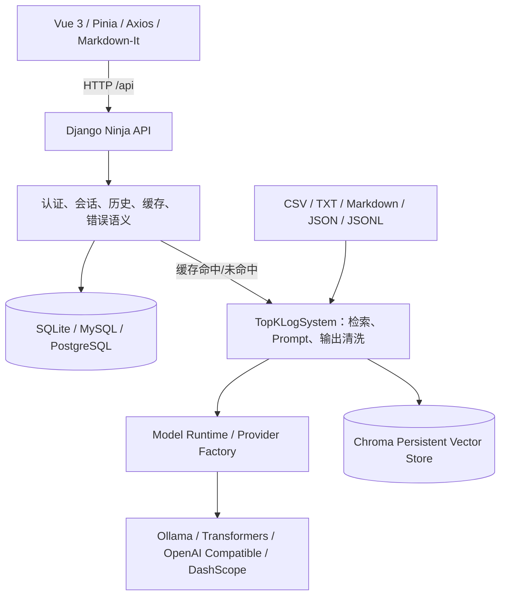

# 智能故障日志分析系统：简历呈现与面试素材

> 对应岗位：数据平台前端产品与 Agent 应用全栈研发
>
> 依据：[`job_description.md`](./job_description.md)、[`development_plan.md`](./development_plan.md)、[`project_interview_guide.md`](./project_interview_guide.md)

## 0. 使用边界

本文档按当前仓库和开发计划整理，适合用于简历项目描述、面试自我介绍和技术追问准备。

- “已实现”以当前代码和测试证据为准；
- “规划”表示愿景，不应写成已经上线的能力；
- 个人负责内容、团队规模、线上用户数和业务收益需要根据真实经历补充；
- 项目当前是 RAG 驱动的智能分析应用，不应描述为已经具备 Tool Calling、Workflow 或 Multi-Agent 协作的完整 Agent 系统。

## 1. 简历上一句话介绍

**基于 Vue 3、Django Ninja、LlamaIndex、Chroma 和 Ollama 的智能故障日志分析系统，通过 RAG 检索历史日志并生成结构化诊断，支持多模型 Provider、多用户会话、缓存和并发一致性治理，形成从 Web 交互到模型服务的全栈闭环。**

## 2. 可直接改写到简历的项目描述

### 2.1 项目定位

项目面向开发、运维和平台支持人员，将“搜索历史日志—判断故障原因—整理排查步骤”的人工流程转化为 Web 对话式诊断流程。用户输入故障现象或日志问题后，系统从项目日志知识库召回相似案例，再由大模型结合证据生成诊断、原因、排查步骤、临时缓解和最终修复建议。

### 2.2 简历项目要点（按个人实际分工取舍）

- 设计并实现 Vue 3 + Django Ninja 的前后端闭环，覆盖登录、会话管理、历史消息、模型选择、错误提示和 Markdown 展示；
- 基于 LlamaIndex + Chroma 搭建可持久化 RAG Pipeline，支持 CSV、TXT、Markdown、JSON/JSONL 日志读取、Embedding、Top-K 召回和 Prompt 组装；
- 抽象 Transformers、Ollama、OpenAI Compatible、DashScope 等模型 Provider，将 LLM 与 Embedding 解耦，并通过 `(provider, model, endpoint)` 有界缓存避免并发请求修改全局模型状态；
- 通过 Session/History 外键、事务、会话行锁、单调序号和 `message_id` 幂等，解决多用户会话串线、重复写入和孤立历史问题；
- 建立 50 条固定评测集和自动化基线：Recall@5=0.95、Recall@10=0.95、MRR@10=0.8646，API 成功率和五段回答结构通过率均为 100%；
- 建立 Ruff、ESLint、Prettier、Vitest、Playwright、Django Test 和 pre-commit 质量门禁，后端测试 62/62 通过，核心后端模块行覆盖率 88%。

以上表述中的“设计并实现”“解决”应替换为个人真实参与范围；如果只独立完成其中一部分，应改为“参与实现”或明确具体模块。

### 2.3 30 秒面试介绍

这是一个智能故障日志分析系统，核心是把日志检索和大模型生成结合起来。前端用 Vue 3 和 Pinia 管理登录、会话和消息状态，后端用 Django Ninja 提供认证、会话、历史、模型选择和聊天 API。聊天请求会先使用 Embedding 在 Chroma 中召回相似日志，再把日志证据、相关历史和用户问题组装成 Prompt，调用本地 Ollama 或其他 Provider，最后将回答清洗为固定的五段 Markdown。后续计划是在现有 RAG Pipeline 上增加证据阈值、结构化输出、流式体验、可观测性和只读 Agent 工具，但这些不应说成当前已完成。

## 3. 与 JD 的对应关系

| JD 方向            | 项目中的可证明内容                                             | 面试表达重点                                                      |
| ------------------ | -------------------------------------------------------------- | ----------------------------------------------------------------- |
| Web 前端与全栈闭环 | Vue 3、Vite、Pinia、Axios、Django Ninja、Django ORM            | 能从页面状态、HTTP API 到数据库和模型调用完整定位问题             |
| Agent 应用基础     | RAG、Prompt 组装、历史选择、模型 Provider、输出清洗            | 诚实说明当前是 RAG 应用，Agent Workflow/Tool Calling 属于后续演进 |
| 数据分析场景       | CSV 日志、Embedding、Chroma、Top-K、Recall/MRR/NDCG 评测       | 能解释数据来源、检索指标和证据链，而不只展示聊天效果              |
| 性能与架构升级     | 持久化索引、模型实例缓存、回复缓存、事务和并发控制             | 说明为什么优化，以及如何用基线和回归测试证明没有退化              |
| 工程质量           | 配置契约、迁移、Mock/Fake Provider、单元/API/E2E 测试、CI 门禁 | 能描述可重复安装、测试隔离、错误语义和发布前质量门槛              |

## 4. 项目架构

### 4.1 分层架构



### 4.2 请求链路

```text
用户问题
  → Axios 注入 Bearer Token
  → Django Ninja 校验请求和用户
  → Session 行锁 + 读取该会话 History
  → auto/on/off 选择相关历史
  → 生成完整缓存身份并查询回复缓存
  → Query Embedding + Chroma Top-K 检索
  → 组装系统 Prompt、日志证据、历史和问题
  → Provider Factory 获取 LLM 实例并生成
  → 章节白名单、长度/条数限制和 Markdown 模板清洗
  → 写入 History、更新 Session、返回前端
```

### 4.3 主要代码职责

| 模块                                                       | 主要职责                                           |
| ---------------------------------------------------------- | -------------------------------------------------- |
| `frontend/vue_frontend/src/views`                          | 登录页、聊天页和页面编排                           |
| `frontend/vue_frontend/src/components`                     | 侧边栏、消息区、输入框和消息渲染                   |
| `frontend/vue_frontend/src/stores`                         | 认证、会话、消息、模型和全局 UI 状态               |
| `frontend/vue_frontend/src/api`                            | Axios 实例、Token 注入、接口封装和错误映射         |
| `backend/django_backend/deepseek_api/api.py`               | Django Ninja 路由、认证、事务和 HTTP 响应          |
| `backend/django_backend/deepseek_api/services.py`          | 历史选择、模型调用、回复缓存和用户模型偏好         |
| `backend/django_backend/deepseek_api/models.py`            | APIKey、Session、History、RateLimit 和模型配置     |
| `backend/django_backend/topklogsystem.py`                  | 日志加载、向量索引、检索、Prompt 和回答清洗        |
| `backend/django_backend/llm_provider_factory.py`           | LLM/Embedding Provider 构建和适配                  |
| `backend/django_backend/deepseek_project/model_runtime.py` | Provider/model/endpoint 维度的线程安全有界实例缓存 |
| `backend/django_backend/config`                            | LLM、数据库、系统 Prompt 和回答模板规范配置        |

## 5. 关键实现细节

### 5.1 前端状态和交互

- `auth` Store 保存当前登录状态；Axios 请求拦截器统一注入 Bearer Token，响应遇到 401 时清理状态并回登录页；
- `chat` Store 管理会话列表、当前会话和按会话分组的消息；LocalStorage 仅作为用户隔离的体验缓存，后端数据库仍是真值来源；
- 点击新建会话时先使用 `temp:new_chat` 临时 ID，用户发送第一条消息后再创建真实 Session，避免产生大量空会话；
- 聊天、会话加载、模型加载和错误状态已有测试覆盖；长会话虚拟列表、流式 Token 合并和请求取消仍在规划中；
- 模型输出通过 Markdown-It 展示，当前默认不打开原始 HTML，生产环境仍应增加显式 HTML 白名单清洗。

### 5.2 API、认证与数据模型

当前接口覆盖注册、登录、Refresh Token、聊天、Session/History、Provider/本地模型查询、模型偏好和外部兼容模型配置。登录成功后 Access Token 放在 `Authorization` 响应头，Refresh Token 写入 HttpOnly Cookie。

核心一致性设计：

- `Session.user` 使用 Django User 外键，`History.session` 使用 ForeignKey 并级联删除；
- 同一 Session 的聊天请求在事务中获取行锁，使用单调 `sequence` 保证顺序；
- 客户端可携带 `message_id`，重复请求返回已有结果，避免网络重试生成重复 History；
- History API 返回记录 ID、时间和 `(created_at, id)` 复合游标，并兼容旧 ID 游标；
- API 错误统一为 `code`、兼容字段 `error` 和可选 `details`，前端可以区分认证、校验、限流、模型不可用和内部错误。

### 5.3 RAG 和模型 Provider

1. **数据加载**：扫描配置中的日志目录，支持 CSV、TXT、Markdown、JSON 和 JSONL；CSV 以 1000 行为一批读取，再转换为 LlamaIndex `Document`。
2. **索引复用**：Chroma 使用持久化目录；集合名称按 Embedding 模型派生，已有向量时直接复用，空集合才触发构建。
3. **检索生成**：用户问题通过 Embedding 转为向量，召回默认 Top-K=10 的相似日志；检索结果、用户问题和相关历史共同进入 Prompt。
4. **Provider 抽象**：对话模型和 Embedding 模型可独立配置，支持 Transformers、Ollama、OpenAI Compatible 和 DashScope；用户模型选择通过显式参数传入，不再在请求期间修改全局 LlamaIndex Settings。
5. **输出约束**：系统 Prompt 和 `response_template.md` 约束回答包含“问题诊断、可能原因、建议的排查步骤、临时缓解措施、最终修复建议”五个章节；服务端还限制章节数量、单条长度和重试次数。

### 5.4 历史选择和缓存

- `auto` 模式从最近 8 轮历史中选候选，使用 Embedding 余弦相似度筛选 Top 3，阈值默认 0.25，Embedding 不可用时回退到词集合重叠率；
- Prompt 历史预算默认约 1000 Token，当前以字符数做保守近似，后续应改为模型 tokenizer 精确计数；
- 回复缓存键使用 SHA-256，绑定用户、Session、完整 Prompt、历史、Provider、模型、生成参数、Prompt/Index/Cache 版本和命名空间；
- 缓存默认 TTL 为 3600 秒，只缓存成功且非空的字符串；更新 Prompt 或知识库时可轮换命名空间批量逻辑失效。

### 5.5 配置和工程质量

- LLM 与数据库分别使用跟踪的 `*.yaml.example` 作为配置契约，本地配置和密钥文件被 Git 忽略；
- 支持 SQLite、MySQL 和 PostgreSQL，配置值支持环境变量展开；
- 测试默认使用独立 Django 测试数据库、Fake LLM/Embedding 和临时运行目录，不访问真实模型、生产数据或外部网络；
- 使用 Ruff、ESLint、Prettier 和 pre-commit，前端通过 Vitest/Playwright，后端通过 Django Test 和覆盖率报告。

## 6. 数据来源与评测证据

### 6.1 知识库来源

当前仓库数据不是生产业务日志，主要包括：

| 来源                        | 文件/规模                                                                                                                                                    | 用途和注意事项                                                                  |
| --------------------------- | ------------------------------------------------------------------------------------------------------------------------------------------------------------ | ------------------------------------------------------------------------------- |
| 项目内生成或整理的故障日志  | `20200.csv`、`java_error_deepseek.csv`、`linuxcomand_error_deepseek.csv`、`python_error_deepseek.csv`、`python_error_doubao.csv`，M0 基线实际索引约 1,708 条 | 覆盖通用服务、Java、Linux 命令和 Python 故障；适合固定回归，不代表生产分布      |
| Kaggle/公开计算机事件数据   | `windows_event_log.csv` 约 669,853 行、`Computer_events.csv` 约 19,063 行、精简版约 18,316 行                                                                | 提供 Windows/计算机事件样本；完整与精简数据可能重复，尚未完成统一 Schema 和去重 |
| Kaggle/公开 Python 修复数据 | `python_bug_fix_pairs.csv` 约 6,237 行                                                                                                                       | 提供 Python Bug/Fix 对，用于扩充故障原因和修复语料                              |

索引构建当前仍以“每行转文本”的原型方式为主，尚未稳定保存 `source_file`、`source_row`、服务名、级别和错误码等 Metadata。后续 M4 计划升级为统一日志 Schema、稳定文档 ID、增量索引和来源引用。

### 6.2 M0 固定评测集

- 50 条查询，覆盖 Python、Java、Linux 命令、Windows 事件和通用服务五类；
- 40 条正样本绑定相关日志 ID，10 条 Windows 负样本没有知识库直接证据；
- 检索基线：Recall@1=0.80、Recall@5=0.95、Recall@10=0.95、MRR@10=0.8646、NDCG@10=0.9337；
- API 基线：50/50 成功，回答五段结构通过率 100%，缓存重复请求约 19.82ms 且回答一致；
- 性能基线：索引复用启动约 4.88s，1,708 条索引构建约 28.06s，构建峰值 RSS 177,876 KiB；
- 负样本明确拒答率为 0%，说明当前系统仍会在缺少证据时生成看似确定的诊断，这是后续 M4/M5 最重要的质量问题。

评测详情见 [`evaluation/m0/baseline_report.md`](../evaluation/m0/baseline_report.md) 和 [`development_plan.md`](./development_plan.md)。

## 7. 项目现状与后续愿景

### 7.1 当前已完成或已有证据

- M0：完成固定数据集、环境清单、检索/API/索引/启动基线和 AI 辅助评测；
- M1：测试基础设施、配置治理和质量门禁已完成本地验收，后端 62/62 测试通过，等待 CI 分支保护等平台配置；
- M2：模型实例隔离、Session/History 一致性、缓存正确性和错误语义已实现并测试；
- 当前剩余的核心工程项包括实际限流接入、共享缓存/真实数据库并发压测、外部模型密钥保护和 SSRF 防护。

### 7.2 规划中的演进路线

```text
M0 基线与评测
  → M1 测试与配置治理
  → M2 正确性、并发与数据一致性
  → M3 认证、安全和自定义模型闭环
  → M4 数据 Schema、索引版本和检索质量
  → M5 Prompt、结构化输出和证据评测
  → M6 流式、缓存和性能优化
  → M7 可观测性、部署和故障降级
  → M8 只读工具与 Agent Workflow
  → M9 Multi-Agent 对照实验
```

面试中可以把愿景表述为：先用固定评测集把 RAG 正确性和安全边界做实，再增加工具调用和 Agent Workflow；工具第一阶段只允许查询日志、指标、发布记录和服务依赖，不允许模型直接执行 Shell 或生产写操作。

## 8. 本项目的不足

### 8.1 数据和质量不足

- 数据主要来自公开数据集和生成样本，没有生产日志、用户反馈或一次解决率等业务闭环；
- 完整/精简数据可能重复，日志尚未统一为结构化 Schema，也没有完整来源 Metadata；
- 当前无证据负样本明确拒答率为 0%，存在幻觉式确定性诊断和危险建议；
- 当前回答主要依赖 Markdown 模板和 Sanitizer，尚未完成原生 JSON Schema 结构化输出、引用校验和证据阈值；
- 质量评分包含 AI 辅助评审，不能等同于真实两名专家的生产级标注。

### 8.2 架构和性能不足

- CSV 虽然分块读取，但最终仍将所有行构造成内存中的 `Document` 列表，大规模增量索引能力有限；
- 当前索引缺少稳定来源 Metadata，无法可靠返回文件、行号和数据版本；
- 启动预热会提前加载模型和索引，缩短首请求等待但增加启动时间和内存；
- 当前没有流式输出，用户要等完整模型生成结束后才能看到回答；
- 默认 LocMemCache 只适合单进程开发，尚未用 Redis 等共享缓存完成多进程一致性和击穿压测；
- 目前没有真实生产数据库矩阵和 20 并发下的端到端压测；
- 前端仍使用 JavaScript，初始 JS 包约 2.65 MB，构建存在大 chunk 警告。

### 8.3 安全和产品不足

- 外部模型 API Key 当前仍需完成加密存储、轮换和脱敏闭环；
- 限流模型已定义但实际聊天链路尚未完整接入；
- SSRF、外部 URL 重定向、模型连通性探测和外部 Provider 的安全边界仍需 M3 完成；
- Markdown 输出虽然默认不启用原始 HTML，但生产环境仍应加入显式 HTML 清洗和内容安全策略；
- 没有日志实时采集、告警、工单、CMDB 或监控平台集成，不能直接替代生产运维系统；
- 尚未实现正式 Workflow、Tool Calling、Agent 自主规划或 Multi-Agent 协作，也没有数据可视化分析页面。

### 8.4 面试中的诚实回答模板

> 当前项目的优势是完成了一个可运行、可评测、覆盖前后端和模型服务的 RAG 闭环，并进一步处理了模型实例隔离、会话一致性、缓存键和错误语义等工程问题。它的主要不足是还没有生产数据和真实业务收益证明，负样本拒答能力不足，外部模型安全、共享缓存、流式体验和 Tool Calling 仍在后续里程碑中。我会先用固定评测集和证据引用把正确性做稳，再逐步开放只读工具和 Agent Workflow。

## 9. 面试前需补充的个人信息

下列内容无法仅从仓库推断，建议在简历提交前补齐：

- 个人负责的模块、代码量和关键技术决策；
- 是否独立完成前端、后端、RAG 或测试中的某一部分；
- 项目开发周期、协作者和代码评审方式；
- 实际使用的 GPU/CPU、模型推理成本和部署环境；
- 真实用户数量、平均排障耗时变化、采纳率或满意度；
- 最有代表性的一个线上/演示故障案例及其排查过程。
