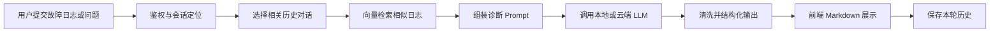
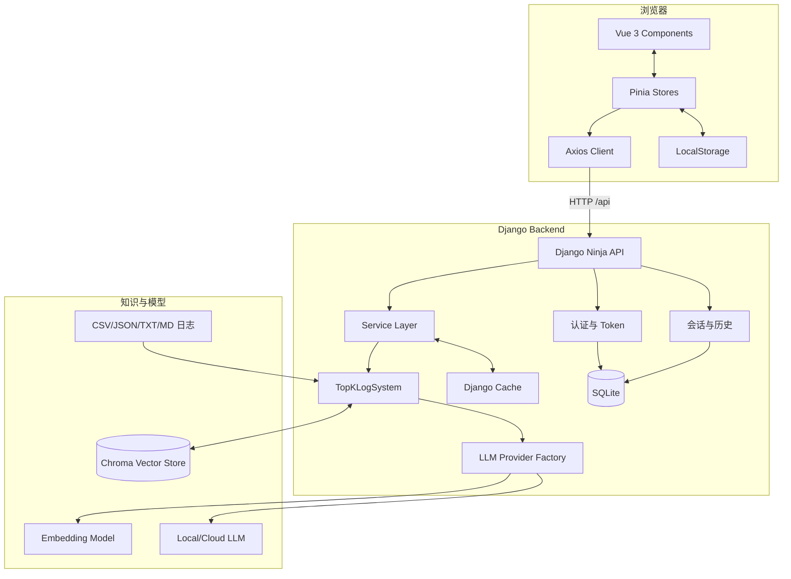
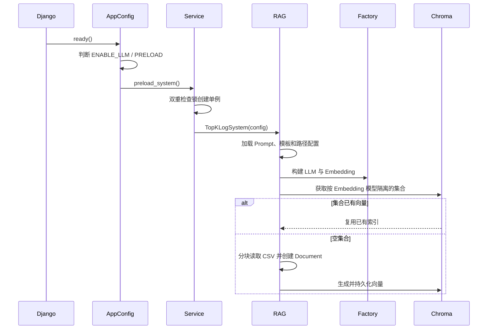
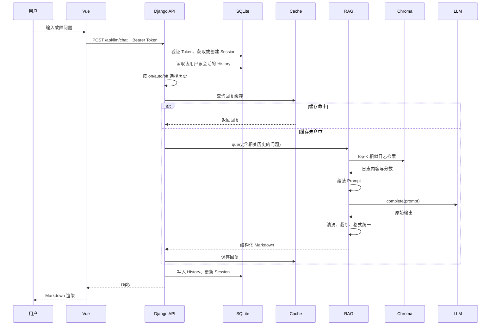
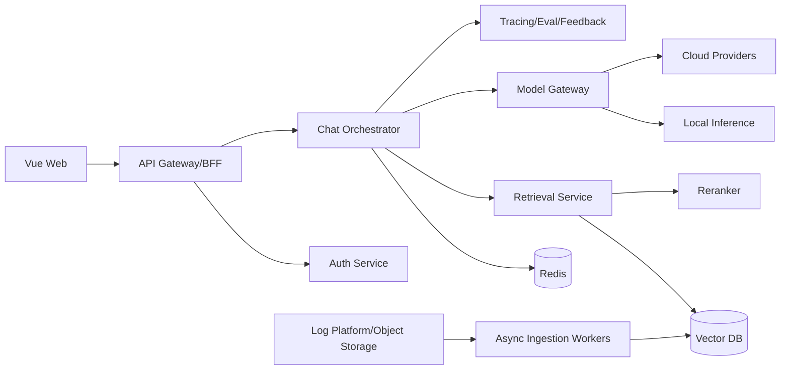
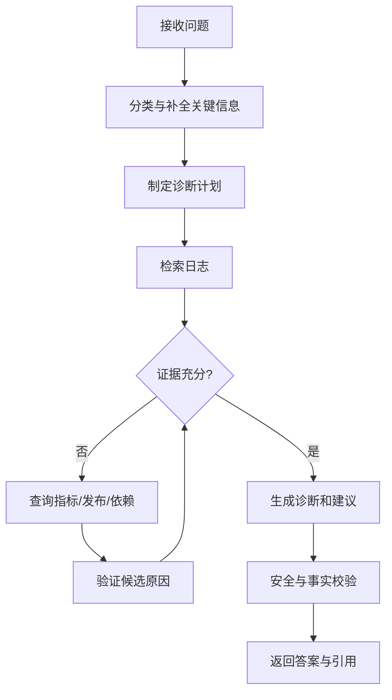

# 智能故障日志分析项目：面试拆解与准备指南

> 适用岗位：数据平台前端产品与 Agent 应用全栈研发实习生
> 对照职位描述：[`job_description.md`](./job_description.md)
> 项目原始要求：[`智能数据分析任务书-2025 V4.pdf`](./智能数据分析任务书-2025%20V4.pdf)

## 0. 文档使用说明

本文档用于准备项目面试，不是对项目的宣传材料。回答面试问题时，应严格区分以下三类信息：

- **仓库事实**：能够从当前代码、配置、数据文件或提交历史中直接验证。
- **合理推断**：可以根据提交顺序还原开发背景，但不应描述成已被量化验证的事实。
- **个人信息待补充**：个人分工、实际投入、线上效果、团队协作等无法仅从仓库判断，需要结合真实经历补全。

项目最准确的定位是：

> 一个基于 Vue 3、Django Ninja、Chroma 和大模型的全栈 RAG 故障日志诊断系统。它实现了日志知识检索、Prompt 组织、多轮会话、结构化诊断和多模型 Provider 适配，属于 Agent 应用的前置实践，但当前并不是包含规划、工具执行和多 Agent 协作的完整 Agent 系统。

面试时不要把以下内容说成已经实现：

- Workflow 编排；
- Tool Calling；
- Multi-Agent；
- 图表类数据可视化；
- 完整的线上监控、自动化测试和评测平台；
- 已被数据证明的故障解决效率提升。

---

## 1. 项目速览

### 1.1 一句话介绍

该项目让用户通过 Web 对话界面提交故障日志或排障问题，后端先从历史日志知识库中检索相似记录，再让大模型结合检索结果生成结构化的故障诊断、可能原因、排查步骤和修复建议。

### 1.2 30 秒项目介绍

这是一个智能故障日志分析系统。前端使用 Vue 3、Pinia 和 Naive UI，后端使用 Django 5 与 Django Ninja。用户输入故障信息后，系统会通过 Embedding 和 Chroma 向量数据库召回 Top-K 条相似日志，将日志上下文、相关对话历史和用户问题拼成 Prompt，再调用本地 Ollama、Transformers 或云端兼容 API 生成结构化诊断。项目还实现了用户认证、会话历史、Markdown 展示、索引持久化和模型 Provider 抽象。

### 1.3 2 分钟项目介绍

项目要解决的问题是：传统故障排查依赖工程师人工搜索日志、匹配历史案例并整理排查步骤，过程耗时，而且经验难以复用。我们将这个过程拆成“检索”和“生成”两部分。

在检索侧，系统读取 CSV 等日志数据，将每条日志转成文档，通过 Embedding 模型生成向量并存入 Chroma。收到用户问题后，使用同一个 Embedding 模型进行相似度检索，召回最相关的日志记录。为了减少重复启动成本，向量索引会持久化，并根据 Embedding 模型名称隔离集合。

在生成侧，系统把召回日志、当前问题、相关对话历史、系统 Prompt 和 Markdown 回答模板拼装后交给大模型。模型输出还会经过白名单章节提取、条数限制、长度限制和格式统一，最终稳定为故障诊断、可能原因、排查步骤、临时措施和最终修复建议五部分。

全栈层面，前端负责登录、会话、消息状态、模型选择和 Markdown 渲染；后端负责认证、会话持久化、模型适配和 RAG 调用。项目的亮点是完成了从前端到大模型服务的完整闭环，并针对硬件限制、多模型接入、多轮历史污染和索引重复构建做了工程优化。当前不足是检索评测、并发模型隔离、自定义模型接入和生产级安全仍需完善。

### 1.4 项目输入与输出

| 项目     | 内容                                                                  |
| -------- | --------------------------------------------------------------------- |
| 主要输入 | 故障日志、异常信息、自然语言排障问题                                  |
| 知识来源 | 项目内 CSV 日志、Kaggle 数据集、生成的 Python/Java/Linux 命令故障数据 |
| 中间产物 | Query Embedding、Top-K 相似日志、相关历史片段、组合 Prompt            |
| 最终输出 | 问题诊断、可能原因、排查步骤、临时缓解措施、最终修复建议              |
| 交互形式 | 多会话 Web 聊天界面                                                   |

### 1.5 技术栈

| 层级 | 技术                                                               |
| ---- | ------------------------------------------------------------------ |
| 前端 | Vue 3、Vite、Pinia、Vue Router、Axios、Naive UI、Markdown-It       |
| API  | Django 5、Django Ninja、Django ORM                                 |
| RAG  | LlamaIndex、LangChain Adapter、ChromaDB                            |
| 模型 | Transformers、Ollama、OpenAI 兼容 API、DashScope                   |
| 存储 | SQLite、Chroma Persistent Store、浏览器 LocalStorage、Django Cache |
| 数据 | Pandas、CSV/JSON/Markdown/TXT 日志文件                             |

---

## 2. 业务背景与项目目的

### 2.1 原始业务问题

故障日志通常存在以下痛点：

1. 日志数量大、格式不统一，直接依赖关键词搜索容易漏掉语义相近但措辞不同的历史问题。
2. 故障原因可能跨服务、组件和环境，使用者需要具备较强经验才能完成归因。
3. 历史案例分散在日志、文档和个人经验中，不易复用。
4. 通用大模型虽然能够解释错误，但缺少企业或项目内部日志上下文，容易给出泛化甚至错误建议。
5. 大模型输出格式不稳定，不便于业务人员快速定位结论和执行排查步骤。

### 2.2 目标用户

当前项目没有显式用户研究，按功能可以推断目标用户包括：

- 需要快速定位故障的一线开发工程师；
- 运维、SRE 或平台支持人员；
- 对某一技术栈经验不足、需要历史案例辅助的开发者；
- 教学场景中学习 RAG 与大模型系统集成的学生。

面试时应表述为“目标用户推断”，不要声称做过正式用户访谈。

### 2.3 核心业务流程



### 2.4 为什么不能只调用大模型

直接调用通用大模型存在四个问题：

- **缺少私有知识**：模型未必见过项目内部日志和具体故障案例。
- **知识时效性有限**：模型参数中的知识不能随日志数据实时更新。
- **可解释性不足**：用户无法判断回答是否参考了真实历史案例。
- **幻觉风险**：缺少证据约束时，模型可能生成听起来合理但无法验证的原因。

RAG 的作用不是让模型“记住”日志，而是在每次回答前动态寻找相关证据并放入上下文。

### 2.5 业务收益应如何衡量

当前项目没有保存以下指标，面试中应将其作为未来评测方案：

| 指标层级 | 可选指标                                | 含义                                 |
| -------- | --------------------------------------- | ------------------------------------ |
| 检索     | Recall@K、MRR、NDCG                     | 正确历史案例是否被召回、排序是否靠前 |
| 生成     | 原因命中率、步骤可执行率、事实一致性    | 最终诊断是否正确且可执行             |
| 系统     | 首 Token 延迟、总响应时间、索引构建时间 | 用户等待成本和系统性能               |
| 业务     | 平均定位时间、一次解决率、人工搜索次数  | 是否真正提升排障效率                 |
| 体验     | 用户采纳率、满意度、追问率              | 输出是否清晰、是否需要反复沟通       |

---

## 3. 基础概念

### 3.1 大语言模型（LLM）

大语言模型根据输入 Token 序列预测后续 Token。在本项目中，它不负责从全部日志中直接搜索，而是负责阅读已经召回的少量日志上下文并生成诊断结论。

关键参数：

- `temperature`：控制随机性；故障诊断通常倾向较低随机性。
- `top_p`：只从累计概率达到阈值的候选 Token 中采样。
- `max_new_tokens`：限制最大生成长度。
- `repetition_penalty`：减少重复内容。

### 3.2 Token 与上下文窗口

模型处理的是 Token，不是字符。上下文窗口同时容纳系统 Prompt、历史对话、检索日志和模型输出。

本项目通过以下方式控制上下文：

- 只从最近若干轮历史中选择相关片段；
- 限制最多使用的历史轮数和 Top-K；
- 用字符数近似 Token 数进行截断；
- 限制回答章节、条数和单条长度。

当前字符估算只是工程近似，不等同于模型真实分词。生产环境应使用对应模型的 tokenizer 精确计数。

### 3.3 Embedding

Embedding 将文本映射到高维向量，使语义相近的文本在向量空间中距离更近。

本项目中 Embedding 有两个用途：

1. 将知识库日志向量化，用于日志检索；
2. 将当前问题与历史对话向量化，用于选择相关历史。

Embedding 模型一旦变化，向量维度和语义空间也可能变化，因此已有 Chroma 索引通常需要重建。

### 3.4 余弦相似度

余弦相似度关注两个向量方向是否一致：

\[
\cos(\theta)=\frac{A\cdot B}{\|A\|\|B\|}
\]

值越大通常表示语义越相近。本项目在历史选择阶段显式计算余弦相似度；日志检索则由 LlamaIndex 和 Chroma 的 Retriever 完成。

### 3.5 向量数据库与 Chroma

向量数据库存储文本向量，并支持近似最近邻检索。Chroma 在本项目中负责：

- 持久化日志向量；
- 按集合隔离不同 Embedding 模型生成的索引；
- 根据 Query 向量召回相似日志；
- 让系统重启后复用已有索引。

### 3.6 Top-K 检索

Top-K 表示取相似度最高的 K 条记录。

- K 太小：可能漏掉正确案例；
- K 太大：引入噪声、占用上下文、增加延迟；
- 合理做法：用标注查询集比较不同 K 下的 Recall@K 和生成质量，而不是凭感觉设置。

当前代码默认使用 10，但配置模板写的是 `RESPONSE_TOP_K`，核心检索实现读取的是 `TOP_K`，存在配置不一致。

### 3.7 RAG

RAG 即 Retrieval-Augmented Generation，基本流程为：

```text
数据加载 → 文本处理 → Embedding → 向量索引
用户 Query → Query Embedding → 相似检索 → Prompt 组装 → LLM 生成
```

它与微调的区别：

| 对比项   | RAG                  | 微调                   |
| -------- | -------------------- | ---------------------- |
| 主要目的 | 动态注入知识         | 调整模型行为或能力     |
| 更新知识 | 更新索引即可         | 通常需要重新训练       |
| 可追溯性 | 可以返回检索证据     | 参数知识较难追踪       |
| 成本     | 需要检索和上下文成本 | 需要训练与模型维护成本 |
| 本项目   | 已采用               | 未采用                 |

### 3.8 Prompt Engineering

本项目的 Prompt 包含：

- 角色：资深日志分析助手；
- 任务：输出结构化分析报告；
- 约束：不输出代码、限制条数和长度；
- 日志上下文；
- 当前问题；
- Markdown 回答模板。

Prompt 负责“引导”，后处理负责“兜底”。仅靠 Prompt 无法保证模型百分之百遵守格式，因此代码又增加了输出白名单和标准化。

### 3.9 多轮对话与记忆

多轮对话不等于将全部历史永久拼接。全部拼接会产生：

- 上下文快速膨胀；
- 无关旧问题干扰当前问题；
- 成本和延迟增加；
- 历史中的错误答案被重复放大。

本项目支持：

- `on`：最近若干轮全部注入；
- `off`：完全不注入；
- `auto`：对候选历史进行相关性筛选。

### 3.10 缓存

缓存用于避免对同一用户、同一会话、同一 Prompt 重复调用模型。

当前缓存键包含用户、会话和 Python `hash(prompt)`。这能够降低重复请求成本，但存在进程间不稳定、哈希碰撞、默认本地缓存无法跨实例共享等问题。生产环境更适合使用 SHA-256 稳定键和 Redis。

### 3.11 Provider 抽象

Provider 抽象将业务流程与具体模型厂商解耦。当前工厂支持：

- Transformers：进程内加载 Hugging Face 模型；
- Ollama：调用本地 Ollama 服务；
- OpenAI Compatible：调用实现 OpenAI 协议的远端服务；
- DashScope：对话走兼容接口，Embedding 使用专门适配。

### 3.12 Agent、Workflow、Tool Calling 与 Multi-Agent

| 概念         | 含义                                     | 当前项目状态         |
| ------------ | ---------------------------------------- | -------------------- |
| RAG 应用     | 检索知识后生成回答                       | 已实现               |
| Agent        | 模型根据目标进行规划、选择动作并循环执行 | 未完整实现           |
| Workflow     | 预定义或动态编排多个处理节点             | 未实现正式工作流引擎 |
| Tool Calling | 模型以结构化参数调用外部函数或 API       | 未实现               |
| Multi-Agent  | 多个角色 Agent 协作、交接或辩论          | 未实现               |

如果面试官问“这是不是 Agent”，推荐回答：

> 严格来说当前版本是 RAG 驱动的智能分析应用，而不是完整 Agent。它已经具备模型调用、知识检索、会话记忆和结构化输出等 Agent 基础组件，但检索流程仍由程序固定执行，模型不能自主选择工具、制定计划或迭代验证结果。

---

## 4. 总体架构

### 4.1 系统边界

系统负责：

- 用户注册、登录和 Token 校验；
- 多会话管理与历史保存；
- 本地日志知识库索引和语义检索；
- 多种 LLM/Embedding Provider 适配；
- Prompt 组装、模型调用与输出清洗；
- Web 端交互和 Markdown 展示。

系统暂不负责：

- 实时采集生产环境日志；
- 日志流式处理和告警；
- 自动执行修复命令；
- 工单系统、监控平台或 CMDB 集成；
- Agent 工具权限管理与执行沙箱；
- 生产级多租户和审计。

### 4.2 组件架构



### 4.3 代码结构与职责

| 路径                                              | 主要职责                            |
| ------------------------------------------------- | ----------------------------------- |
| `frontend/vue_frontend/src/views`                 | 登录页和聊天主页面                  |
| `frontend/vue_frontend/src/components`            | 侧边栏、消息区、输入框、消息渲染    |
| `frontend/vue_frontend/src/stores`                | 认证、会话、模型和全局 UI 状态      |
| `frontend/vue_frontend/src/api`                   | Axios 实例和接口封装                |
| `backend/django_backend/deepseek_api/api.py`      | Django Ninja 路由与请求编排         |
| `backend/django_backend/deepseek_api/services.py` | Token、缓存、历史选择和模型调用服务 |
| `backend/django_backend/deepseek_api/models.py`   | 数据库模型                          |
| `backend/django_backend/topklogsystem.py`         | RAG 主流程                          |
| `backend/django_backend/llm_provider_factory.py`  | LLM 与 Embedding Provider 构建      |
| `backend/django_backend/config`                   | Prompt、回答模板和配置生成脚本      |
| `backend/django_backend/data/log`                 | 日志知识数据                        |

### 4.4 数据存储划分

| 数据                  | 存储位置               | 原因                        |
| --------------------- | ---------------------- | --------------------------- |
| Django 用户与密码哈希 | SQLite/Django Auth     | 关系数据和框架内置认证能力  |
| Access/Refresh Token  | `APIKey` 表            | 需要过期校验和用户关联      |
| 会话列表              | `Session` 表           | 支持用户隔离和更新时间排序  |
| 每轮对话              | `History` 表           | 结构化读取和分页            |
| 用户模型偏好          | `UserLLMPreference` 表 | 每个 Token 用户一份模型配置 |
| 外部模型配置          | `ExternalLLMAPI` 表    | 保存用户自定义接口信息      |
| 日志向量              | Chroma                 | 支持语义近邻检索            |
| 前端当前 Token        | LocalStorage           | 页面刷新后保持登录状态      |
| 前端会话状态          | Pinia + LocalStorage   | 响应式 UI 和本地回退        |
| 重复回复              | Django Cache           | 减少重复 LLM 调用           |

### 4.5 启动流程



启动预热的收益是避免第一个用户承担完整模型和索引初始化成本；缺点是服务启动时间变长、内存占用提前发生。代码通过 Django 自动重载子进程判断，尽量避免开发模式加载两次。

### 4.6 聊天请求时序



---

## 5. 前端架构与实现

### 5.1 页面和组件

- `Login.vue`：登录与注册表单；从响应头读取 Bearer Token。
- `Chat.vue`：聊天页面总体布局。
- `SideBar.vue`：会话列表、新建/删除会话、模型选择、自定义模型管理、退出登录。
- `ChatArea.vue`：当前消息列表、加载状态、滚动到底部。
- `MessageInput.vue`：输入与提交控制。
- `ChatMessage.vue`：区分用户消息和模型消息，并渲染 Markdown。

### 5.2 为什么使用 Pinia

会话列表、当前会话、消息、Token 和模型选择会被多个组件共享。如果仅通过多层 `props` 和事件传递，会导致组件耦合和状态同步困难。

当前 Store 划分：

| Store   | 状态                                |
| ------- | ----------------------------------- |
| `auth`  | API Key                             |
| `chat`  | 当前会话、会话列表、各会话消息      |
| `model` | Provider、模型列表、用户模型偏好    |
| `app`   | Loading、错误信息、主题、初始化状态 |

### 5.3 新会话的延迟创建

点击“New Chat”时，前端只创建临时 ID `temp:new_chat`。用户发送第一条消息后才：

1. 取消息前七个字符作为显示名；
2. 使用时间戳构造真实 `session_id`；
3. 调用后端创建 Session；
4. 将临时消息状态迁移到真实 Session；
5. 再发送聊天请求。

收益：避免用户反复点击“新对话”产生大量空会话。

局限：

- 前七个字符不一定能准确表达主题；
- 长中文、Emoji 和特殊字符可能影响展示；
- 更好的方案是由模型异步生成标题，或由后端返回稳定 ID 和标题字段。

### 5.4 前端缓存与后端真值

初始化时前端优先请求后端会话列表。请求失败时，才回退到 LocalStorage 中的用户会话缓存。LocalStorage 的 Key 还包含 API Key，以避免不同登录用户在同一浏览器中读取到彼此的会话缓存。

后端数据库仍应是会话真值来源，LocalStorage 只是体验优化，不能代替权限校验。

### 5.5 Axios 拦截器

请求拦截器统一注入 Bearer Token，避免每个 API 函数重复编写认证逻辑。响应拦截器遇到 401 时清除 Token 并跳转登录页。

不足：

- 没有调用已有的 Refresh Token 接口进行静默刷新；
- Token 放在 LocalStorage 中，发生 XSS 时可能被读取；
- 更安全的生产方案通常是短期 Access Token 放内存、Refresh Token 放 HttpOnly Cookie，并加入单次刷新队列避免并发刷新风暴。

### 5.6 Markdown 渲染

机器人消息通过 Markdown-It 渲染，并使用 `v-html` 插入页面。代码还尝试集成 Highlight.js 进行代码高亮。

安全关注点：

- Markdown-It 默认不启用原始 HTML，能降低部分 XSS 风险；
- 如果未来打开 `html: true`，必须增加 DOMPurify 等白名单清洗；
- 模型输出属于不可信内容，不能因为来源是模型就跳过安全处理。

### 5.7 全局 Loading 的取舍

当前 `appStore.loading` 同时控制模型数据加载、会话加载和聊天发送。实现简单，但会让互不相关的请求相互阻塞。

改进方向：

- 拆分为 `chatSending`、`sessionLoading`、`modelLoading`；
- 每个会话维护独立的发送状态；
- 支持取消请求和重复提交去重；
- 流式响应时区分“连接中、生成中、完成、失败”。

### 5.8 浏览器渲染与前端性能

Vue 响应式状态变化后，会触发组件重新执行渲染逻辑并生成新的虚拟 DOM。Vue 比较新旧虚拟 DOM 后更新真实 DOM，浏览器再完成 Style、Layout、Paint 和 Composite。项目中需要关注：

- 消息列表持续增长会增加 DOM 节点和布局成本；
- `watch(messages, { deep: true })` 会深度观察整组消息；
- `v-for` 使用数组下标作为 Key，不利于稳定复用节点；
- 每次消息变化都滚动到底部，可能触发布局读取与写入交错；
- Markdown 内容变化会重新解析并更新 HTML；
- 非流式接口让首个可见结果延迟等于完整模型生成时间。

可采用的优化：

- History 使用稳定 ID 作为 Key；
- 长会话分页或虚拟滚动；
- 只监听消息数量或最后一条消息；
- 使用 `requestAnimationFrame` 合并滚动更新；
- 流式响应期间按时间片批量刷新文本，而不是每个 Token 都触发渲染；
- 对已完成 Markdown 结果做渲染缓存；
- 路由和非首屏组件按需加载。

### 5.9 JavaScript 与 TypeScript 取舍

当前前端使用 JavaScript。开发速度快，但 API 请求、消息结构和 Store 状态缺少编译期约束。例如 `HistoryItem`、`ChatMessage`、Provider 配置在前后端分别维护，字段变化容易造成运行时错误。

如果迁移到 TypeScript，可以：

- 从 OpenAPI 生成请求和响应类型；
- 为 Pinia State、Getter 和 Action 建立类型；
- 用联合类型约束 Provider；
- 用消息状态机描述 `pending/streaming/success/error`；
- 在编译阶段发现字段缺失和错误参数。

---

## 6. 后端 API 与数据模型

### 6.1 API 分组

| 方法            | 路径                    | 功能                                         |
| --------------- | ----------------------- | -------------------------------------------- |
| POST            | `/api/users/register`   | 注册用户                                     |
| POST            | `/api/users/login`      | 登录并返回 Access Token、设置 Refresh Cookie |
| POST            | `/api/refresh`          | 使用 Refresh Token 延长 Access Token 有效期  |
| POST            | `/api/llm/chat`         | 执行多轮 RAG 对话                            |
| GET             | `/api/sessions`         | 获取当前用户会话列表                         |
| POST            | `/api/sessions`         | 创建会话                                     |
| DELETE          | `/api/sessions`         | 删除会话                                     |
| GET             | `/api/sessions/history` | 获取结构化会话历史                           |
| DELETE          | `/api/sessions/history` | 清空会话历史                                 |
| GET             | `/api/llm/providers`    | 获取允许的 Provider                          |
| GET             | `/api/llm/local_models` | 获取本地模型列表                             |
| GET             | `/api/llm/my`           | 获取用户当前模型偏好                         |
| POST            | `/api/llm/select`       | 更新用户模型偏好                             |
| GET/POST/DELETE | `/api/llm/extern`       | 管理用户自定义兼容接口                       |

### 6.2 Django Ninja 的作用

Django Ninja 使用 Schema 描述请求与响应，提供参数校验、类型提示和 OpenAPI 文档，同时保留 Django ORM、认证和中间件生态。

项目选择它的合理性：

- 比传统 Django View 更适合 JSON API；
- 比完整 DRF 更轻量；
- 与 Pydantic 风格 Schema 接近；
- 能快速形成前后端闭环。

### 6.3 认证流程

注册使用 Django `create_user`，密码经过框架哈希存储。登录成功后：

1. `authenticate` 验证用户名和密码；
2. 创建或复用 `APIKey`；
3. Access Token 放在响应头 `Authorization`；
4. Refresh Token 放入 HttpOnly Cookie；
5. 受保护 Router 从请求头解析 Bearer Token；
6. 查询 `APIKey` 并校验过期时间。

当前 Token 是数据库可撤销的随机字符串，不是 JWT。优点是服务端可主动吊销；缺点是每次认证需要查数据库，且水平扩展时需要共享存储。

### 6.4 主要数据模型

#### APIKey

保存用户、Access Token、Access 过期时间、Refresh Token 和 Refresh 过期时间。

#### RateLimit

保存某 API Key 在时间窗口内的请求次数。但当前聊天认证流程没有调用 `check_rate_limit`，所以限流设计尚未真正生效。

#### Session

保存 `session_id + user` 唯一组合，以及创建和更新时间。会话列表按最近更新时间倒序返回。

#### History

每轮单独保存 `user_input` 和 `response`，相比旧版将所有历史拼成一个 TextField：

- 更容易分页；
- 更容易按轮筛选；
- 避免每次追加时重写整个上下文；
- 更方便后续增加 Token 数、模型、反馈和检索证据字段。

#### UserLLMPreference

保存用户选择的 Provider 和模型名称。

#### ExternalLLMAPI

保存用户自定义的 Base URL、模型名、API Key 和别名。当前以明文保存 API Key，不满足生产安全要求。

### 6.5 会话历史分页问题

后端支持 `before_id` 和 `after_id`，但响应只返回问答内容，没有返回 History ID，因此客户端无法可靠获得下一页游标。生产设计应返回：

- 每条 History 的 ID 和时间；
- `next_before_id` 或 `next_after_id`；
- `has_more`；
- 明确稳定排序规则。

### 6.6 会话删除问题

`Session` 与 `History` 只通过字符串字段关联，没有数据库 ForeignKey。删除 Session 时不会级联删除 History：

- 会留下孤立历史；
- 重新创建相同 Session ID 时可能看到旧历史；
- 无法依靠数据库保证引用完整性。

改进方案是让 `History.session` 使用 ForeignKey，并设置合适的 `on_delete` 策略。

---

## 7. 多轮历史选择

### 7.1 为什么增加相关性选择

最近历史不一定与当前问题有关。例如用户先讨论 Python 导包错误，随后切换到 Linux 权限问题。机械注入全部历史会让模型混淆故障域。

### 7.2 当前算法

配置默认值：

- 候选范围：最近 8 轮；
- 最大选中：3 轮；
- 相似度阈值：0.25；
- 历史预算：约 1000 Token；
- 默认模式：`auto`。

算法流程：

```text
取最近 N 轮历史
    ↓
将当前问题与每轮“用户问题 + 模型回复”向量化
    ↓
计算余弦相似度
    ↓
Embedding 不可用时使用词集合重叠率
    ↓
过滤低于阈值的历史
    ↓
按得分排序并取 Top-K
    ↓
按预算截断后加入当前 Prompt
```

### 7.3 优点

- 避免全部历史无限增长；
- 能找回不在最近一轮但语义相关的上下文；
- Embedding 不可用时仍有回退策略；
- 参数配置化，便于调优。

### 7.4 局限

- 只搜索最近八轮，早期的重要信息仍可能丢失；
- 将模型旧回答也加入相似度计算，可能强化错误回答；
- 没有识别指代关系，例如“这个错误”“继续刚才的方案”；
- 字符数近似 Token 不够准确；
- 选中历史按相似度排序后直接拼装，未恢复原始时间顺序；
- 相似度阈值没有通过数据集评测。

### 7.5 更好的方案

1. 先做问题改写，把带指代的追问改写为独立问题；
2. 同时保留最近一到两轮和语义检索结果；
3. 对长会话维护滚动摘要；
4. 将稳定用户事实与普通对话分开存储；
5. 使用 tokenizer 精确控制预算；
6. 通过标注数据评测不同阈值和候选范围。

---

## 8. RAG 数据与索引

### 8.1 数据规模

当前主要数据文件：

| 数据文件                             |   约行数 |    约大小 | 内容                           |
| ------------------------------------ | -------: | --------: | ------------------------------ |
| `windows_event_log.csv`              |  669,853 |     74 MB | Windows 事件日志               |
| `Computer_events.csv`                |   19,063 |    2.9 MB | 计算机事件详细字段             |
| `Computer_events_column_reduced.csv` |   18,316 |    2.0 MB | 精简字段事件数据               |
| `python_bug_fix_pairs.csv`           |    6,237 |    264 KB | Python Bug/Fix 对              |
| 其他生成日志                         | 约 1,700 | 约 196 KB | Python、Java、Linux 命令等错误 |

数据总量约 71 万条。由于同时保留完整和精简版 Computer Events，部分内容可能重复。

### 8.2 数据加载

支持扩展名：

- `.csv`；
- `.txt`；
- `.md`；
- `.json`；
- `.jsonl`。

CSV 每次以 1000 行为一个 Pandas Chunk 读取，但随后仍将全部行构造成内存中的 `Document` 列表。这里的分块主要降低单次 DataFrame 峰值，不能避免最终 Document 集合占用大量内存。

### 8.3 当前文档粒度

CSV 每行变成一个 Document；其他文件整文件变成一个 Document。

问题：

- CSV 行通过 `str(namedtuple)` 转换，列名和内容表达不够稳定；
- 整个 JSON 或 Markdown 作为单文档可能超过理想检索粒度；
- 没有保留文件名、行号、服务、错误级别等 Metadata；
- 无法在回答中展示证据来源；
- 数据重复会挤占 Top-K 名额。

### 8.4 索引持久化

系统以 Embedding 模型名称派生 Chroma Collection 名称，例如：

```text
log_collection_<embedding_model_slug>
```

启动时：

- 如果 Collection 已有向量，直接包装为 VectorStoreIndex；
- 如果为空，加载全部日志并构建索引。

收益：避免每次服务启动重复计算几十万条日志 Embedding。

局限：只判断向量数量是否大于零，无法识别：

- 数据文件增加、删除或修改；
- 文档切分策略改变；
- Embedding 配置维度变化但模型名未变化；
- 索引构建中途失败导致的半成品集合。

### 8.5 索引版本化改进

可以为索引计算版本指纹：

```text
Embedding Provider
+ Embedding 模型名和维度
+ 数据文件路径、大小、修改时间或内容哈希
+ 文档解析器版本
+ Chunk 策略
```

指纹变化时创建新 Collection，验证完成后原子切换别名，避免直接删除当前可用索引。

### 8.6 检索改进路线

推荐按以下顺序优化：

1. 数据清洗、去重、字段标准化；
2. 为 Document 保留服务、级别、来源、时间等 Metadata；
3. 使用领域化文本模板组织每条日志；
4. 增加相似度阈值，低相关时允许“无证据回答”；
5. 使用 BM25 + 向量检索的混合召回；
6. 使用 Cross-Encoder 或 LLM Reranker 重排序；
7. 在回答中返回引用日志；
8. 建立查询—正确日志标注集并评测 Recall@K/MRR。

---

## 9. Prompt 与输出控制

### 9.1 Prompt 组成

当前 Prompt 由四层组成：

1. 系统角色和任务约束；
2. 相关历史日志；
3. 当前问题及选中的会话历史；
4. 固定 Markdown 回答模板。

### 9.2 为什么既要 Prompt 又要后处理

Prompt 只能提高遵守格式的概率，不能提供强保证。不同模型、温度和上下文都可能导致：

- 标题名称变化；
- 增加多余总结；
- 列表条数超限；
- 回显系统提示；
- 输出为空或过短。

因此系统增加了确定性的 Sanitizer：

- 从“问题诊断”标题开始截取；
- 只保留五个白名单章节；
- 将标题别名映射为统一名称；
- 清理 Markdown 修饰和重复编号；
- 对内容去重；
- 限制章节条数和单条长度；
- 不足时补空占位。

### 9.3 Sanitizer 的代价

- 可能截断正确但较长的诊断；
- 非白名单信息会丢失；
- 补空行虽然格式稳定，但用户体验不佳；
- 基于正则解析 Markdown，面对复杂格式时比较脆弱；
- 输出“结构正确”不代表事实正确。

更可靠的方向是使用模型原生结构化输出或 JSON Schema，再由后端校验并渲染 Markdown。

### 9.4 当前 Prompt 占位符问题

`system_prompt.yaml` 中使用了带空格的 `{ log_context }`、`{ query }`，核心代码检查的是无空格的 `{log_context}`、`{query}`。结果是原占位符可能无法被正常格式化，随后代码又追加实际日志和问题。

系统可能仍能工作，但 Prompt 中会残留无效占位符，属于配置与解析协议不一致。

---

## 10. 模型 Provider 与部署取舍

### 10.1 为什么支持多 Provider

| Provider          | 优点                       | 缺点                         | 场景             |
| ----------------- | -------------------------- | ---------------------------- | ---------------- |
| Transformers      | 完全本地、控制力强         | 内存/显存占用高、加载慢      | 离线或模型实验   |
| Ollama            | 本地部署简单、模型切换方便 | 依赖外部服务、性能受本机限制 | 本地开发和演示   |
| OpenAI Compatible | 接入厂商多、能力通常更强   | 成本、网络和隐私问题         | 快速使用云端模型 |
| DashScope         | 国内网络和模型生态适配     | 厂商依赖                     | 国内云模型场景   |

### 10.2 为什么 LLM 与 Embedding 分离

LLM 负责生成，Embedding 负责检索，两者优化目标不同：

- 生成模型重视推理、指令遵循和表达；
- Embedding 模型重视语义空间和检索效果；
- LLM 切换不一定需要重建日志索引；
- Embedding 切换通常需要重建索引。

因此将二者独立配置能降低切换生成模型的成本，也能针对检索和生成分别选型。

### 10.3 硬件约束下的技术决策

提交历史显示，团队曾尝试 vLLM，但因 GPU 显存不足转为 Transformers，并进一步支持 Ollama。

可用于回答“遇到过什么技术困难”：

> 一开始希望用 vLLM 获得更高吞吐，但课程环境 GPU 显存不足，继续调参无法改变模型常驻显存这个核心约束。我们把目标从单一高性能推理框架调整为可运行、可切换的 Provider 架构：小模型可以直接用 Transformers，本地服务可用 Ollama，资源不足时还可以调用云端兼容 API。这样牺牲了统一的高吞吐推理能力，但提升了项目在不同机器上的可部署性。

### 10.4 当前动态模型选择的实际问题

虽然数据库保存了 `provider` 和 `model`，但当前生成路径只将 Provider 传给工厂，具体模型仍从全局配置读取。因此：

- 用户选择的模型名称可能没有真正生效；
- 不同用户选择同一 Provider 下不同模型时无法隔离；
- 前端显示的偏好和后端实际调用可能不一致。

### 10.5 并发模型串台风险

请求级模型切换通过以下逻辑实现：

1. 保存全局 `LlamaIndex Settings.llm`；
2. 替换为当前用户的 LLM；
3. 执行查询；
4. 在 `finally` 中恢复旧值。

这不是线程隔离。两个请求并发执行时可能交叉覆盖全局对象。生产级方案：

- 不使用全局可变 LLM；
- 将 LLM 实例显式传给 Query/Generate 方法；
- 按 `(provider, model, endpoint)` 缓存实例；
- 对本地重模型使用独立推理服务；
- 将租户和模型信息放入请求上下文，而不是全局 Settings。

### 10.6 自定义外部模型未闭环

当前系统能够：

- 接收用户 Base URL、模型名、API Key 和别名；
- 用一次最小 Chat 请求验证接口；
- 保存、列出和删除配置。

但生成路径没有根据当前用户读取 `ExternalLLMAPI` 并构造 Client；自定义别名也不属于后端允许的 Provider。因此 UI、存储和实际调用尚未形成闭环。

---

## 11. 性能、可靠性与安全

### 11.1 已实现的性能优化

- 单例复用 `TopKLogSystem`，避免每次请求重建整个索引；
- 支持启动时预热模型和索引；
- Chroma 向量持久化，避免每次启动重新 Embedding；
- CSV 按 1000 行读取，降低单次 DataFrame 内存；
- 相同用户、会话和 Prompt 的回复缓存；
- 历史只取有限候选和 Top-K，控制上下文。

### 11.2 性能瓶颈

- 每个请求可能重新构建 LLM Provider，本地模型尤其昂贵；
- Django 同步请求会一直占用 Worker 等待模型；
- 没有流式返回，用户只能等待完整结果；
- 全部 Document 最终仍驻留内存后统一建索引；
- 没有批量增量索引和后台任务；
- 本地 Django Cache 无法跨进程共享；
- 全局 Loading 限制前端并发体验。

### 11.3 生产化架构建议



### 11.4 安全问题

#### Token

- 随机 Token 使用 `random.choice`，安全敏感场景更适合 `secrets`；
- Access Token 存 LocalStorage，存在 XSS 窃取风险；
- 过期 API Key 在认证时会被删除，可能连带删除模型偏好；
- 前端没有执行 Refresh Token 刷新流程。

#### 外部 API Key

- 当前明文保存在 SQLite；
- 应使用 KMS/密钥管理服务加密，日志中禁止打印；
- API 返回时不应回传完整密钥；
- 删除和轮换需要审计。

#### SSRF

用户可以提交任意 `base_url`，后端会主动请求验证，可能访问内网地址。需要：

- 协议白名单，只允许 HTTPS；
- 域名白名单或解析后 IP 检查；
- 禁止环回、链路本地和内网地址；
- 限制重定向；
- 设置较短超时和响应大小上限；
- 通过受控出口代理访问。

#### Prompt Injection

日志本身可能包含恶意文本，例如“忽略系统提示”。RAG 数据不应被当作可信指令。可采用：

- 明确将检索内容标记为“不可信数据”；
- 使用结构化字段而不是直接拼接；
- 工具执行时做权限和参数校验；
- 输出前做敏感数据检测；
- 建立注入攻击评测集。

### 11.5 可靠性问题

- LLM 调用有重试，但 Chroma、数据库和外部接口缺少统一超时/重试策略；
- 没有熔断、降级和服务健康检查；
- 没有请求 ID、链路追踪和 Token/成本监控；
- 缓存可能返回旧模型生成的结果，缓存键没有包含模型和索引版本；
- 没有自动化测试和回归评测。

---

## 12. 开发过程还原

以下过程来自 Git 提交历史，能说明项目如何逐步演进，但不能自动等同于个人贡献。

### 12.1 阶段一：复现基本链路

目标：让前端、Django、RAG 和模型调用先跑通。

形成最小闭环：

```text
用户输入 → 后端接口 → 日志检索 → LLM → 前端显示
```

### 12.2 阶段二：解决本地模型部署约束

问题：vLLM 对 GPU 显存要求较高，课程环境无法稳定运行。

决策：切换到 Transformers，并增加 Ollama 配置能力。

工程意义：从“绑定某个推理框架”转为“Provider 可切换”。

### 12.3 阶段三：改进 Prompt 与展示

新增：

- 系统 Prompt 配置；
- Markdown 回答模板；
- 输出 Sanitizer；
- 前端 Markdown 渲染；
- 生成失败和输出过短重试。

目标：提高回答结构稳定性和可读性。

### 12.4 阶段四：扩展模型和 Embedding

新增：

- OpenAI Compatible；
- DashScope；
- LLM 与 Embedding 独立选择；
- 不同 Embedding 模型使用不同 Chroma Collection。

目标：适应本地、云端和混合部署。

### 12.5 阶段五：索引和数据优化

新增：

- Chroma 持久化复用；
- Top-K 配置；
- 本地模型列表生成；
- Kaggle 及生成日志数据集。

目标：减少启动重复计算并扩充知识库。

### 12.6 阶段六：用户与会话体系

新增：

- 注册与登录；
- Access/Refresh Token；
- 多用户会话隔离；
- Session API；
- 模型偏好；
- 外部模型配置。

目标：从单用户 Demo 演进为可保存个人状态的应用。

### 12.7 阶段七：历史结构化和前端重构

变化：

- 从一个 TextField 拼接全部历史，改为每轮一条 History；
- 前后端会话接口对齐；
- 点击新建时只创建临时会话，首次发送时落库；
- 会话标题由首条消息生成。

目标：改善会话管理、历史读取和用户体验。

### 12.8 可总结出的工程方法

- 先打通最小闭环，再逐步替换薄弱模块；
- 将硬件限制转化为 Provider 抽象需求；
- 用配置和适配器隔离模型差异；
- 用持久化索引解决重复计算；
- 用结构化 History 代替难维护的长字符串；
- 用 Prompt + 确定性后处理平衡模型灵活性和产品格式要求。

---

## 13. 与 JD 的对应关系

### 13.1 全栈研发

JD：覆盖 Web 前端、Node/BFF、服务端接口与 Agent Skill。

项目证据：

- Vue 组件化页面；
- Pinia 状态管理；
- Axios 统一接口层；
- Django Ninja REST API；
- ORM 模型、迁移和认证；
- 前端到 LLM 的完整闭环。

不足：项目没有 Node/BFF，也没有 Agent Skill。

推荐表述：

> 项目覆盖了 Web 前端和 Python 服务端接口，我独立理解了从 UI 状态、HTTP 协议到数据库和模型服务的完整链路。虽然没有使用 Node/BFF，但分层思想类似：前端只依赖统一 API，后端负责认证、聚合和模型编排。

### 13.2 Prompt、Workflow、Multi-Agent、Tool Calling

项目证据：

- Prompt 模板；
- RAG 上下文注入；
- 多轮历史选择；
- 输出结构化与重试。

不足：没有 Workflow、Multi-Agent、Tool Calling。

推荐表述：

> 我有真实的 Prompt 和 RAG 工程经验，也理解系统如何从固定 Pipeline 继续演进为 Agent。当前项目的检索、生成和清洗顺序由代码固定，还不是模型自主规划；如果升级，我会把日志检索、指标查询和工单查询封装为受控工具，再加入计划、执行、验证和终止条件。

### 13.3 数据分析和可视化

项目证据：

- 日志数据加载、向量化和语义检索；
- 故障原因分析；
- Markdown 结构化展示。

不足：没有统计图表、趋势分析和交互式 Dashboard。

### 13.4 性能优化和架构升级

项目证据：

- vLLM 受限后进行 Provider 重构；
- LLM 和 Embedding 分离；
- 单例和启动预热；
- Chroma 持久化；
- 历史 Top-K 和回复缓存；
- Session/History 结构化重构。

### 13.5 Web 基础

可从项目延伸准备：

- HTTP 请求方法和状态码；
- Bearer Token 与 Cookie；
- CORS 与 Vite 反向代理；
- Axios 拦截器；
- LocalStorage 安全；
- Vue 响应式、组件通信和 Pinia；
- Markdown 渲染与 XSS；
- 首屏、请求和长列表性能。

### 13.6 JD 匹配矩阵

| JD 能力            | 匹配度 | 面试证据                        | 风险                   |
| ------------------ | -----: | ------------------------------- | ---------------------- |
| Vue/Web 前端       |     高 | 组件、路由、状态、API、Markdown | 缺少 TypeScript 和测试 |
| 服务端工程         |     高 | Django Ninja、ORM、认证、会话   | 生产安全和并发不足     |
| 全栈闭环           |     高 | 登录到 RAG 输出完整链路         | 配置存在不一致         |
| Prompt Engineering |     高 | Prompt、模板、清洗、重试        | 无系统评测             |
| RAG                |     高 | Embedding、Chroma、Top-K        | 数据和召回较原始       |
| 数据产品           |     中 | 日志诊断场景                    | 无正式业务指标         |
| 数据可视化         | 低到中 | Markdown 展示                   | 无图表                 |
| Workflow           |     低 | 可描述升级方案                  | 未实现                 |
| Tool Calling       |     低 | 可描述升级方案                  | 未实现                 |
| Multi-Agent        |     低 | 可描述适用边界                  | 未实现                 |

---

## 14. 当前问题清单与改进优先级

### 14.1 P0：影响正确性或安全

| 问题                         | 影响                    | 建议                            |
| ---------------------------- | ----------------------- | ------------------------------- |
| 全局 `Settings.llm` 动态覆盖 | 并发用户可能模型串台    | 显式依赖注入，请求级实例        |
| 用户模型名称未真正应用       | UI 偏好与实际调用不一致 | 工厂接收用户级完整配置          |
| 外部模型未接入生成链路       | 功能看似存在但无法使用  | 建立 External Provider Resolver |
| 外部 API Key 明文存储        | 密钥泄漏                | KMS/加密字段/审计               |
| 用户可控 Base URL            | SSRF                    | 协议、域名、IP 和重定向限制     |
| Session 删除不级联 History   | 数据一致性错误          | ForeignKey + 事务               |

### 14.2 P1：影响可靠性和性能

| 问题                     | 影响                      | 建议                         |
| ------------------------ | ------------------------- | ---------------------------- |
| 每请求构建 LLM           | 高延迟和内存压力          | 按 Provider/Model 缓存客户端 |
| 同步非流式生成           | 用户等待长、Worker 被占用 | SSE/流式输出/异步任务        |
| 索引无数据版本检测       | 数据更新后仍用旧索引      | 数据与配置指纹               |
| 缓存键不含模型和索引版本 | 切换模型后可能返回旧答案  | 加入模型、Prompt、索引版本   |
| Rate Limit 未接入        | 无实际限流                | 认证依赖或中间件统一执行     |
| Refresh 流程前端未使用   | Token 过期直接退出        | 401 刷新队列和请求重放       |

### 14.3 P2：影响质量和维护性

| 问题                            | 影响                 | 建议                        |
| ------------------------------- | -------------------- | --------------------------- |
| 缺少检索/生成评测               | 无法证明改进有效     | 建立离线评测集              |
| 日志无 Metadata                 | 无法过滤、引用和解释 | 结构化 Document             |
| 无阈值和 Reranker               | Top-K 噪声较大       | 混合召回 + 重排             |
| 历史预算按字符估算              | Token 控制不准       | 使用 tokenizer              |
| Prompt 占位符不一致             | 残留无效模板文本     | 统一模板协议并启动校验      |
| `RESPONSE_TOP_K`/`TOP_K` 不一致 | 配置不生效           | 单一配置名与 Schema 校验    |
| 无自动化测试                    | 修改容易回归         | 单元、接口、前端和 RAG 评测 |

### 14.4 配置不一致

当前存在：

- Vite 默认端口为 8082；
- Vite API Proxy 指向后端 8081；
- README 中 Django 示例默认运行在 8000；
- CORS 配置允许的是前端 8090。

开发代理下浏览器请求是同源 `/api`，CORS 不一定触发，但后端端口仍必须与 Proxy 一致。生产环境应使用环境变量统一管理前端 API Base URL，并区分开发、测试和生产配置。

---

## 15. Agent 化升级方案

### 15.1 为什么需要 Agent

当前 RAG Pipeline 只能执行固定流程。真实故障分析可能需要：

- 查询日志；
- 查询监控指标；
- 检查最近发布；
- 查询服务依赖；
- 查找历史工单；
- 验证假设；
- 必要时向用户追问信息。

这些任务需要模型根据当前证据选择下一步动作，更适合 Agent 或受控 Workflow。

### 15.2 可设计的工具

| 工具                       | 输入                   | 输出               | 权限风险     |
| -------------------------- | ---------------------- | ------------------ | ------------ |
| `search_logs`              | 服务、时间范围、关键词 | 日志片段与来源     | 数据越权     |
| `query_metrics`            | 指标名、服务、时间范围 | 时序指标和异常点   | 查询成本     |
| `get_deployments`          | 服务、时间范围         | 发布记录           | 内部信息泄漏 |
| `get_service_dependencies` | 服务名                 | 上下游依赖         | 拓扑敏感信息 |
| `search_incidents`         | 问题描述               | 历史事故与解决方案 | 用户隔离     |
| `create_ticket`            | 标题、描述、优先级     | 工单 ID            | 外部写操作   |

### 15.3 推荐工作流



### 15.4 为什么不一定需要 Multi-Agent

多 Agent 会增加延迟、成本、状态管理和调试难度。只有在以下情况才值得引入：

- 日志、指标、数据库等领域需要不同专长和工具权限；
- 任务可以并行检索；
- 需要独立 Reviewer 验证诊断；
- 单 Agent Prompt 过长、角色冲突明显。

一个可行拆分：

- Log Agent：分析日志；
- Metrics Agent：分析指标；
- Change Agent：检查发布和配置变更；
- Reviewer Agent：检查证据、冲突和最终结论。

如果单 Workflow 已经可以稳定完成任务，不应为了技术名词强行引入 Multi-Agent。

---

## 16. 高频业务面试题

### Q1：项目解决的核心问题是什么？

推荐回答：

> 核心问题不是单纯“让大模型解释错误”，而是如何复用历史故障知识。传统关键词搜索难以找到措辞不同但语义相似的案例，通用模型又缺少私有日志上下文。因此我们用向量检索找历史相似日志，再让模型基于证据生成结构化诊断。

### Q2：这个系统的用户是谁？

> 主要面向开发、运维和平台支持人员，尤其适合遇到不熟悉故障、需要快速搜索历史案例的场景。当前是课程项目，没有完成正式用户访谈，所以这是按功能推断的目标用户。

### Q3：它相对搜索框有什么价值？

> 搜索框主要返回文档，需要用户自己阅读和归纳；该系统在语义检索后继续完成原因排序、排查步骤和修复建议的组织。但生成结果必须保留证据和不确定性，不能取代工程师判断。

### Q4：如何证明项目有效？

> 当前仓库没有完整评测，这是项目不足。我会把效果拆成检索、生成、系统和业务四层：用 Recall@K/MRR 测检索，用专家标注测原因命中率和步骤可执行率，用延迟和成本测系统表现，最终用平均定位时间和一次解决率衡量业务价值。

### Q5：如果没有找到相关日志怎么办？

> 不应该把低相关日志硬塞给模型。应设置相似度阈值，低于阈值时明确告诉模型“知识库没有足够证据”，允许使用通用知识回答并标记低置信度，或者向用户追问服务名、时间范围和完整堆栈。

### Q6：为什么输出固定为五个章节？

> 固定章节符合排障决策顺序：先判断问题，再给原因，随后给验证步骤、临时止损和最终修复。它提高可读性和产品一致性，但不能只追求格式，仍需评估内容正确性。

### Q7：业务上最重要的风险是什么？

> 用户可能把模型建议直接用于生产。如果答案缺乏证据、权限控制和风险等级，会导致错误操作。因此应返回引用、置信度和影响说明；写操作必须经过参数校验、最小权限和人工确认。

---

## 17. 高频技术面试题

### Q1：一次请求经过哪些模块？

回答顺序：

1. Vue 收集输入并通过 Axios 发送；
2. Django Ninja 完成 Bearer Token 认证；
3. 根据用户和 Session 查询历史；
4. 筛选相关历史并检查缓存；
5. TopKLogSystem 从 Chroma 检索日志；
6. 组装 Prompt 并调用用户模型；
7. 清洗输出；
8. 写入 History；
9. 前端 Markdown 渲染。

### Q2：为什么使用 Chroma？

> Chroma 本地部署简单、支持持久化，并且与 LlamaIndex 集成方便，适合课程项目快速构建语义检索。生产大规模场景还要根据数据量、延迟、过滤、分片和高可用要求评估 Milvus、Elasticsearch/OpenSearch、pgvector 等方案。

### Q3：Top-K 越大越好吗？

> 不是。K 大会提高召回机会，但也增加噪声和上下文成本。应该在标注集上看 Recall@K 和最终答案质量，同时结合阈值和 Reranker，而不是只调大 K。

### Q4：为什么 Embedding 模型变化后要重建索引？

> 不同模型的向量维度和语义空间不同。旧文档向量与新 Query 向量不可直接比较，即便维度相同也不表示处于同一空间。因此索引必须与 Embedding 模型及版本绑定。

### Q5：多轮历史如何防止污染？

> 当前方案只对最近八轮做相关性筛选，选择最多三轮并设置阈值；Embedding 不可用时回退到词项重叠。进一步可做问题改写、最近历史与语义历史混合、滚动摘要和精确 Token 预算。

### Q6：为什么要做输出清洗？

> Prompt 约束是概率性的，模型可能改变标题、输出多余内容或超过长度。后处理用确定性规则保证产品格式。但正则清洗会损失信息，更好的生产方案是 JSON Schema 结构化输出和服务端校验。

### Q7：模型如何支持多用户选择？

> 设计上数据库保存用户 Provider 和模型，调用时动态构建对应 LLM。但当前代码只真正使用 Provider，模型名称没有传入工厂，而且通过修改全局 Settings 切换模型，并发不安全。这是我会优先重构的地方：显式传递模型实例并按用户配置解析。

### Q8：为什么要用单例和预热？

> 模型加载和几十万条日志索引初始化都很昂贵。单例避免每个请求重复初始化，预热避免首个用户承担冷启动。代价是启动变慢和常驻资源增加，需要结合部署模型和健康检查管理。

### Q9：缓存键应该包含什么？

至少包括：

- 用户或租户；
- 会话和完整 Prompt；
- LLM Provider、模型和关键参数；
- Prompt 模板版本；
- 日志索引版本；
- 历史选择版本。

否则切换模型或更新知识库后可能仍返回旧答案。

### Q10：如何支持流式输出？

> 模型端使用流式生成，后端通过 SSE 或 WebSocket 转发 Token，前端增量更新当前机器人消息。还要处理断线重连、取消生成、最终历史落库、部分输出清洗和代理缓冲。

### Q11：如何做接口限流？

> 当前代码有数据库计数和线程锁，但没有接入请求链路，也不适合多进程。生产环境可以在 API Gateway 或 Redis 中实现令牌桶/滑动窗口，并按用户、租户和模型成本设置不同限额。

### Q12：前端为什么用 LocalStorage 存 Token？

> 它实现简单且刷新页面后仍能登录，但 XSS 可以读取。项目中的 Refresh Token 已放 HttpOnly Cookie，不过前端刷新流程没有接通。生产上应缩短 Access Token 生命周期、尽量放内存，并通过 HttpOnly Refresh Cookie 静默刷新。

### Q13：CORS 和 Vite Proxy 有什么区别？

> CORS 是浏览器对跨源请求的安全控制，需要服务端返回允许来源；Vite Proxy 是开发服务器将同源 `/api` 请求转发给后端，浏览器看到的仍是前端源，因此通常避开 CORS。当前项目多个端口配置不一致，需要统一环境配置。

### Q14：为什么 Session 和 History 要拆表？

> Session 保存会话元数据，History 按轮保存内容。这样列表查询不需要扫描全部消息，历史可以分页和筛选，也便于以后增加反馈、模型、Token 和引用字段。当前仍需补 ForeignKey 保证完整性。

### Q15：如何测试 RAG？

> 单元测试覆盖数据解析、Prompt 和 Sanitizer；接口测试覆盖认证、用户隔离和会话；离线评测使用“问题—相关日志—期望诊断”数据集评估 Recall@K、排序和答案质量；再通过固定模型参数和 Prompt 版本做回归。

---

## 18. Agent 方向面试题

### Q1：这个项目为什么不是完整 Agent？

> 检索、生成和清洗顺序完全由代码预先固定，模型没有决定下一步动作，也没有工具循环、状态机和终止条件。因此它是 RAG Pipeline，不是自主 Agent。

### Q2：如何加入 Tool Calling？

> 把日志检索、指标查询、发布记录和历史工单封装为有 JSON Schema 的工具。模型只负责选择工具和生成参数，执行层必须做权限、参数和超时校验。工具结果返回模型后再决定是否继续调用或生成结论。

### Q3：Workflow 与 Agent 如何选择？

> 流程稳定、合规要求高时优先显式 Workflow；任务路径不确定、需要根据证据动态选择工具时使用 Agent。故障诊断适合“Workflow 主干 + 局部 Agent 决策”，避免完全开放式循环。

### Q4：如何避免 Agent 无限循环？

- 最大步数；
- 总 Token 和时间预算；
- 工具重复调用检测；
- 明确完成条件；
- 证据没有新增时终止；
- 高风险或低置信度时转人工。

### Q5：Tool Calling 如何保证安全？

> 模型输出只是调用建议，不是授权。服务端必须重新校验工具名、参数、用户权限、资源范围和风险等级。读操作与写操作分级，生产写操作默认需要人工确认，并记录审计日志。

### Q6：什么时候需要 Multi-Agent？

> 当任务可以由不同领域专家并行处理，或需要独立 Reviewer 时才值得使用。若只是固定顺序调用几个工具，单 Agent Workflow 更简单、延迟更低、可观测性更好。

---

## 19. 项目复盘类问题

### Q1：项目最大的亮点是什么？

推荐回答：

> 最大亮点不是单个模型调用，而是完成了前端、认证、会话、向量检索、模型适配和结构化输出的全栈闭环。同时针对硬件约束做了 Provider 抽象，针对冷启动做了索引持久化，针对多轮污染做了相关历史选择。

### Q2：最大的不足是什么？

> 缺少数据驱动的评测体系。虽然增加了 Prompt、数据和检索策略，但没有用固定测试集证明检索和回答是否变好。第二个问题是多用户模型切换使用全局 Settings，并发不安全。两者分别影响效果可信度和生产可靠性。

### Q3：如果重新做一次，顺序会怎么调整？

> 我会先定义二三十条标注查询作为最小评测集，再设计统一数据 Schema 和索引版本。打通基础 RAG 后，每次修改 Prompt、Embedding、Top-K 或数据都跑回归。架构上从一开始避免全局可变 LLM，并把模型网关与检索服务边界定义清楚。

### Q4：你如何处理技术选型失败？

可使用 vLLM 转换故事，回答重点：

1. 用监控或错误确认约束是显存而不是简单配置问题；
2. 重新明确目标是“课程环境可运行和可演示”；
3. 比较 Transformers、Ollama 和云 API；
4. 将切换能力抽象到 Provider；
5. 保留未来替换高吞吐推理服务的接口边界。

### Q5：团队合作中你负责什么？

该问题必须按真实经历填写，不能从仓库提交自动推断。

建议结构：

> 团队共 X 人，我主要负责 A、B、C。接口边界上我与某同学通过 OpenAPI/请求结构对齐；遇到 D 问题时，我完成了 E 调研和 F 实现；最终通过 G 方法验证。其他成员主要负责 H，我能够解释其接口和整体链路，但不会把它描述成个人实现。

---

## 20. STAR 故事模板

### 20.1 硬件限制与 Provider 重构

- **S**：本地希望部署大模型，但 vLLM 无法在现有 GPU 显存下稳定运行。
- **T**：保证项目在课程环境可运行，同时保留本地和云端切换能力。
- **A**：分析资源瓶颈；转用 Transformers/Ollama；抽象统一 Provider；进一步拆分 LLM 和 Embedding 配置。
- **R**：形成多 Provider 架构，降低部署环境耦合。实际延迟和资源改善数据需要按真实测试补充。

### 20.2 会话历史结构化重构

- **S**：旧版将所有对话拼到一个 TextField，读取、分页和筛选困难。
- **T**：支持多会话、按轮历史和前端会话切换。
- **A**：拆分 Session/History；按用户和会话查询；前端根据结构化 turns 恢复消息；新增延迟创建会话。
- **R**：会话列表和历史接口职责更清楚，为分页和历史相关性检索提供基础。仍需补 ForeignKey。

### 20.3 Prompt 输出稳定化

- **S**：不同模型输出标题、列表数量和格式不一致，前端难以稳定展示。
- **T**：提供统一、易读的诊断结构。
- **A**：增加角色和约束 Prompt、Markdown 模板、标题别名、白名单章节、去重、截断和重试。
- **R**：输出结构更一致，但缺少正式格式遵循率和内容质量评测。

### 20.4 索引持久化

- **S**：约 71 万行日志如果每次启动都重新 Embedding，冷启动时间和调用成本很高。
- **T**：复用相同 Embedding 模型生成的向量。
- **A**：使用 Chroma PersistentClient；按 Embedding 模型派生 Collection；已有向量时直接恢复 Index。
- **R**：避免重复向量化。当前仍需数据版本指纹处理日志更新。

---

## 21. 面试表达禁区

不要说：

- “这是一个完整 Agent。”
- “我们用了 Multi-Agent。”
- “实现了 Tool Calling。”
- “准确率提升了 XX%。”除非有真实实验记录。
- “解决故障速度提升了 XX%。”除非有用户或业务数据。
- “系统支持用户任意切换具体模型。”当前实现并未真正闭环。
- “系统是生产级的。”当前安全、并发、评测和部署仍不足。
- “我实现了整个项目。”除非确实如此。

更好的说法：

- “当前版本实现了……，但还没有……”
- “仓库中的设计意图是……，实际调用链仍存在……”
- “这是我们做出的工程取舍……”
- “如果生产化，我会优先……”
- “这个指标当前没有测量，我会通过……评估。”

---

## 22. 个人贡献待补充模板

在正式面试前，请补全：

### 22.1 基本信息

- 团队人数：`TODO`
- 开发周期：`TODO`
- 本人主要负责：`TODO`
- 本人参与但非主责：`TODO`
- 完全由队友负责：`TODO`

### 22.2 个人核心贡献

每项按以下格式填写：

1. 原始问题是什么；
2. 为什么由你处理；
3. 你调研了哪些方案；
4. 最终为什么这样选；
5. 修改了哪些模块；
6. 如何验证；
7. 结果和不足；
8. 如果重做会如何改进。

### 22.3 可量化信息

只填写有依据的数据：

- 索引构建时间：`TODO`
- 索引复用后的启动时间：`TODO`
- 单次请求平均/最大延迟：`TODO`
- 使用的本地模型和显存：`TODO`
- 标注测试问题数量：`TODO`
- Recall@K 或人工评分：`TODO`
- 个人提交或负责接口数量：`TODO`

---

## 23. 面试前检查清单

### 23.1 必须能够脱稿回答

- [ ] 一句话项目定位；
- [ ] 2 分钟项目介绍；
- [ ] 一次聊天请求的完整链路；
- [ ] RAG、Embedding、Top-K、Chroma 的作用；
- [ ] 为什么拆分 LLM 和 Embedding；
- [ ] 多轮历史如何筛选；
- [ ] Prompt 与 Sanitizer 如何配合；
- [ ] vLLM 失败后的技术决策；
- [ ] 两个项目亮点和两个项目不足；
- [ ] 为什么不是完整 Agent；
- [ ] 如何升级为 Tool Calling Workflow；
- [ ] 自己的真实分工和一个 STAR 故事。

### 23.2 建议继续补充的实践

- [ ] 真实运行并记录启动与聊天延迟；
- [ ] 准备 20 至 50 条标注查询；
- [ ] 比较不同 Top-K；
- [ ] 对比有无 RAG 的回答质量；
- [ ] 对比 `history=on/off/auto`；
- [ ] 记录模型、Embedding、数据版本；
- [ ] 梳理个人提交和负责模块；
- [ ] 准备一张架构图和一张请求时序图。

---

## 24. 代码证据索引

| 主题              | 文件                                                   |
| ----------------- | ------------------------------------------------------ |
| JD                | `doc/job_description.md`                               |
| 项目原始要求      | `doc/智能数据分析任务书-2025 V4.pdf`                   |
| 前端会话状态      | `frontend/vue_frontend/src/stores/chat.js`             |
| 前端模型状态      | `frontend/vue_frontend/src/stores/model.js`            |
| Axios 认证        | `frontend/vue_frontend/src/api/client.js`              |
| 前端模型与会话 UI | `frontend/vue_frontend/src/components/SideBar.vue`     |
| Markdown 渲染     | `frontend/vue_frontend/src/components/ChatMessage.vue` |
| 后端路由          | `backend/django_backend/deepseek_api/api.py`           |
| 后端服务          | `backend/django_backend/deepseek_api/services.py`      |
| 数据模型          | `backend/django_backend/deepseek_api/models.py`        |
| API Schema        | `backend/django_backend/deepseek_api/schemas.py`       |
| RAG 核心          | `backend/django_backend/topklogsystem.py`              |
| Provider 工厂     | `backend/django_backend/llm_provider_factory.py`       |
| Prompt            | `backend/django_backend/config/system_prompt.yaml`     |
| 输出模板          | `backend/django_backend/config/response_template.md`   |
| 配置模板          | `backend/django_backend/config/generate_llm_config.py` |
| Django 配置       | `backend/django_backend/deepseek_project/settings.py`  |
| Vite 代理         | `frontend/vue_frontend/vite.config.js`                 |

---

## 25. 最终总结

该项目最值得用于面试的内容是：

1. 完成了从 Vue 前端、HTTP API、数据库到 RAG 和 LLM 的完整全栈闭环；
2. 能结合故障日志业务解释为什么需要语义检索和结构化诊断；
3. 经历了硬件约束、模型 Provider 抽象、索引持久化和会话结构重构；
4. 对 Prompt、多轮历史、缓存和输出控制有真实代码证据；
5. 能够清楚识别当前实现与完整 Agent、生产系统之间的距离。

最好的面试策略不是夸大项目，而是做到三点：

- 能从业务问题讲到架构选择；
- 能从正常链路讲到边界条件和并发安全；
- 能从当前实现讲出有优先级、可评测的升级方案。
